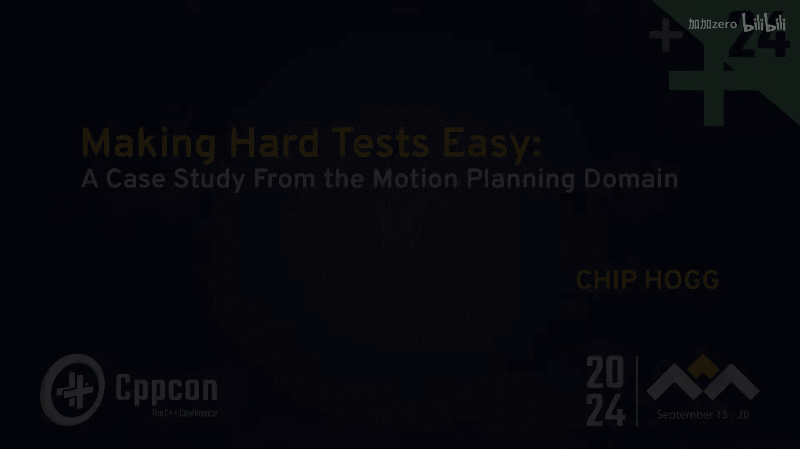
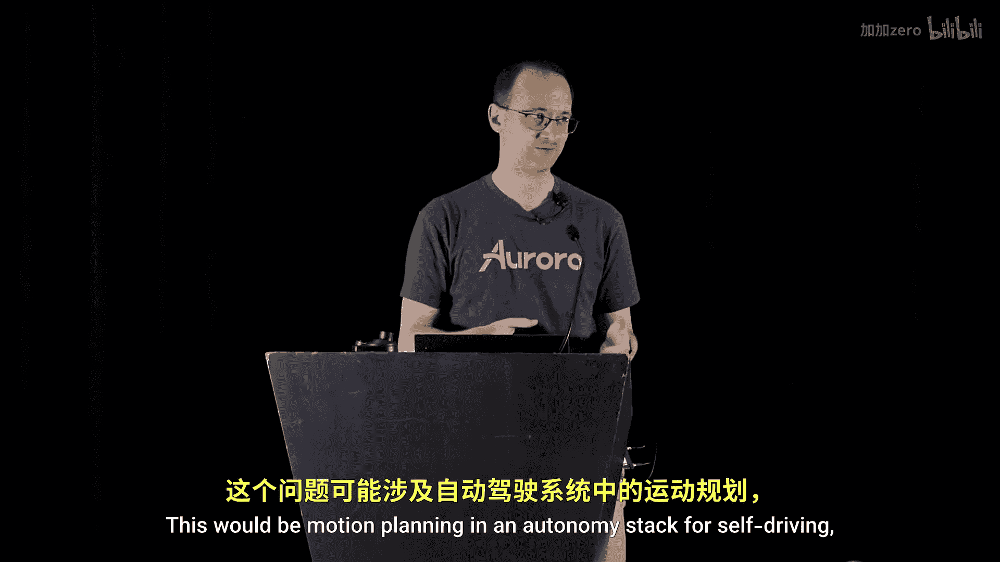
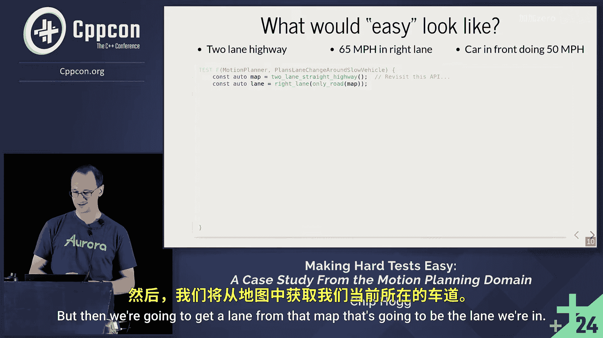

# CppCon【中英⚡CppCon 2024】 p41 P43 Making Hard C++ Tests Easy： A Case Study From the Motion Planning Domain - C -BV1NHEEzdE92_p41-

🎼There are also all of these informal aspects of a conference where like we had a gathering of all of the women of the conference last night and it was really nice and I made some new friends so that's the kind of stuff that you would missed you weren't in person。

Thanks， everyone for coming out。 Really， thanks。 I saw the other talks at this time slot。

 I almost didn't come。 I wrote this talk with two main kinds of audience in mind。

 The first is going to be people who are writing tests for functions that have complicated inputs。

 So it's a pretty hard problem in general。 We're going deep dive on one concrete example and try to find something from that。

 that we can generalize if possible。 The other audience is people who have that exact problem。

 This would be motion planning in an autonomy stack for selfdriving， maybe aerial applications。

 I don't know。 if you're in that audience。 lucky you。 We're going take some clear。

 specific path through design space where we look at the things we've seen that work in practice。

So a little bit about the application。 I work for a company called Aurora。

 We're on a mission to deliver the benefits of self-driving safely， quickly and broadly。

 We're actually launching our first product this year 2024。 selfdriving trucks。

 Long haul cargo driver out Dallas to Houston。 So it's a very exciting time for the company。

 was for me， I'm Chip Hogue， I've been at Aurora almost four years。 I'm on the motion planning team。

 and I've been in the self-driving industry almost9。 believe it or not。

 So I mainly focus on making good tests easy， but I've been wearing a lot of other hats as well。

 disclaimer about the talk。 The Apis here are not exactly what you would see if you went and got hired in at Aurora。

 which I recommend。 But this is not what that is。 It's not onboarding for Aurora。 This is instead。

 The goal is whatever communicates the ideas that we learned with the greatest clarity。

 So that's what we're going to see today。😊，So let's talk a little bit about tests generally。

 They come on a spectrum。 They range from end to end test。

 the scope is the whole system then you have integration tests test the parts work together。

 unit tests to test individual components even compiler errors can be a kind of test at the line or subline level when you get up near the top。

 you have bigger scope。 there's more that you can test。

 but they tend to be slower and more expensive。 you kind of have to be judicious with these down at the bottom。

 they are finegrained， they're fast， they're cheap。

 easy to understand and iterate on tight cycles Now do we know at the best kind here is the most important kind actually it's all of them a question I'll try not to do any more of those they are complementary they give us a defense in depth which is very important for what we're trying to do here So today's top kind of lives in the middle here。

 these are like integration tests down to maybe bigishh unit tests。

Basically the thing of it is things that you would write a kind of classic C+ plus test case for so for these things you've got a test case kind of comes in three stages so a range is going to set up the inputs to your function。

 then act， you're going to call your function and then you have assert。

 at the end where you test to see what whether the thing you got was something that is good or not。

Today's problem mostly lives in the arranged portionian part， maybe a little bit in act as well。

We know that real world functions can have complicated inputs。 And that's a big challenge。 So。

 for example， we have a function here that takes a historical motion as an input and some Dt in the future。

 And we want to predict a future motion。 those inputs can be really complicated。

 Maybe we have an actor that is simultaneously changing lanes and accelerating。

 And how do you like write that input through a unit test， It's just really hard。

 And kind of have two bad choices， Honestly， we can give realistic data that we set up very meticulously。

 but then it becomes kind of hard to understand， you lose the intent becomes very fragile。

 maybe as the code evolves。 So alternative to Luke， you try to make some simple。

 fake data to pass just something that fulfills the contract。

 But the test that we get from that tend not to be all that meaningful， so。

How do we find our way out of a dilemma like this， Well， according to Tolstoy。

All simple function inputs are alike。 Each complicated input is complicated in its own way。

Fred Fred Tolstoy， my old manager back at Google anyway。

That means there's light not likely to be a sort of generalized theory here。

 What we're going to do instead is pick one complicated input， deep dive and try to generalize。

So the example is going to be motion planning component in a self driving car。

 if you don't know how to make a self driving car， that's no problem。

We're going to learn just enough so that anyone can follow along。

 So start with this black box picture。 We know we have some sensors on the input， camera， Lidar， GPS。

 whatever， some black box autonomy stack。 And then on the other side。

 the pedals and steering are actuated。If we refine this picture。

 we have well defined components that communicate by passing messages。

 So sensors tell us where we are， localization， what's out there， perception。

 We know what part of the map to fetch how to make a route to get to the goal。

 And then all these things。😊，Go into the motion planning component and its job is to assess the situation and come up with a trajectory。

 a spacetime trajectory to drive over the next couple seconds So the next component is controls which knows how to read that trajectory for the specific platform we're on and translate that into actuation and then of course we're going to get new sensor data fraction of a second later and we're going to repeat and replan so that's the big picture of an autonomy stack Now how do we implement the motion plan or component that we're focusing on today。

One common way is by a kind of three stageage architecture。 It's pretty flexible。

 The first thing we do with all these inputs we get is to assess the situation。

 So we assemble them into a coherent hole。 And then we come up with like a bunch of ideas， hundreds。

 thousands。 then last， we evaluate all those ideas。 and we pick the best one。 So this is a nice。

 elegant， robust， flexible architecture。 So， for example， in that middle stage。

 where you coming up with a bunch of ideas。 You can reserve some of the capacity for a handful of emergency maneuvers that you just always want to consider。

 And then we will do those maneuvers exactly when they are better than anything else we could come up with。

 So it's easy to understand very nice。 So assess the situation， come up with a bunch of ideas。

 pick the best one。 Not just enough to build a selfdriv truck and get it from A to B。

 It's kind of a recipe for winning at life。 honestly， so。😊。

Going from these inputs all the way out to the output trajectory constitutes one planning cycle。

 so this cycle is going to be the sort of unit of test for what we're focusing on today。

 now we could be testing the whole thing we could be testing any of these individual main components。

 we could be testing their subcomps anything like that is fair game we notice if we had these sort of first inputs it would be easy to make any downstream complicated inputs by just running the parts of the planner on these So we've kind of reduced our problem to building these inputs。

 which is kind of great but kind of not because these inputs themselves are really complicated。

So the way out here is based on this all time classic campt be tweet。

 when you're trying to make a change first， make the change easy warning this may be hard。

 But then make the easy change。 Now， for those of you who have yet to cultivate this habit in your day to day job。

 It's like a cheat code， It is so satisfying its way to move fast with confidence So highly recommend。

 But then how do you go about doing this， make the change easy。😊，Well。

 the absolute first step is you need to figure out what easy would even look like。

 So if you can't do this， there's no point in going further。

 But the good news is that this step is really fun。

 You can imagine whatever source code you would write in your ideal world。

 but you have everything No constraints here， just brainstorming， no bad ideas。

 But then after you do that， you put on your judging hat。

 you step back and you look at what you wrote and you think is this feasible。

 can you imagine how someone would implement these As I would it be easy to use correctly。

 hard to use incorrectly， and don't forget to think about the scope。

 So get clear in your mind about what use cases are the kind of core use cases that you're just gonna nail what are the kind of peripheral use cases。

 the stretch ones that you can imagine how you would implement， you know maybe a bit of a stretch。

 and don't forget to identify the use cases that are just simply out of scope。 remember。

 you can always build another library to handle those later。So what's an example for motion planning？

Let's say we have this two lane highway。 We're doing 65 and the right lane。

 We got a car in front doing just 50， Nobody else around。

 We want to run the planner and test that it proposes a lane change to overtake the car， okay。Well。

 we got to get a map from somewhere。 This API， I don't know。 Maybe we'll come back to it later。

 but then we're going get a lane from that map that's going to be the laneer。

