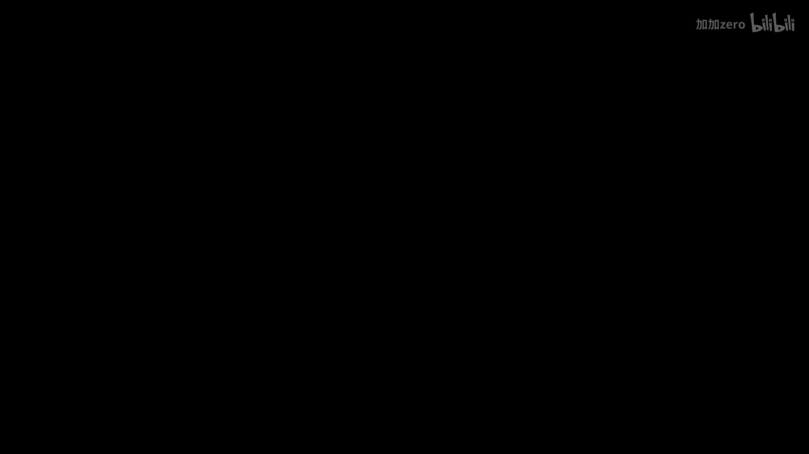
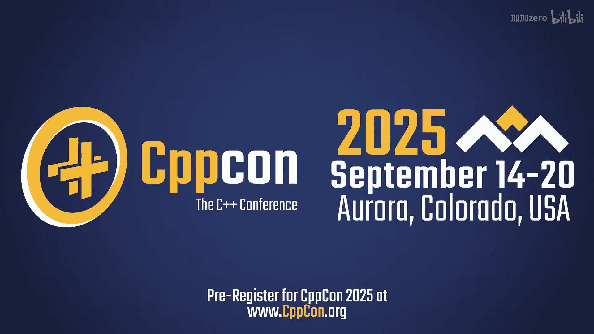
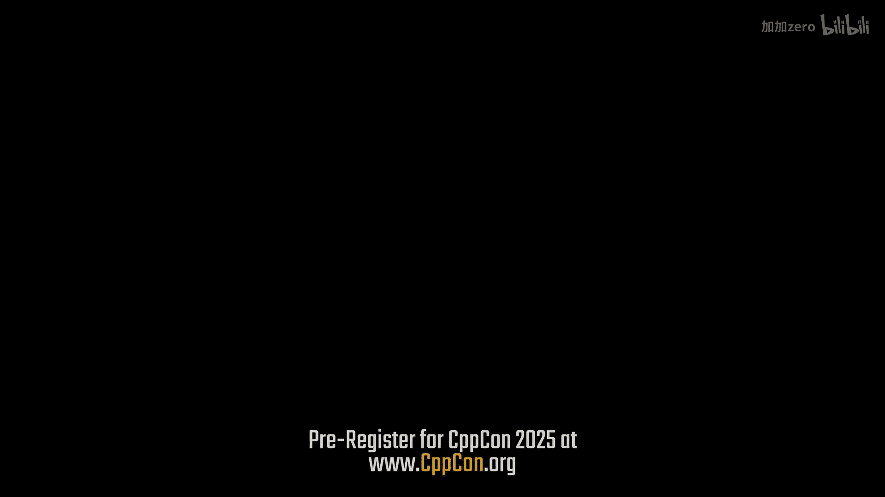
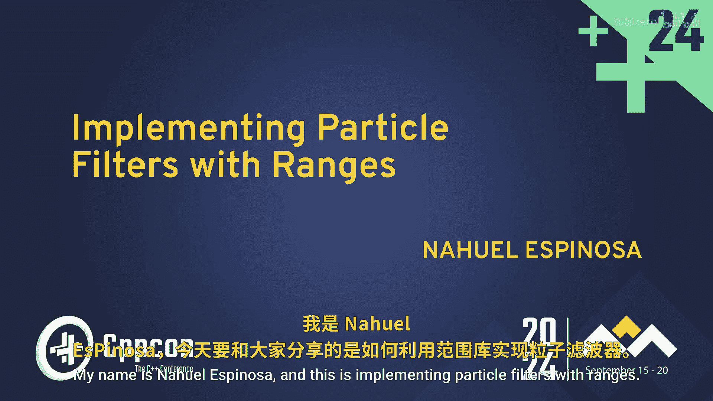
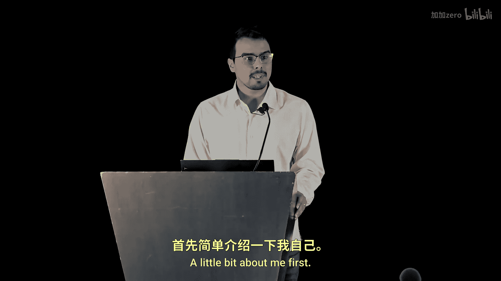
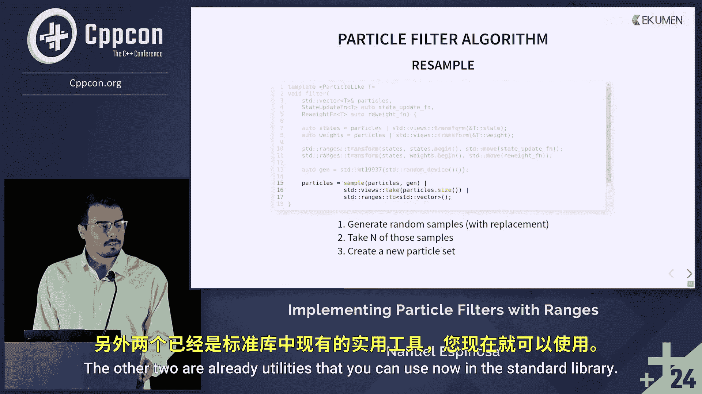

# CppCon【中英⚡CppCon 2024】 p42 P44 Implementing Particle Filters with C++ Ranges - Nahuel Espinosa - CppCon 202 -BV1NHEEzdE92_p42-

It's been pretty amazing to be kind of at the forefront at the cutting edge。

 to see all the luminaries in the field and you find out that these big names are just people with a lot of common interests that overlap with yours and who would only be too happy to talk with you about them。

Hello everyone My name is Naes Pinoa and this is implementing particle filters with Rs a little bit about me first I'm an electronics engineer from Buenos Aires。

 Argentina I've been working as a robotics software engineer at Ecumen since 2020 before that I had some experience with embeddedbed systems Ecumen is a company that provides software development services around the world with companies with headquarters in Argentina and Europe and I've worked mainly in localization and simulation projects。

And lastly， I'm maintainer of an open source project called Beluga。

 which is an implementation of localization algorithms for， for compatible with Ro and Rostu。

Before we start， I wanted to give you a look and show you exactly what problem we're trying to solve。

 This is a simulation of an autonomous mobile robot that's trying to localize itself in a room it collects sensor data from lighters and the wheels。

 and using a particle filters， tries to estimate its position in the environment。

The red arrows here represent different hypotheses for where the robot could be。

 And by computing a weighted mean of those states， we can get a pretty good estimate for where the robot actually is just as a quick overview。

 there there will be a brief introduction to particle filters and not going to dive into the theory behind this there will also mention the range library。

 but it will be good if if you already are familiar with this， and we by the way。

 this is a 30 minute talk， So we will spend most of our time in an implementation walkthrough for this particular problem。

😊，And so for starters， Ba filters are algorithms used to estimate the internal state of a dynamical system using given noisy observations and random perturbation in the system itself the state can be anything from position to velocity to orientation or accommodation variables and we have a proistic distribution called belief that we want to update as we incorporate information from the environment。

 so we do that in two steps the first step is called prediction where we incorporate information transition data for our state and then there is the update stage when we use observation from the environment to change our probability distribution。

As long as we incorporate more information from the environment。

 we get closer to estimating the true state of our system。

Particle filters are a type of ba filter where the procedureed distribution is represented by a set of particles。

Each particle is a single hypothesis for of the state of the system and has an associated weight。

 This weight is proportional to the likelihood of that particle being the true state of our system。

 So the particle set as a whole acts as a discrete distribution that we can evolve over time。😊。

In these algorithms， the prediction step consists of computing new states for for each particle based on the transition model。

 and the update stage consists of computing weights for each particle based on observations and。

There is a step during the update stage that's called reseling and what we'll do is duplicate particles with high weight and eliminate those with low weight。

 The reason for that is that we want to keep our distribution representative of the state we're trying to estimate。

Monticikalo localization algorithms are particle filters applied to the robot localization problem。

 so the state we're trying to estimate is the position and orientation of the robot in the map and the transition data comes from control commands orometry and observation data comes from sensors like lightar cameras or others。

 This is MCL in action。😊，Now two ranges， ranges is an extension and generalization of the algorithm and itator libraries。

 Since the beginnings of simple+， we have had algorithms that take iter as a input since simple plus 20。

 We now have a formalized range concept and we can pass ranges to our algorithms directly。

 and we also have views which are lazy ranges that where the computation happens only when we it over them an object that takes a range and generates a view is called range adapter。

 and these adapters can be composed in range range pipelines producing nice and decative expressions like this one。

😊，There's also in simple 23。 We got the capability of implementing user defined adapters that are compatible with the ones provided by the S TL。

 and we also。😊，Can materialize ranges into non view types。 So we could create we。

 given a range or review， we can create a container or in initialize a container using the two adapter。

 Also， we can could we could actually create anything that takes pair of iters。😊。

As you can probably begin to see， particle sets are ranges and particle filters are algorithms applied to them。

 So the Rs library provides the tools to write these algorithms in a way that is easy to read。

 less error printne and easy to reuse。 Hopefully， we will show that here。😊。

We will start with framing concepts for our implementation The first one is a particle like object which is an object that has two members。

 a state that could potentially be anything and a weight that must be convertible to double we have two coable concepts the first one is state object function which given a particle object can take each state and compute a new state and reassign it so this is our transition model from before。

And we also have a re function that can take a state of a particle and compute the likelihood of that particle being being the true state of the system。

We can also define a filter a filter function that should perform two steps。 First。

 you will take three three arguments。 The first one is a particle set here。

 we're taking to vector for simplicity， but this can be generalized to all kinds of containers and also are two update functions。

The two steps it needs to perform are updating all the states and weights of our particles and reseling the particle set。

 So we can start with with our implementation using utilities from the standard library。

 The first one we're going to use is to use transform， which。

We can use to generate views into our particles set for different properties of our particles。

 So in line 7， you can see that we're passing a pointer to data member to the transform adapter。

 and this will create a view over all the states of our particles。 And in line  8。

 we can pass a pointer to data member to the weight and create a view over all the weights of our particles。

 There is no computation yet。 This is just a declaration。 and。😊。

We can then do some work by using St ranges transform algorithm to basically for each one of the states of our particles。

 we want to call the state update function and update that that state and do basically the same with the weights。

 So after this point， we have our particle sets has all the states and weights updated and ready to be reled。

 resampled。嗯。So。In the resembling step， remember that we need to keep particles with high weights and eliminate particles with lower weights。

 One way to do that is by con using our particle set as a discrete distribution and sample from it using the weights as a probability。

 The standard library provides a class to that does exactly that that is discrete distribution。嗯。

And here we we're using it， but it does it cannot be constructed with a range。

 It doesn't have a construct that takes a range so we can use the two ranges to adapter to materialize our our weights into this discrete distribution class。

 or instance， And lastly， we need to create a new particle set and use the values returned by our discrete distribution to sample or take particles from original particle set and initialize the new vector。

 As you can see， this for loop here that accomplishing several things at once。

 Since we are using the range of library， what I would like to write is something like this。😊。

This is our range pipeline that with three steps， the first one is generating random samples from our original particle set here it says with replacement。

 that means that we can draw the same particle more than once。

And this is an adapter that doesn't exist in the standard library。

 so we would have to implement it ourselves。The other two are already utilities that you can use now。

