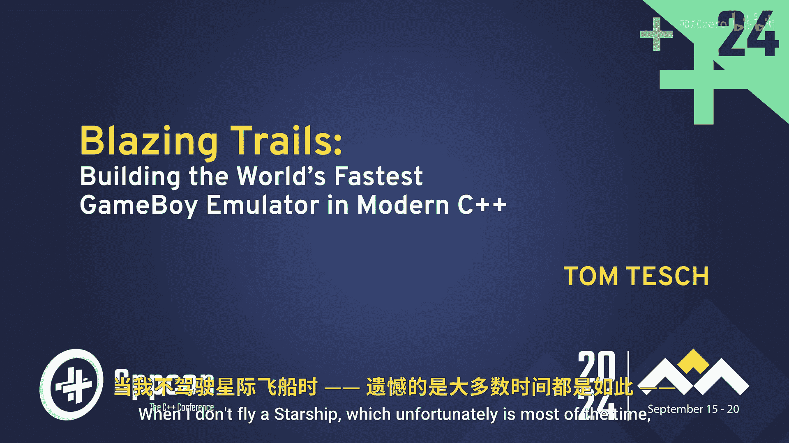
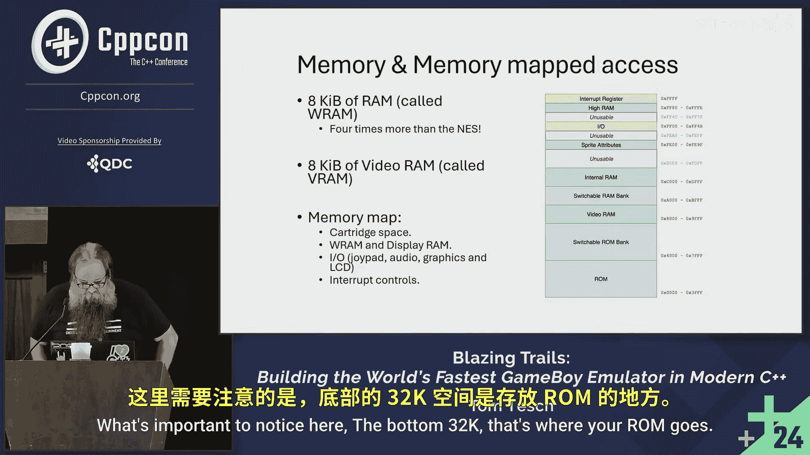

# C++与模拟器编程：1：为何选择现代C++构建最快的GameBoy模拟器

在本节课中，我们将探讨为何选择现代C++来构建世界上最快的GameBoy模拟器。我们将从动机、技术背景和项目优势等多个角度进行分析。

---

## 为何选择现代C++

这是CppCon大会。我认为如果尝试用Java编写最快的模拟器，大家可能不会感兴趣。我也不想那样做。所以我们选择C++。

## 为何编写模拟器

作为一名程序员，我注意到我的学生也是如此。他们中的一些人在毕业设计中编写了模拟器或部分模拟器。这让他们对硬件有了更深入的理解。如果你必须模拟硬件，你就必须理解硬件的工作原理。那种“我把C++代码放进去，然后就有结果出来”的神秘感会消失，取而代之的是“我理解这些步骤的作用”。

## 为何选择GameBoy

顺便说一句，GameBoy生日快乐。它在美国推出已有25年，也就是四分之一个世纪。在座有谁玩过GameBoy？这很好，这让这次演讲变得更容易一些。

GameBoy的销量约为1.2亿台。如果算上向后兼容的GameBoy Advance，销量约为1.97亿台。实际上，GameBoy Advance并不是真正的向后兼容，而是内部集成了GameBoy硬件。因此，总销量大约在2亿台左右。它曾是史上最畅销的游戏机，仅次于PlayStation 2。所以，这是一项非常重要的技术。

它的屏幕效果很差。说它不差的人，可能是因为很久没玩过了。我手头有几台。原版GameBoy的屏幕确实很糟糕。我找到的这张截图拍摄得很好，不知道他们是怎么处理光线的。当画面开始移动时，一切都会变得模糊。分辨率很低。

它有八个按钮：一个方向键、开始、选择、A、B。它是单声道输出，但如果你接上耳机，可以听到立体声。所以，大家都知道它是什么。

它之所以重要，是因为技术相当简单。屏幕分辨率不高，这些都是优势。

很多人已经注意到，为GameBoy编写模拟器相对容易。如果你想自己写一个，你绝不会是第一个。网上有很多开源项目，这是一个巨大的优势。如果你在某个地方卡住了，可以看看别人是怎么做的。

网上还有大量非常详细的技术资料。我们都希望自己能有这样的资料。我不知道你们中有多少人参加了关于单元测试的演讲。那位演讲者讲得很棒，他说最重要的一点是必须编写单元测试。这是对的。我们需要编写单元测试。谁不写单元测试呢？在座的有些人可能在说谎，尤其是在业余项目中。

好消息是，GameBoy有一系列测试程序。虽然不如单元测试那么完善，但仍然很有用。你把这些测试程序放进你的模拟器，如果它能运行，你就知道自己的模拟器处于什么水平。这些测试实际上能提供相当详细的关于哪里正确或错误的信息。总而言之，这非常棒。

它拥有庞大的游戏库。这对我们最终要做的项目来说很有趣。而且，这个庞大的游戏库体积很小。我没有疯。它的体积确实很小。整个包含数千款游戏的库只有800MB，这使得处理起来很合理。仅用800MB你能获得多少乐趣？如果你有一个GameBoy模拟器，乐趣会相当多。

令人惊讶的是，今早我查了一下数据，有一个非常活跃的自制游戏社区。图中蓝色部分代表原版GameBoy。网上有807个自制项目可供使用。所以，除了那数千款商业游戏，以及其中约30%向后兼容的576款游戏之外，所有这些自制游戏也供你享受。其中一些非常出色，当然不是全部。这些自制项目有时也只是一个演示程序。我说“只是一个演示”，但演示程序可能真的很有趣，就像Commodore 64的演示场景一样，人们用这些东西做出疯狂的效果。

对于编写模拟器来说，另一个重要点是它的架构相当简单。GameBoy在80年代末推出，实际上是在8位机时代之后。这意味着在设计它的时候，大家对如何设计一个优秀、精巧的8位系统已经非常了解。这就是为什么你能得到如此简洁的设计。如果你看这里的PCB板，上面有一些标签。是的，不能再比这更简单了：一些RAM，一些VRAM，然后所有东西都连接到接口上。基本上就这些了。板上几乎没有其他芯片。为什么？因为它远远超前于时代，这是一个片上系统。它内置了一个图形处理设备。现在我们会称之为GPU，但当时它被称为PPU（像素处理单元）。

时钟频率是4,194,304 Hz，即4 MHz。这个数字看起来很特别，大家都知道为什么吗？这与PAL或NTSC制式无关吗？实际上，GameBoy没有区域锁。你可以在任何地方购买。我有一台GameBoy Light，带内置背光，非常棒，但只在日本发售。我的一个学生实习时给我带了一台。

这个时钟频率是2的幂次方。作为一个程序员，这让我很高兴。作为一个C++程序员，这也让我很高兴。它没有I/O端口指令。Intel 8080有那些烦人的I/O端口指令，然后你必须将它们映射到内部函数来调用之类的。正如你所见，GameBoy的芯片是Intel 8080和Zilog Z80的子集，并加入了一些自己的东西。他们从Intel 8080中去掉的主要就是那些端口操作。GameBoy是完全内存映射的，这使我们的生活轻松多了。

它拥有8080的寄存器组，以及Z80的一些额外位操作指令，还有一些新增的、旨在帮助图形处理的新指令。

这个片上系统超级简单。正因为如此，很容易理解发生了什么。这里有一张内存映射图，你可以看看。

---

本节课中，我们一起学习了选择现代C++构建最快GameBoy模拟器的原因。我们探讨了现代C++的适用性、编写模拟器对理解硬件的价值，以及GameBoy平台因其简洁性、丰富的资源和活跃社区而成为理想目标的诸多优势。下一节，我们将开始深入GameBoy的硬件架构细节。