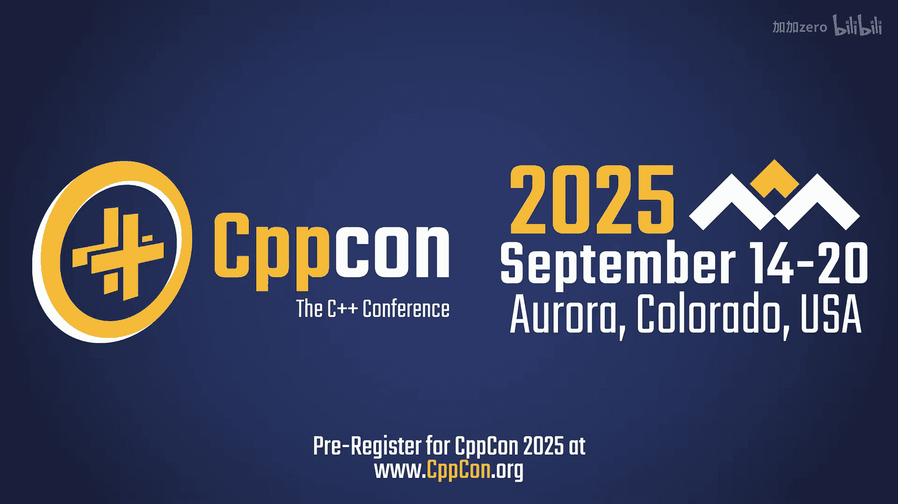
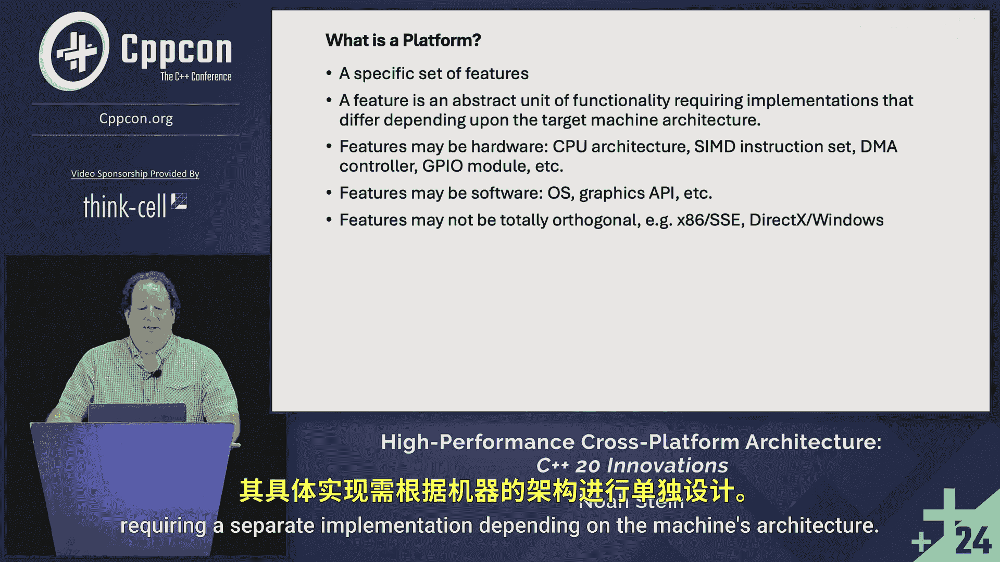

# CppCon【中英⚡CppCon 2024】 p44 P46 C++ 20 Innovations： High-Performance Cross-Platform Architecture in C++ - No -BV1NHEEzdE92_p44-

It's my first time at CPPCon， I've thought about going for a lot of years and now kind of regretting that they didn't go sooner。

Okay， welcome to High Performance cross Plaform architectureit。 I'm Noah Stein。Just a check。

 this is my first time presenting at CPPCon， iss this readable？good。

 because I hate talking about myself。 So you already know， I don't have to。

 But I will mention out there that the first cross platform project I ever worked on was back in 1994。

 was a lead programr game that was on。The original PlayStation， the Saturn， and PC， the old dots。

And there were three completely different platforms， different CPUs， different graphic systems， I O。

 everything。From that time， I've just continued to study that， study cross platformform issues。

 and recently I looked at， does C plus plus 20 offer us anything that can take this to another level。

 and I believe so。Now， the goals of this cross platform architecture。

A to take advantage of all the platforms， to be optimized on them。

 to be able to use their different features。The solution focuses on the compiler。It's。I want that。

 That's what the standard really covers。 And I want to minimize what happens in the build。

 And actually， there's only one。Prety processor macro that gets set in order to use all this stuff。

 So moving between built systems should be easy。I want to minimize boilerplate and unnecessary code。

 minimize redundant code。If you wrote something and it should work， then it will work。

In other situations， I want to minimize modifying existing code when I add something new when I whether it's a new platform or a new revision of a platform。

And I want to minimize use of preprocessor macros。There's not a single if death in what I wrote to support different Cdi architectures on different chips。

So here I'm going to walk through designing a crternian class。

Not all of you will be familiar with it。 It's used a lot in 3D graphics， some physics， some。

Physical simulations of astrodynamics。We're going to walk through the， the project build issues。

A systematic method to include the header files， which is one of the keys to making this happen。

The concept hierarchies and the class and function design that just bring it all together。

There's a fundamental overriding principle that's tying that drove the development of this。

 And that's the open close principle。And C++。It。It was first brought in in 1996 by Robert Martin， C。

 Martin in an issue of C++ report long sinces gone。

 Open Coast principle means that it's open for extension and closed for modification。

As presented to the C plus plus community， the example was implemented via a delegated polymorphism。

In classic C， what we saw was that if we wanted to draw a bunch of shapes， a collection of shapes。

 we would create an enum that told us what the shape was。

 We would put it at the start of differentstructs， such as a circle and a square。

We then had drawing functions for each of those types， the circle in the square。

 And then the draw shapes routine would just iterate through。And switch on the type。 And then in。

 in this cases， it would cast to the appropriate。Extracted。And then call the draw。Now。

 the issue on open close there is that whenever we add a new shape， such as an ellipse。

We're going to add a new case to that draw now that the draw shapes is the interface。

 so the code that's directly being seen is being modified。

 and that's a danger to clients that those changes could cause breaks， could break the clients。

The C plus plus solution， the object oriented solution presented by Robert C。 Martin。

 involved having a base class of shape， having a virtual draw call。 Then the circle。

 the square and the other shapes would derive from the base shape。

 Then the draw simplifies out to just a simple iteration。You get a pointer to the base class。

 and then you draw the draws automatic through the virtual。 You get the correct drawing call。

 So when you add a new shape， such as in the lips again。You end up creating a new class。

 nothing changed in the call to draw and actually nothing changed for circle or shape even。So。

You were extending it without actually modifying the interface。

 thus you have a lot more security in knowing that you're not breaking things。

In researching this talk， I found out。That。The， the earlier version has a slightly different。

Bertrand Meyer in 1988， actually defined the open closed principle eight years before Robert C。

 Meron brought to C++。His definition is a little bit different。

His definition is that once you have released code into the while， you want it closed。

 You don't want it modified because clients rely upon it。And as I already said。

 if you if you change something， you can break something else。But you want it open for extension。

What's interesting， though， is。His example is very different than the one we know in C++。

He uses direct inheritance。So you don't see， I've never seen that in C plus plus。

You would have everything virtual in your class。Then you would， if you wanted to make a change。

 you would subclass it。Change the virtual functions， Add whatever and get your new thing。

 But that means everything in your program would have to be by reference by pointer， not by value。

I would show an example of that in code， but I can't think of one。

 So what I did do is reproduce faithfully， visually。The example from his book。

 objectject or software construction。So if you have a class A。If B C and D。

Our clients of it depend on it。 And then E depends on C。When you want to extend it in the open way。

You actually subclass off of A。And then anything new you write will interact with this A prime。

 All the originals will still work off of the older A。 So B， C and D will still work off of A and。

I've just never seen anybody implement anything that way。Odly enough， until now。

 I didn't realize that I followed his original design methodology on the open close principle。So。

 I'd like to。I think there are two flavors of the open close principle when we get in C++。

 it being a compiled language and with the way it's structured。So first， let me start with。

 there's no consideration for the open close principle。If you。

 you're gonna go back and you're gonna modify previous code that you've written in order to add a new feature。

That can potentially change the current behavior or the interface。

 and that means that your clients' that user are going to have change in response and their clients might have to。

 and it's just going to all ripple out and it's going to be a lot of work and potentially bugs a lot of time。

Now， when we get to actual OCP。I like to think in C++ that there's two flavors a week and a strong。

In the case of weak OCP， you are modifying previous code。

But there's no visible change to clients in the current behavior and interface。And therefore。

 what you will see is a recompilation， but you won't have breakage and you won't have other problems associated it。

 a perfect example would be if that draw was in a larger class。

 say a render and it had other functions unrelated to drawing， if you added something there。

 that would be a weak OCP extension， if it doesn't affect the draw。In the case of strong OCP。

 when you add a feature， you in no way modify any preexisting code。

And what you'll see is if nothing uses the new feature， nothing recompes in your build。

 and we'll actually see this later on。So my design here is not oop。I have separate data。

 and separate。Functions， theyre free， they're free functions， not member functions。 However。

 depending on what you're doing， it does work with oop。 that's not strictly a limiting feature。

 a limiting factor。Whenever I add a new platform， no previous platform changes。

 and that can be seen in that once when I make changes on one platform， I can push the code up。

Other people can pull it down。 And when they rebuild a different platform， nothing compiles。

 nothing rebuils。 These are isolated。Platforms， the code is totally isolated from each other。

At the same time， when I add a new revision， such as going from SSE to SSE2。

 it's the same rule any if I had a project that was still on SE， original SSE， not SSE2。

 it will not recompile。 No prior code is modified in order to take advantage of some new feature。

So then the question is， what is a platform？Simply， it's a specific set of features。Thus。

 the next question， what is a feature？Features an abstract unit of functionality。

 requiring a separate。

