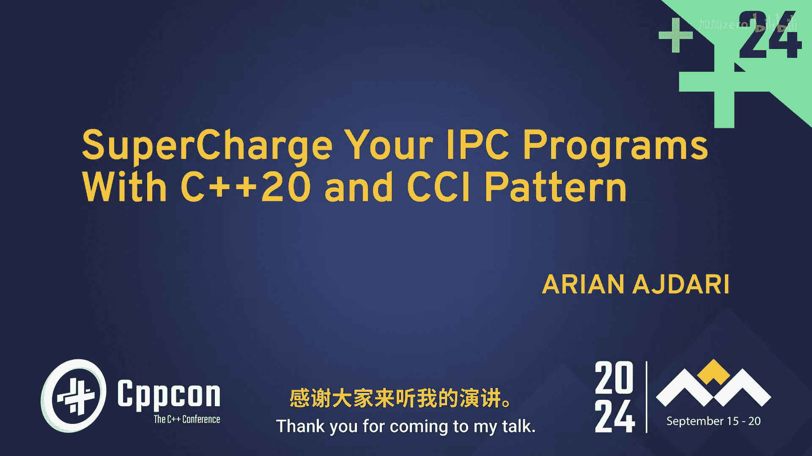
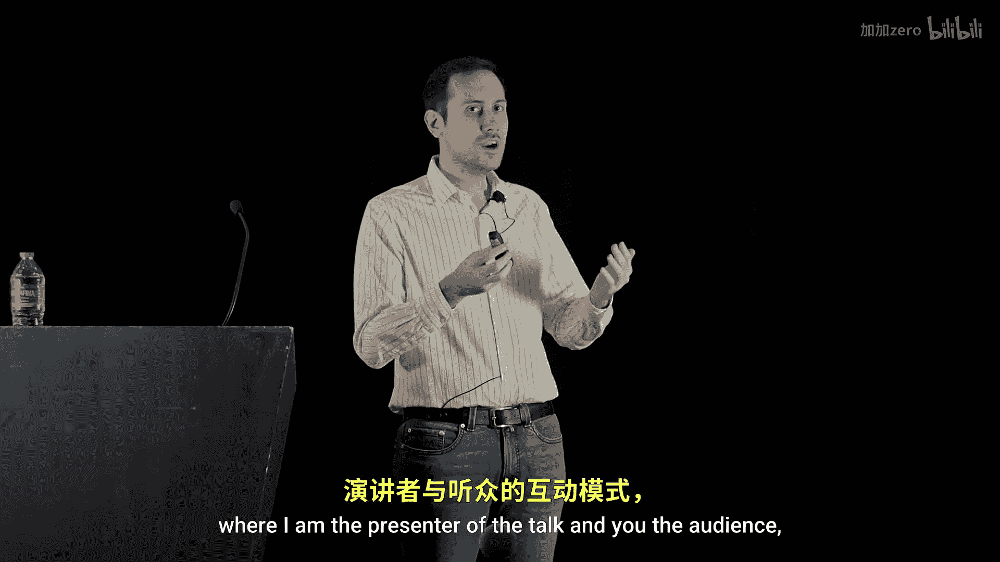
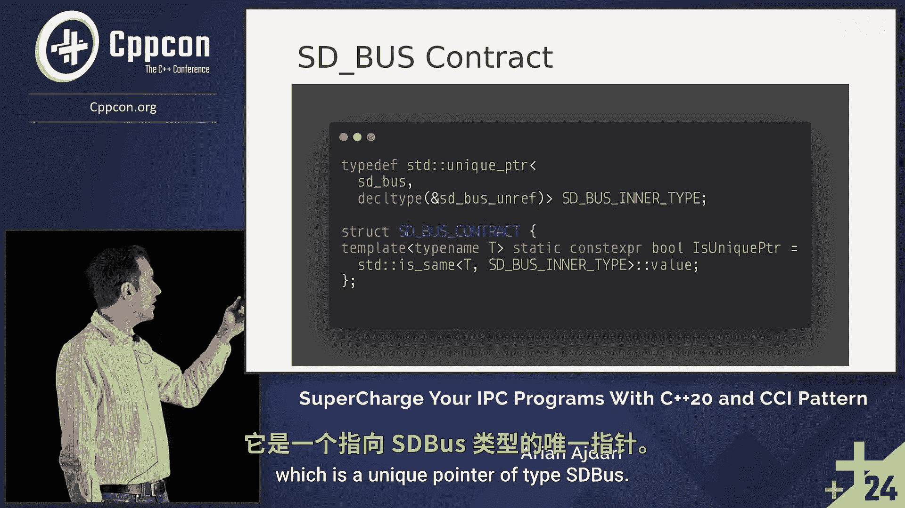

# C++ 进程间通信编程：第1章：使用 C++20 与契约概念提升程序

## 概述
在本节课中，我们将学习如何利用 C++20 的特性与“契约-概念-实现”模式，来改进和强化进程间通信程序的接口设计、安全性与易用性。

---

性能是 C++ 的主要支柱之一，也是我们编写代码的核心原因。因此，我确保标题足够吸引人，以引起你的注意。但为了本次讲解的目的，我希望你暂时忘记标题。

我注意到，在生活中与人沟通或获得新工作时，我总是需要签署各种合同。作为一个技术人员，在失眠的夜晚，我试图解决这个问题，并得出结论：我们所做的一切都是一种安排或契约。深入研究后，我发现所有这些契约的核心只是生成新信息或交换现有信息。因此，我认为 C++ 本身作为一种编程语言，就是一份赋予我们表达自我的契约。所以，与其采用通常的演讲者与听众的安排，我希望我们都能戴上“律师”的帽子，一起开始编写一些契约，以增强我们的进程间通信程序。

---

首先，让我们设定一些规则。IPC 代表进程间通信。“程序”指在受限环境中运行的软件，我称之为嵌入式设备。但对某些人来说，嵌入式设备可能是仅有 64MB 内存的微型设备。在我们的案例中，我们针对的是至少拥有 512MB 内存的嵌入式设备，这意味着它们能够运行完整的 Linux 内核并使用其提供的所有功能。CCI 代表契约、概念和实现，这是我们将用来增强进程内通信的模式。

我们试图用 IPC 解决什么问题？众所周知，图像被广泛应用。对图像的一项基本操作是提取其颜色通道。在计算机世界中，图像由三种主要颜色构成：红、绿、蓝。我们希望有一个服务，允许我们从图像中提取特定通道。

对于进程间通信，我们将使用一个名为 D-Bus 的设施。它是一个用 C 语言编写的抽象层，位于 Linux 套接字之上，引入了诸如总线服务、对象路径、接口和方法等抽象概念，使我们的编程更容易。为了解释这些含义，我将用一个简单的类比：总线可以看作所有网络通信；服务可以看作生活在单一父进程下的进程组；对象路径可以是你的可执行文件；接口是一个结构体或 C++ 类；方法名就是属于这个特定类的方法。

系统 D 的设计者为我们提供了一个接口来实现这一点，我们将使用这个低级契约来提取上传图像中的指定颜色。为此，首先我们需要定义一个名为 `error` 的结构体，并使用一个宏定义 `fin`。我们不知道背后发生了什么，但这就是接口的工作方式，这就是我们应用系统 D 提供的契约的方式。然后，我们需要声明一个 `SD_bus_message` 类型的指针，声明一个 `SD_bus` 指针来存储总线，声明一个 `int32_t` 常量来存储操作是否成功的结果，当方法从 D-Bus 执行后，我们将结果存储在变量 `R` 中。对于输入参数，我们将使用两个静态字符串：第一个是我们要执行操作的图像文件路径；第二个是我们希望保存提取通道后新图像的路径。使用 `uint8_t` 类型的 `channel` 参数，我们指定要提取的通道，例如数字 1 代表绿色通道。

为了调用方法，我们调用名为 `SD_bus_call_method` 的函数。如你所见，我们提供了大量输入参数：总线、三个常量字符串（指定方法名，这里是 `extract_channel`）、错误消息的引用、一个带有奇怪字母 `OOY` 的常量字符串（签名），以及我们的三个输入参数。

现在，我想请你们举手，认为这是一个出色的接口吗？你认为它易于使用、易于访问且不易出错吗？正如我所料，没有人举手。那么，相反，谁认为这不是一个好接口，可能导致灾难？所有人。所以答案很明显。

我认为通过应用 CCI 模式，我们可以使这个接口好得多。因为在这个接口中，我看到每个参数都有问题。让我们从 `bus` 开始：它是一个指针，在 C 语言中我们需要管理其生命周期。无论你多么有经验，当你退休或那天咖啡不够时，你可能会忘记释放它，这很正常。然后我们有三个常量字符串来指定服务名、对象路径和接口名，它们在指定方式上非常特殊：服务名使用点，对象路径使用斜杠。如果你犯错或不遵循约定，代码会编译，运行也正确，但当你将其刷入嵌入式设备并尝试使用时，会遇到运行时错误。所以，这三个参数存在一些需要我们处理的运行时错误。

我看到的最大问题是，对于输入参数（在我们的例子中是文件路径、保存路径和通道），你同时需要提供它们的签名。如果你没有写入 `OOY`（这三个输入参数的签名），代码会编译，你不会收到任何警告，但当你刷入设备并尝试使用代码时，会遇到错误消息。想象一下，你的嵌入式设备在汽车里，你编译代码，十分钟后上车，希望程序能工作，却遇到了运行时错误，这是巨大的时间浪费。

因此，我们将创建一个契约来指定数据类型的特征，然后创建一个概念来强制执行契约，最后创建一个受概念约束的实现。

我有一个普遍的问题：你们中有谁喜欢编写或阅读合同？我猜没有人喜欢翻阅冗长的合同并试图理解它们。我看到有些人举手了。别担心，我会尽量让这个合同简单易懂。我们将定义一些词汇，以便在讲解中理解我们实际在做什么。

契约只是一堆文件，在我们的案例中，将由结构体或 C++ 类表示。在合同中，有许多段落解释条件或签署合同后会发生什么。所以，我们的条件将是类型的成员或成员函数。它们将被模板化，对于类型，它们将接受我们应用契约的类型作为参数。除非另有说明，它们大多数将始终返回布尔类型，即满足条件为真，不满足为假。

对于总线对象，我想通过契约传达的是：我希望它在一个 `unique_ptr` 内部，这保证了其生命周期在创建和离开作用域时会得到妥善管理。我还想确保只有一个总线实例，因为如果你创建了两个总线实例，代码会正确编译，但在运行时它会崩溃，因为你不能有两个总线实例。我创建了一个简单的类型深度，称为 `bus_inner_type`，它是 `unique_ptr` 的包装。

---

## 总结
本节课中，我们一起探讨了传统进程间通信接口存在的问题，并引入了“契约-概念-实现”模式作为解决方案。我们定义了契约的基本构成，并开始为一个总线对象设计契约，旨在通过编译时检查来提升代码的安全性、可维护性和开发者体验。在接下来的章节中，我们将深入构建具体的契约、概念和实现。