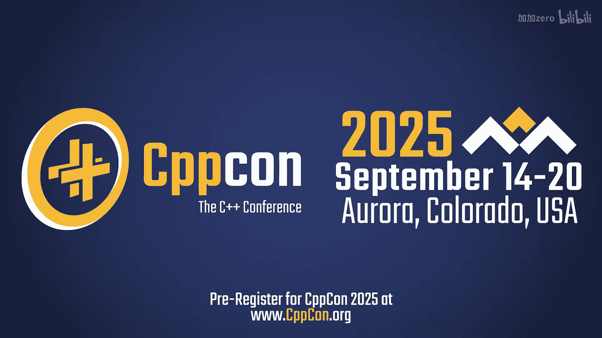
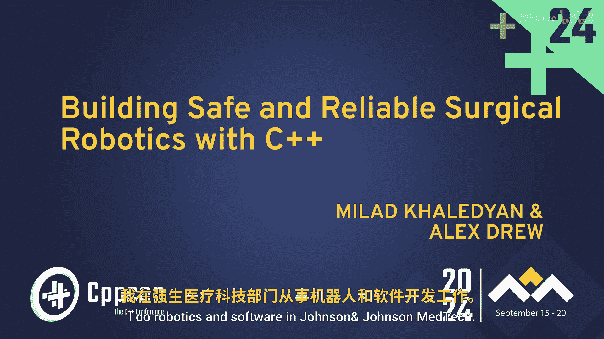
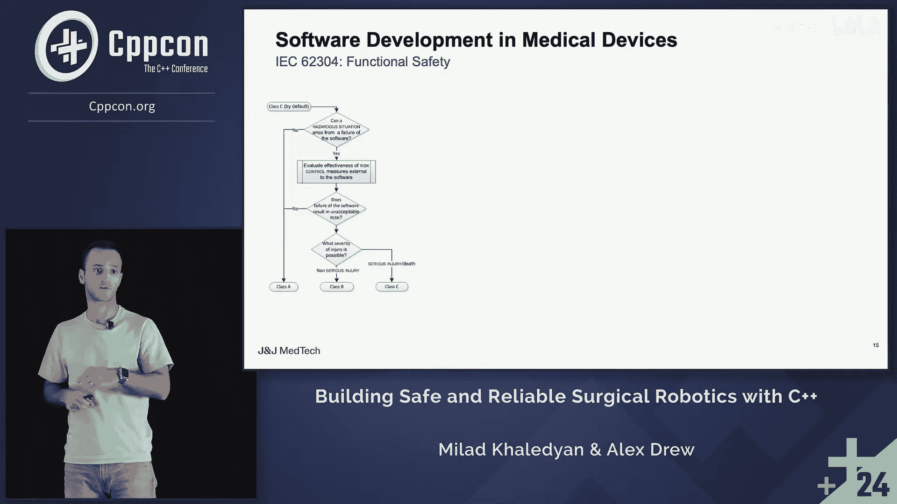

# CppCon【中英⚡CppCon 2024】 p48 P50 Building Safe and Reliable Surgical Robotics with C++ - Milad Khaledyan - Cp -BV1NHEEzdE92_p48-

Just coming here made me realize how much better an in person conference still is。

 it doesn't even compare so it's been really great being here again。

Thank you so much for joining。 My name is Milllo。 I do robotics and software in Johnson& Johnson Meedtech。

 So this year is my first year being at CPPcon。 and also my first year， obviously given a talk。

 So when I submitted the presentation， I think it was just myself with the abstract。

 but because Alex Drew， my friend and colleague， he actually helped out from 0 to 100% of the presentation feedback on everything。

 and I basically asked him to copresentent with me， and he kindly accepted。 hi， so I'm Alex Drew。

 I work as a software engineer for Johnson and Johnson in tech work with Millan closely doing surgical robotics。

 got a couple more of our group in the crowd hope you all enjoy the talk。 All right。

 so going back to the。😊。

Title of the talk。 It's a pretty a mouthful。 So there's a lot of component that goes to building a robotically assisted surgical platform heavily using C++。

 Today， well basically just touch upon a very high level concept For those of you who have been around in medical devices for a long time。

 I think it's gonna at least the introductory part would be like a refresher。

 But for first of you with no medical device back around， I hope it's gonna be beneficial。

So just some legal stuff。For the external engagement disclaimer。

 basically all the content is myself Alex's opinion and they don't represent the stance or view or official position of any company within G andJ family of companies So big picture what we want you guys to take away what's the big picture in the talk first。

 we are going to talk about why we care about safety and security probably in this conference you guys have heard a lot about this in the past few years。

 but I'm going to just repeat this tiny bit and then we're going to talk about the medical device failure analysis and what causes medical device we call and failure based on some database from FDA food and drugug administration。

 and then we're going to talk about briefly maybe five to seven minutes just talk about what we have what are theline。

 what are the regulatory documents standards and reports but to ship a software as medical device for a product So and then we're going to talk about safety and CPP specifically what we can do beyond the guideline and standards to。

A safer usage of C++ especially in medical devices。

 and then we're going to talk about some coding practices and code examples in CPP within safety critical path for any safety critical product。

 especially medical devices， and then at the end final words and Q&A。

So we have probably about 50 minutes worth of content， I would say， And then at the end。

 we can take any questions and feedback you guys have。

 So let's talk about safety and security and CPP。 I think you guys have seen a lot of these reports in the past two years from NSA regarding protecting against software memory safety issues and using memory safe languages you know。

 from CISA。P a fewer revisions。 And then from White House to provision on basically the bottom line or the common denominator for all these reports are stay away from memory unsafe languages like CNC++ and rewrite your software or write new software using memory safe languages。

 that's the common denominator。 although I think all of them they acknowledge you could do a lot of software hardening on the CNC plus plus language to essentially but to make the usage safer。

 but because we can't kind of guarantee that safety， they say stay away from those languages。

So most of this report， they actually refer to common weakness ennueration or common vulnerability and exposures。

 databases from MITR， and I think you guys have seen this from many other presentations basically for example for 2023 they have a list of top 25 common vulnerabilities as you can see many of them are actually language agnostic they could happen in any memory safefe languages as well。

 the ones that I have listed here that have've highlighted it they can happen in C or C++ specifically so for all of us who have written C++ we probably have run to many of these issues like out of Br or rights conditions use afterfr and most of them are basically based on the Microsoft and Google Chrome reports on memory safety issues For example they use afterfr based on the Google Chrome bug report on the security perspective。

 30% almost with purely based on use after free。So ever since two years ago。

 maybe from many years ago， but especially two years ago， there has been a lot of activities。

 a lot of recent talks from IS O CPP notable committee members。

 the C++ community on what we can do from a language perspective to make C++ safer。 Some of them。

 they talk about software hardening， some they take a philosophical approach。

 Can we even save C++ and things like that， But mostly they tackle it from a language perspective。

 what to do to make CP safer。 But in our talk， the idea is。Forget about this。

 We talk about the software hardening on the medical device example。

 What actually we can do to guarantee some sort of safety by using C plus+。

So let's talk about medical device failure analysis and what actually causes medical device failure and recalls based on some data。

 So in 2013， this paper， they looked at FDA， Food and Dr Administration money database from 20062011。

 they basically look at all the medical device failure and recall some of them they could cause injury。

 some of them they could cause a lot of failures and maybe di at some cases and without considering security。

 that the conclusion was 64% of software to medical the medical device failure was actually due to software。

Another database from Stcycl expert solution， they have a recall index database for many different industries such as defense。

onic， automotive and also medical devices。 this one is specific to medical devices。

 they looked at the data from Q2-2016 to Q2 2018 and again the conclusion was software for the ninth quarter in a row was actually the topca for medical device failure and recall we have tons。

 millions of millions of medical device failure than recall for each quarter basically so that's tons and given ever increasing complexity in software in medical device market there is a lot of demand for more complex software and you have more complex software you're gonna to have a lot more issues because it's very hard to manage and then we have a new threat cybersecur so given the cybersecurity and software being super complex software is and will be the core of the many。

 many issue maybe the topca even when we talk about software。

 we don't necessarily say the UI part of things。 we talk about。Software design， the implementation。

 the usage of languages and things like that。So now let's shift gear and talk about some of the standards and documents we have for medical devices that at least gives you some sort of guarantee to have a safe medical device。

 so I believe it was probably 80s the Theac 25 probably you guys have heard of it。

 they call it the nastiest bug in the software history So Theac 25 was a radiotherapy machine that because of there was a lot of software issue with it。

 a lot of different components but at the core there was a race condition at the80s that caused the system to fail and overdose patients with radiotherapy and it killed dozens and injured so many people。

So ever since， you know， government， a lot of regulation， regulatory agencies。

 the medical device community， they have got together。

 theyve got together to actually address the issue with software and medical devices and。

We have tons and tons of different standards reports and documents and medical devices to ensure software is safe。

 So going from you know， quality management system standard to risk management to usability。

 health software security， you application of agile to medical devices。

 AI and machine learning guidances and specifically on the cybersecurity。

 they put out the report in 2023， pretty comprehensive on cybersecurity for medical devices and 2024。

 they actually had a revision， I didn't bring it here。 but it's a draft still。

 but given the you know， complexity， given the increasing complexity with cybersecurity and all the attacks。

 they keep updating these standard because they have to keep up with the increase in the attacks。

So one of the most important documents we have in medical devices that I'm going talk about maybe for2 30 minutes is actually IEC 62304。

 This one is similar to functional safety for automotive。 If you guys have worked in automotive。

 they have functional safety standard is very， very similar to that standard。

 So IEC 6 or2304 functional safety。 So basically this document doesn't tell you how to do things。

 it tells you what to do from know development and design all the way to manufacturing。

 distribution and postmarket release。 And then it starts by talking about I'm not sure if it's too obvious here。

 but I'm going explain it the vision is not so good。

 So basically first it classifies different medical devices。 So you go from class A， class B。

 class C Class A software failure does not cause any injury whatsoever。 Class B。

 it could cause some injury。 So failure， but the injury is not is going to be minor。 but class C。

 which is the kind piious risk class。Software failure could cause serious injuries。

 and in some cases， death。

