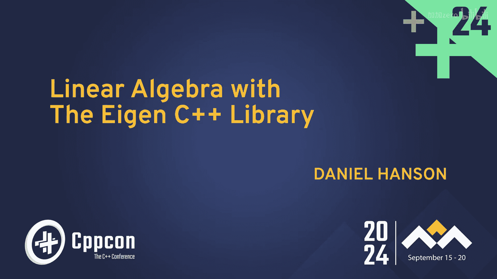
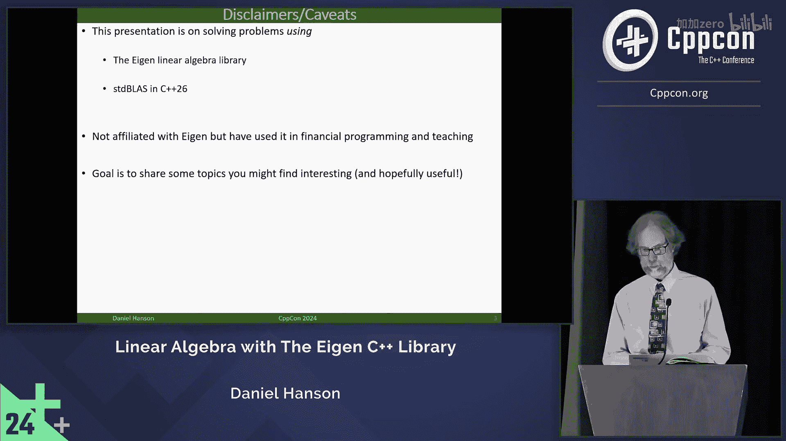
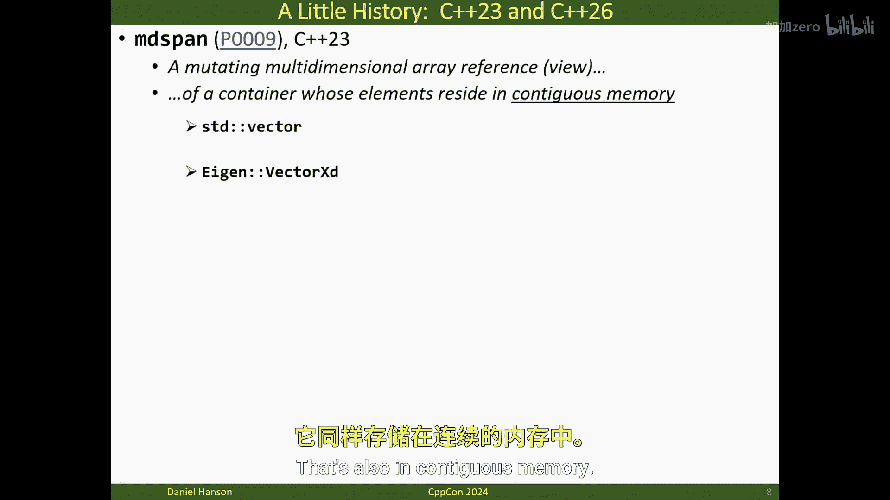

# 001：Eigen库与线性代数简史 🧮

## 概述
在本节课中，我们将学习C++中线性代数的发展简史，并重点介绍Eigen库的基本情况。我们还将简要了解C++26标准中即将引入的新线性代数接口。

## 线性代数与C++的历史回顾

上一节我们介绍了本课程的整体目标，本节中我们来看看线性代数在C++中的发展历程。

让我们回到1998年。当时C++的普及度正在快速增长，特别是在金融编程领域。然而，对于从事量化编程（如期权定价模型和风险管理）的程序员来说，C++缺乏对线性代数的原生支持。

当时的主要选择包括：
*   自行编写矩阵类和运算
*   尝试说服上级购买商业库

## 早期开源线性代数库

以下是早期出现的一些开源线性代数库（非详尽列表）：

**Blitz++库**（2002年11月发布）：
*   提供BLAS（基础线性代数子程序）功能
*   支持矩阵和向量表示、加减法、乘法（矩阵乘矩阵、矩阵乘向量、向量点积）及标量乘法
*   可计算矩阵和向量范数
*   用户需自行实现线性求解器和矩阵分解
*   作者在官网上表示其性能“良好但不出众”
*   最后一次重大更新在2008年

## 新一代线性代数库

随着时间推移，出现了基于表达式模板的新一代库：

**Eigen**（2006年发布）
**Armadillo**（2009年发布）
**Blaze**（2012年发布）

这些库不仅包含之前提到的BLAS功能，还提供了多种分解方法和求解器（类似于Fortran中的LAPACK库）。

## 当前发展：MD Span

现在让我们回到当下，看看C++标准中的新进展。

MD Span（多维跨度）在提案中被描述为：它可以在一个一维连续内存容器上施加一个非拥有的多维数组视图。

例如，你可以对一个`std::vector`施加二维结构来表示矩阵。你也可以使用Eigen的`VectorXd`类型（我们稍后会讨论）。

## 总结
本节课我们一起学习了C++中线性代数支持的发展历程，从早期的匮乏到开源库的出现，再到当前标准的发展。我们了解到Eigen库是其中一个重要且高性能的选择，同时C++26标准也将引入新的线性代数接口。