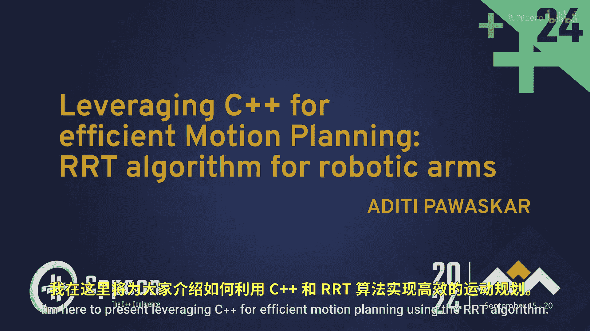
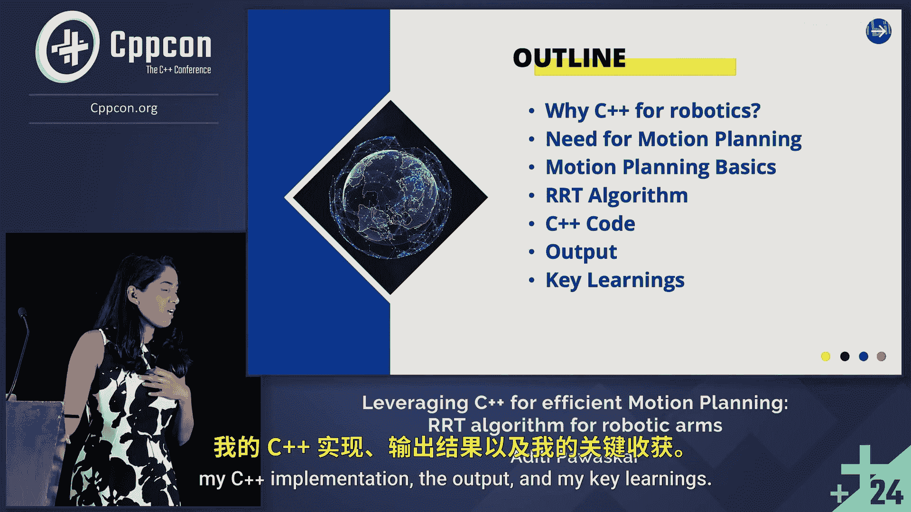
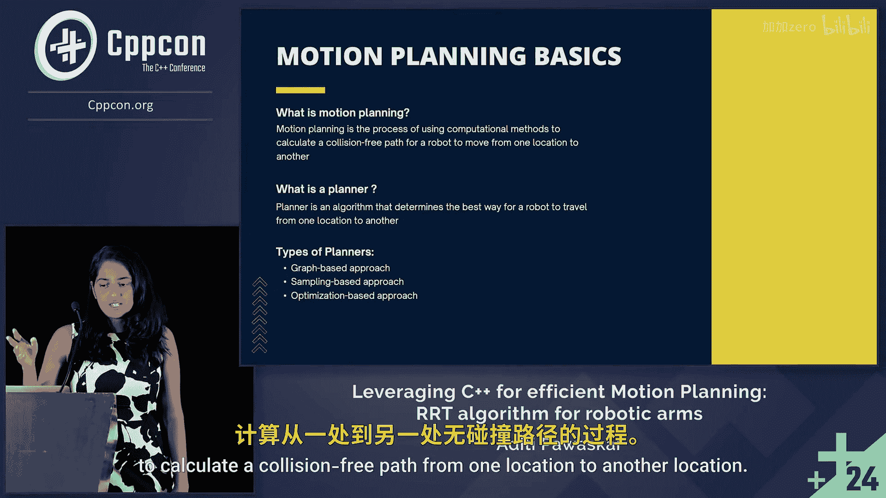
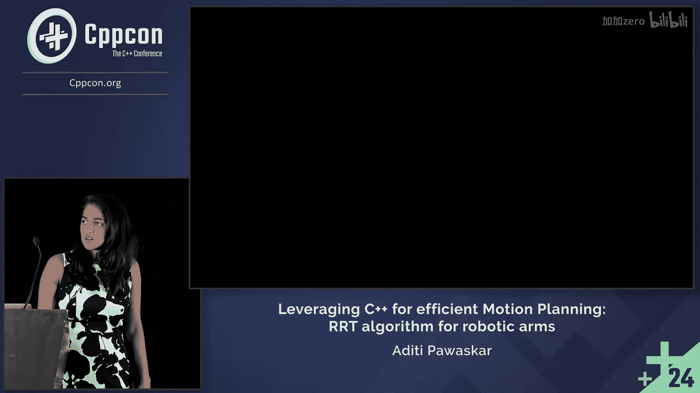
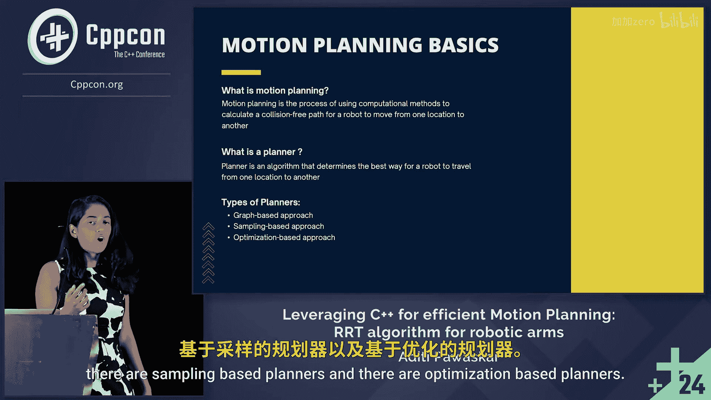
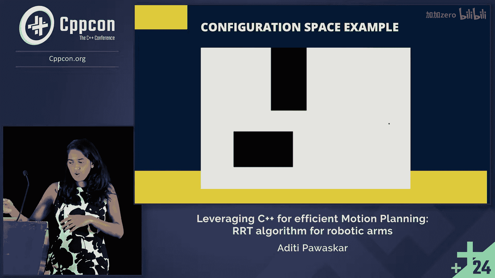
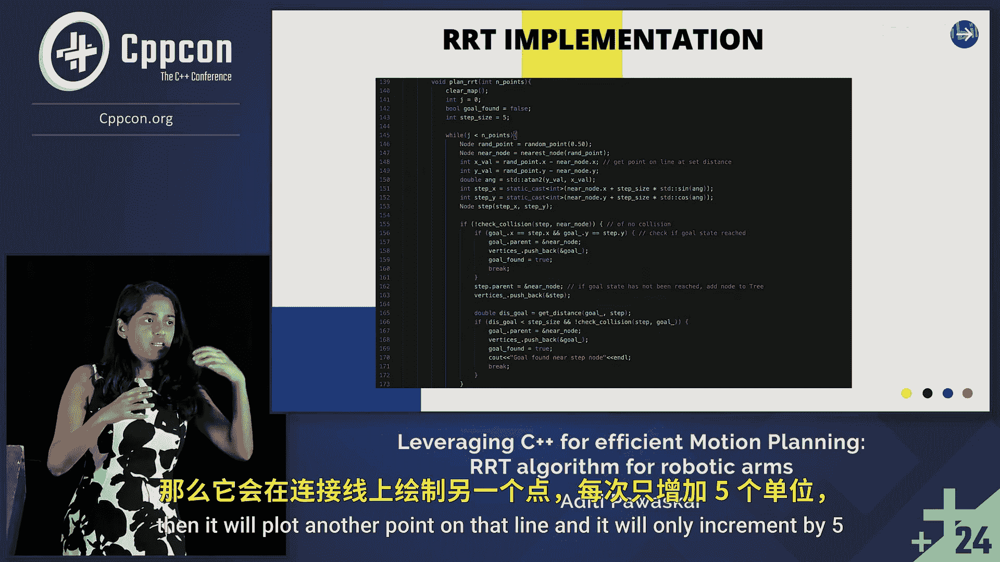

# 002：课程概述与C++优势 🚀

在本节课中，我们将学习如何利用C++高效地实现机器人运动规划，特别是快速探索随机树算法。我们将从C++在机器人领域的优势讲起，逐步深入到运动规划的基础概念和RRT算法的具体实现。

CppCon会议在一个非常棒的场地举行，几乎所有参会者都住在会议酒店。这意味着在会议结束后，人们会出去喝杯啤酒，继续交流。这是一种极佳的体验方式。

大家好，我是Addihi。我今天要分享的主题是“利用C++实现高效运动规划：RRT算法在机械臂上的应用”。作为一名初级工程师，这是我使用C++编写机器人代码的历程。我之前使用其他语言编写代码，但它们不够健壮。现在，我正尝试完全转向C++。让我们先看大纲：首先，为什么机器人需要C++，或者说它为什么有用；其次是运动规划的必要性；运动规划基础；RRT算法；我的C++实现；输出结果；以及我的关键收获。

## C++机器人运动规划：02：为何选择C++？⚡

上一节我们介绍了课程概览，本节中我们来看看为什么C++是机器人领域的理想选择。

众所周知，C++是一种非常快速的语言，因为它编译并生成机器码。它让我们对硬件有更多的控制权，这是我们一直追求的。它更高效，并且可以在不同的设备上运行，可移植性非常好。

## C++机器人运动规划：03：运动规划基础 🤖

了解了C++的优势后，本节我们将探讨运动规划的基本概念。

运动规划是使用计算方法计算从一个位置到另一个位置的无碰撞路径的过程。我们用来计算这个路径的算法被称为规划器。

以下是不同类型的规划器：
*   基于图的规划器
*   基于采样的规划器
*   基于优化的规划器

我们今天要讨论的RRT是一种基于采样的规划器。

## C++机器人运动规划：04：RRT算法原理 🌳

上一节我们提到了RRT是一种基于采样的规划器，本节中我们来深入了解它的工作原理。

RRT用于通过随机构建空间树来高效地搜索路径。我将为你概述这个算法。

它从起点开始，目标是到达目标节点，但不是通过一条固定的已知路径。它的做法是在空间中随机采样点，并尝试构建一棵能通向目标点的树。如果任何树路径最终碰到障碍物，它就会丢弃该路径。之后，它会回溯并找到连接起点和终点的唯一路径。

现在，让我们深入了解一些机械臂运动规划的基础知识。

构型空间是机器人能够达到的所有构型的集合。当我们为高维机器人做运动规划时，我们总是希望通过降低维度来简化问题，以便于编写代码。我们通过定义构型空间障碍物来实现降维。构型空间障碍物是机器人无法达到的所有构型的集合，因为会与障碍物发生碰撞。当然，自由空间是剩余的可达空间。

因此，我们将现实问题转化为包含构型空间障碍物的构型空间问题。现在，我们的规划问题被简化为仅为单个点寻找从点A到点B的路径。

## C++机器人运动规划：05：C++实现与数据结构 🧱

理解了算法原理后，本节我们将开始探讨具体的C++代码实现。

这是我正在使用的构型空间示例，代码中会生成起点和目标节点。

我使用OpenCV来显示输入图像、获取输入并输出结果。OpenCV会获取输入图像，生成一个地图数组传递给算法，然后执行算法的每个步骤，我会在讲解过程中逐一解释。

让我们从使用的基本数据结构开始。

RRT本质上是一种树实现，其中树的每个父节点只有一个子节点，该子节点也只有一个子节点，它不像二叉树那样可以向多个方向延伸。因此，我使用一个`Node`类来存储树中每个节点的对象。它包含x、y坐标、父节点以及指向父节点的指针。

然后，我使用一个节点指针的向量来存储树中所有节点的地址。

这里的一个关键学习点是使用类和面向对象编程。我们都知道什么是面向对象编程，但关键在于何时实际使用类，何时使用私有数据成员来保护并限制对它们的访问。在这个案例中，我将顶点向量作为私有成员，并限制对它的访问，只允许类的成员函数访问该对象。

我使用指针在函数之间传递节点，以提高内存使用效率。

## C++机器人运动规划：06：核心函数详解 ⚙️

上一节我们介绍了数据结构，本节我们将深入探讨每个核心函数。我们采用自底向上的方式来构建代码，因此我将逐一解释每个函数。

`checkCollision`函数检查传递给它的两个点之间是否存在碰撞。这两个点作为两个节点传入。它首先检查目标节点。我们从OpenCV获得的地图基本上是一个二进制地图，它只包含0和1：有障碍物的地方是1，无障碍物的地方是0。因此，它首先检查目标点是否在障碍物上。然后，它检查该节点与目标点之间的每个点。我的做法是使用线性插值。我在那两个点之间进行线性插值，得到它们中间的数百个点，然后检查每个点。如果其中任何一个点发生碰撞，就意味着不应选择该路径。

接下来是随机点生成函数。顾名思义，它在地图矩阵的自由空间中生成一个随机点。这里有一个概念叫做目标偏向。如前所述，如果树是随机构建的，并且图像很大，但你需要朝特定方向前进，可能需要很长时间才能到达目标。因此，我们引入目标偏向。这意味着，如果你的目标偏向是10%（即0.1），那么有10%的时间它会直接选择最终目标节点作为目标点，以便朝那个方向尝试。其他时间，它会找到一个随机节点并选择它。

下一个是最近节点函数。一旦我们找到了一个随机节点并选择了它，我们需要找到将它连接到树上的位置。我们的做法是：遍历树中的所有点，尝试找出哪个点与新节点之间的距离最小，那个点就是最近节点，我们返回该值。

现在来到RRT的实现。正如我解释过的，这个算法首先生成一个随机点，检查碰撞，找到树中可以连接到该点的最近点，然后连接它们。但RRT只以固定步长延伸。它总是连接点。但如果新点距离我们的最近节点有15个单位，而我们的步长是5个单位，那么它将在那条路径上绘制另一个点。

## C++机器人运动规划：07：总结与收获 🎯

本节课中，我们一起学习了如何利用C++实现高效的机器人运动规划。我们从C++在机器人领域的性能和控制优势开始，逐步深入到运动规划的核心概念，特别是RRT算法。我们探讨了如何将高维的机械臂规划问题通过构型空间降维简化，并详细拆解了用C++实现RRT时涉及的数据结构和关键函数，如碰撞检测、随机采样和节点连接。关键收获包括在实践中应用面向对象编程原则来保护数据，以及使用指针来优化内存管理。通过本教程，初学者可以理解运动规划的基本流程和C++在实现复杂算法时的强大能力。