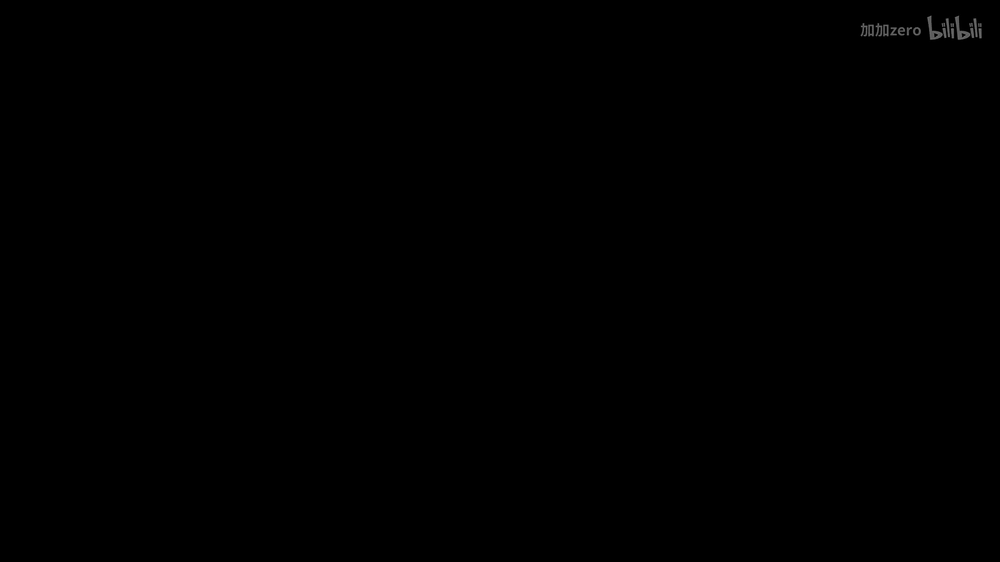
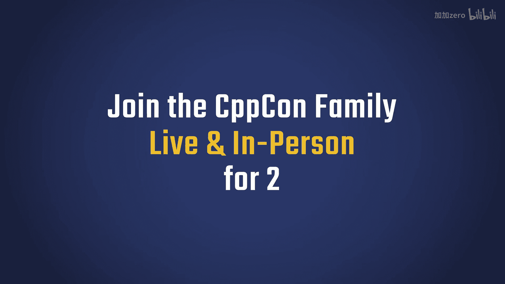
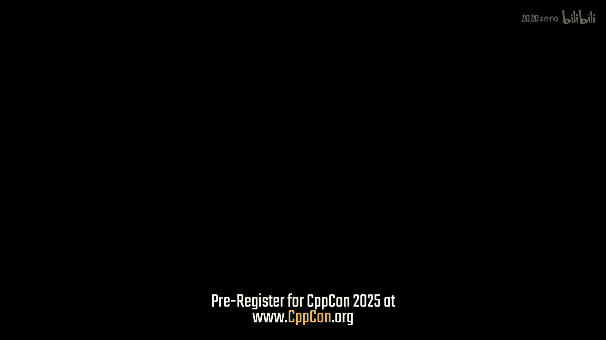
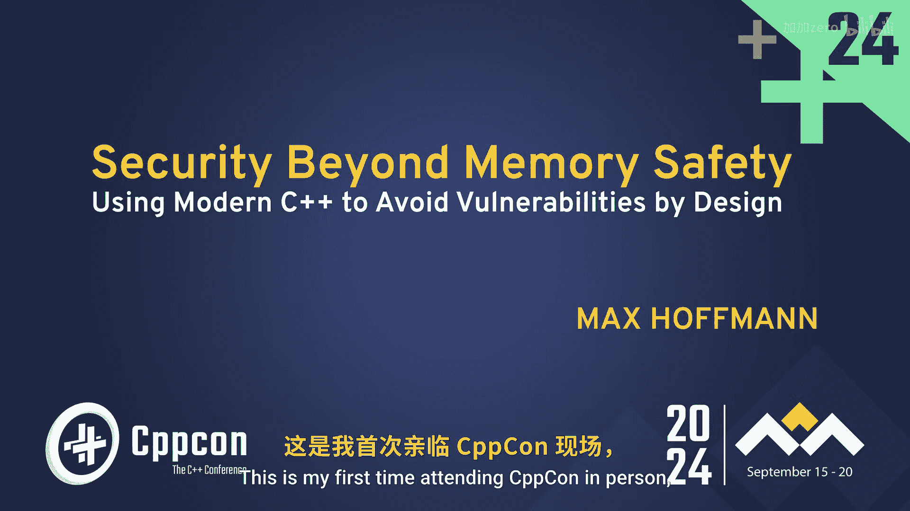
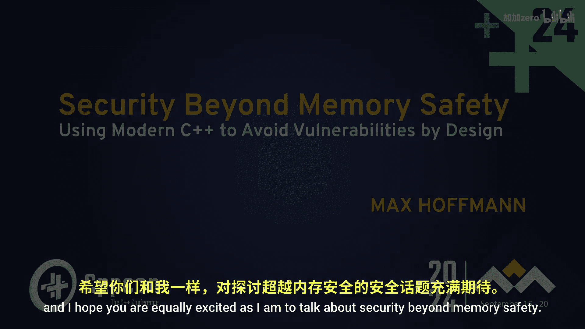
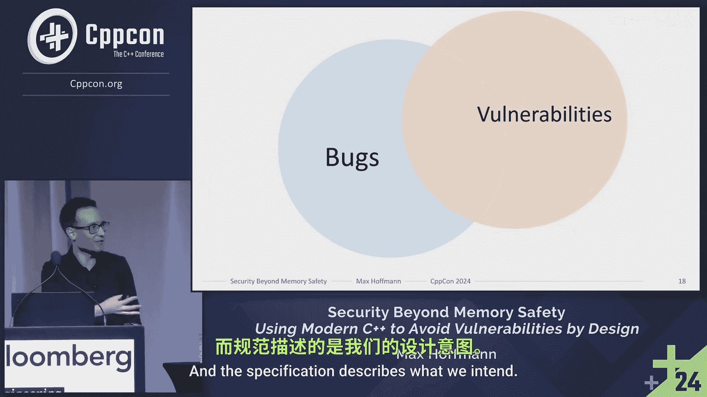

# 004：超越内存安全 - 使用现代C++从设计上避免漏洞 🛡️



在本教程中，我们将探讨如何超越内存安全，利用现代C++的设计理念来构建更安全的软件。我们将首先理解内存安全的现状与局限，然后建立安全设计的基本概念，最后学习如何应用现代C++特性来避免漏洞。







## 内存安全的现状与局限 🔍



上一节我们介绍了课程概述，本节中我们来看看内存安全。目前关于C++的讨论几乎都会涉及内存安全。如果你搜索C++，尤其是新手的体验，你会看到类似“用C++花式给自己脚上来一枪”的描述。虽然这可能源于经验不足，但新手如何首先获得经验呢？也许很多过时的教程是原因之一，但很大程度上要归因于内存安全，或者说内存安全的缺失。对于那些只习惯高级抽象语言、一切由语言负责的开发者来说，进入C++语言是非常困难的。

不仅仅是新手，长期使用C++的人也是如此。你可能见过今年二月白宫的新闻稿，其中提到未来的软件应该是内存安全的。因为使用C++构建产品的用户也关心内存安全，毕竟很多漏洞都与此相关。但更重要的是下面这句话：**“解决许多最严重网络攻击的根本原因”**。这正是我更感兴趣的地方。

让我们看看存在哪些攻击。这是常见弱点枚举（CWE）的Top 25列表。我不希望你阅读整个列表，而是关注标题，因为它写着“顽固弱点”。他们定义“顽固弱点”为过去五年中，每次Top 25漏洞列表都出现的15个弱点。他们分析这个列表后指出，在这15个弱点中，有5个与内存安全相关。所以占了三分之一，这是一个相当大的比例。

这不仅仅是学术结构。就在最近，2024年8月14日，有一个影响Windows的零点击TCP/IP RCE漏洞。Windows IPv6栈中的一个整数下溢导致了缓冲区溢出，并允许任意代码执行。攻击者只需向你的机器发送几个IPv6数据包就能完全控制它。这是由于内存不安全造成的。

那么，直接使用Rust，一切就都好了，对吗？问题在于，即使我们想用Rust做所有事情，目前也做不到。如果你从事嵌入式开发，其他平台的编译器还不成熟。如果你有一个数百万行代码的庞大代码库，你不可能将其转换为Rust，成本太高了。此外还有人员培训等问题。

在C++内部，我们也知道投入了很多努力，并且不是最近才开始的。我们有C++核心准则，它们已经存在很长时间，专注于安全性。从C++11开始，我们有了智能指针等特性。我们有了标准范围库，帮助我们减少错误，避免这些问题。现在，C++26将引入未定义行为消毒剂，这将是一个巨大的改进。甚至在C++生态系统周围，如Cppfront、Carbon、Circle等，也有很多旨在解决内存安全问题的活动。

因此，在本教程的剩余部分，让我们假设内存安全这个热点问题已经解决，或者至少我们无需再为此担忧。有很多聪明人正在研究这个问题，希望他们能找到解决方案。但解决方案尚未到来。我们仍然需要思考如何与现在、过去和未来编写的代码一起工作，以实现超越内存安全的安全性。因为即使我们现在修复了所有内存安全问题，我们的软件仍然不会安全。从数字来看，三分之一的漏洞与内存安全相关，但还有更多其他问题。

为了说明这一点，2015年有一个著名的吉普车黑客事件，黑客能够远程控制多辆吉普车，并完全启动或完全禁用刹车，无需任何交互。这导致克莱斯勒召回了140万辆汽车，想象一下这个成本。今年还有一个有趣的例子，一篇名为《我是如何黑掉我的车》的博客文章。作者想在现代汽车的信息娱乐系统上安装自定义固件，进行了一些逆向工程，发现更新是经过签名的。他们没有私钥，无法签名。于是他们进一步逆向工程，找到了用于验证的公钥，然后去谷歌搜索这个公钥。第一个匹配结果是一个OpenSSL教程。这个密钥是直接从教程中复制粘贴的，而教程里当然也写了私钥。这导致了灾难性的后果。

## 关于演讲者与安全定义 👨‍💻

这个例子正是激励我的原因。大家好，我是Max Sofman，来自德国。与在座的许多人不同，我根本没有学过计算机科学。我一开始就在波鸿鲁尔大学学习网络安全，这是该领域的领先学府之一。我还在那里攻读博士学位，并与马克斯·普朗克研究所合作。我目前仍作为外部讲师在那里任教，向下一代传授安全知识。除此之外，我在IA（博世的一家子公司）担任安全经理，我们为汽车行业编写软件，我负责所有车载核心安全产品的安全管理工作。我处理从建立流程、进行设计和架构及代码的安全审查，到处理漏洞等所有事务。需要声明的是，我不是受雇主派遣来这里的，因此我表达的观点是我个人的，不一定是IA的观点。

现在让我们谈谈安全。如果我做一个调查，询问漏洞和缺陷之间的关系，我猜我们描绘的画面可能是这样的：**漏洞是缺陷的一个子集**。至少这是我经常看到的。但这是完全错误的。让我们看一个简单的真实图片，它显示漏洞实际上与缺陷有重叠，但并非其子集。这是德国波鸿鲁尔大学的一张真实图片。你可以看到这个系统是无缺陷的。栏杆按照规格升降，没有ID卡无法升起。一切正常，但它显然存在漏洞。原因是，缺陷是关于违反预期行为、违反规格说明的，而规格说明描述了我们**意图**做什么。但安全不是关于意图，而是关于**可能**发生什么。我们可以清楚地看到这里的错配。大学也看到了这一点，并通过放置这些石柱来修补漏洞。但显然，他们花了相当长的时间。

那么，他们最初是如何陷入这种不安全的路障安装情况的呢？我们不知道。但一种解释可能是他们拥有一个**不正确的攻击者模型**。因为如果没有一个正确的攻击者模型，关于安全的讨论大多是没有意义的。看看这个，请举手：这个安全吗？这个不安全吗？你无法举手回答，因为你不知道是针对谁。如果这是一个用来阻挡动物的门，我想它是安全的，即使用拉链绑带固定也是如此。

## 建立安全基线：攻击者模型与安全设计 🎯

上一节我们看到了安全与缺陷的区别，本节中我们来看看如何系统地讨论安全。为了论证某物是否安全，我们需要一个共同的基础。这通常通过定义**攻击者模型**来实现。攻击者模型描述了对手的能力、目标和资源。例如，攻击者是本地的还是远程的？他们拥有什么样的计算能力？他们知道系统的哪些信息？

有了攻击者模型，我们就可以定义**安全目标**。安全目标是我们希望保护免受攻击者侵害的属性。常见的例子包括机密性（信息不泄露）、完整性（信息不被篡改）和可用性（服务可访问）。

最后，我们可以分析**安全机制**。这些是系统中为实现安全目标而实施的特定部分。例如，加密提供机密性，数字签名提供完整性，冗余系统提供可用性。

一个强大的安全设计会清晰地阐明其攻击者模型、安全目标，并选择能够在该模型下实现这些目标的机制。现代C++提供了许多工具，可以帮助我们以更清晰、更不易出错的方式实现这些机制。

## 使用现代C++实现安全设计 ⚙️

在建立了安全讨论的基线之后，我们现在可以探讨如何利用现代C++的特性来支持安全设计。核心思想是：**让正确的事情容易做，让错误的事情难以做（或不可能做）**。

以下是现代C++中一些有助于实现这一目标的关键特性：

*   **资源管理**：使用RAII（资源获取即初始化）和智能指针（`std::unique_ptr`, `std::shared_ptr`）自动管理内存、文件句柄、网络连接等资源，消除资源泄漏和双重释放。
    ```cpp
    // 使用 unique_ptr 自动管理内存
    auto data = std::make_unique<char[]>(buffer_size);
    // 无需手动 delete，超出作用域自动释放
    ```

*   **类型安全**：利用强类型枚举（`enum class`）、`std::variant`、`std::optional`等来更精确地表达数据，减少因类型混淆或无效状态导致的错误。
    ```cpp
    std::optional<int> parse_number(const std::string& str) {
        try {
            return std::stoi(str);
        } catch (...) {
            return std::nullopt; // 明确表示无值
        }
    }
    ```

*   **边界安全**：使用`std::array`、`std::vector::at()`（带边界检查）、`std::span`（C++20）以及算法库中的范围操作，避免缓冲区溢出和越界访问。
    ```cpp
    std::vector<int> vec = {1, 2, 3};
    // 安全访问，越界会抛出 std::out_of_range
    int value = vec.at(10);
    ```

*   **不变式与契约**：通过构造函数、私有成员和`assert`（或在未来使用契约）来维护类的不变式，确保对象始终处于有效状态。
    ```cpp
    class SecureBuffer {
        std::vector<char> data_;
        size_t size_;
    public:
        SecureBuffer(size_t size) : data_(size), size_(size) {
            // 构造后不变式成立：data_.size() == size_
        }
        // ... 其他成员函数维护不变式 ...
    };
    ```

*   **避免未定义行为**：使用标准库设施，如`<bit>`头文件中的字节操作、`std::countl_zero`等，代替手动移位和位操作，减少未定义行为风险。

通过将这些特性融入设计，我们可以创建出本质上更健壮、更能抵御各类攻击（包括但不限于内存损坏攻击）的系统。安全不再是事后添加的补丁，而是贯穿于整个设计和实现过程的核心原则。



## 总结 📝

在本节课中，我们一起学习了超越内存安全的重要性。我们首先认识到，即使解决了所有内存安全问题，软件仍可能因设计缺陷而不安全。关键在于区分**缺陷**（违反规格）和**漏洞**（存在可利用的可能性）。为了进行有意义的安全讨论，我们需要建立**攻击者模型**、定义**安全目标**并选择适当的**安全机制**。

最后，我们探讨了如何利用现代C++的特性（如RAII、强类型、安全的容器和算法）来支持**安全设计**，其核心是让正确的用法变得简单，让错误的用法变得困难或不可能。通过将安全思维融入软件开发生命周期的每个阶段，我们可以构建出更可靠、更能抵御复杂攻击的系统。