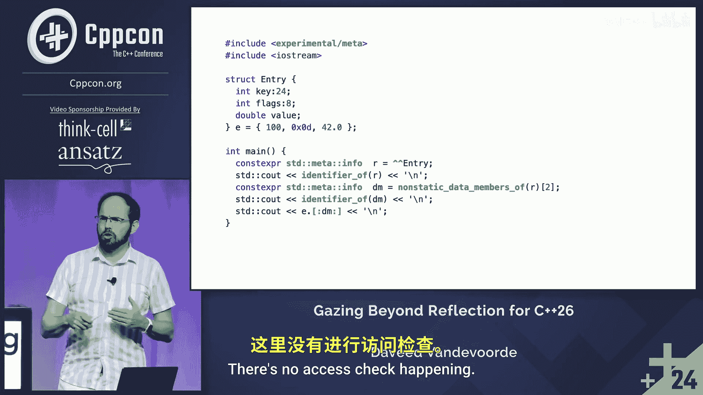

# 006：超越基础反射的展望


在本教程中，我们将学习C++26中即将引入的反射功能，特别是基于核心提案P2996的基础概念，并展望其未来的扩展可能性。我们将了解如何将源代码转换为数据，以及如何将这些数据重新转换回代码结构。

## 反射基础：从源代码到数据

上一节我们概述了课程内容，本节中我们来看看反射的核心概念。反射是指程序能够将自身视为数据的能力，即在编译时检查自身的结构。

P2996提案引入了一个新的运算符，用于将源代码域转换到值域。这个运算符被称为反射运算符，目前拼写为双尖括号 `^^`。

```cpp
// 反射运算符示例
^^std::vector<int>; // 反射一个类型
^^std::cout;        // 反射一个变量
^^std::vector;      // 反射一个模板
^^std;              // 反射一个命名空间
```

应用此运算符后，会得到一个名为 `std::meta::info` 的“黑盒”类型。选择这种不透明的类型设计，是为了给编译器和语言未来的演进留下空间，避免过早定型。

该类型及相关功能定义在新的头文件 `<meta>` 中。伴随该类型，标准库提供了数十个函数，用于分析和拆解程序结构。

以下是 `<meta>` 头文件中部分关键函数的介绍：

*   `is_template(info)`: 判断反射对象是否为模板。
*   `enclosing_namespace(info)`: 获取反射对象所在的命名空间。
*   `enclosing_class(info)`: 获取反射对象所在的类。
*   `substitute(template_info, args...)`: 给定模板反射和一系列模板参数的反射，返回对应特化的反射。

例如，`substitute(^^std::vector, ^^int)` 将返回 `std::vector<int>` 的反射。

## 从数据回到代码：拼接

上一节我们介绍了如何获取程序的反射数据，本节中我们来看看如何将这些数据重新转换回代码。P2996提案中，将反射值转换回源代码的主要机制是拼接。

拼接使用新的标记 `[]`，它是反射操作的逆操作。

```cpp
// 拼接示例
using T = typename []{ ^^int }(); // 拼接出一个类型，等同于 `int`
int x = []{ ^^42 }();            // 拼接出一个表达式，等同于 `42`
```

在需要帮助编译器解析的上下文中（例如在模板中），可能需要使用 `typename` 或 `template` 关键字，其规则与常规模板代码中的规则相同。

拼接可以用于生成类型、命名空间限定符、表达式、变量和函数等任何代码结构。

## 一个简单的反射示例

为了巩固理解，让我们看一个简单的示例。这个示例没有实际用途，仅用于演示反射功能。

```cpp
struct Entry {
    int value : 4;
    bool valid : 1;
    int status : 2;
};

void demo() {
    // 获取 Entry 类型的反射
    constexpr std::meta::info entry_info = ^^Entry;

    // 获取类型的名称并输出（假设有输出流支持）
    // std::cout << name_of(entry_info);

    // 获取所有非静态数据成员的反射
    constexpr std::vector<std::meta::info> members = nonstatic_data_members_of(entry_info);
    // members 现在包含三个 info 对象，对应 value, valid, status

    // 选择第三个成员（status）
    constexpr std::meta::info status_member_info = members[2];

    // 获取并输出该成员的名称
    // std::cout << name_of(status_member_info); // 输出 "status"

    Entry e{};
    // 通过反射编程式地访问成员 e.status
    // e.[] { status_member_info } = 1;
}
```

这个示例展示了如何获取一个结构体的反射，遍历其成员，并编程式地引用特定成员。请注意，示例中注释掉的代码行依赖于尚未完全实现的辅助函数（如 `name_of`）和拼接语法对成员的直接访问，它们用于说明概念。

## 总结与展望

本节课中我们一起学习了C++26计划引入的基础反射功能。我们了解了反射运算符 `^^` 如何将代码实体转换为 `std::meta::info` 类型的值，以及如何通过拼接操作 `[]` 将这些值转换回代码。我们还通过一个简单示例演示了拆解类型结构的过程。



P2996旨在提供一个最小但功能完备的反射基础。在此之上，更多高级功能（例如讲者提到的将枚举值转换为字符串等“炫酷示例”）正在其他提案中探讨，它们有望在C++26之后的标准中打开一个全新的元编程世界。要深入了解所有可用的反射函数和细节，阅读P2996提案原文是最佳途径。