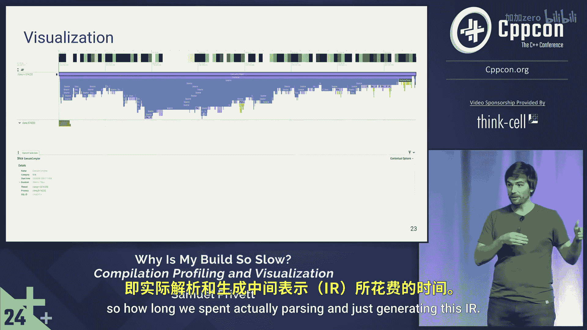

# 007：编译性能分析与可视化 🚀

## 概述
在本节课中，我们将学习如何分析和可视化C++项目的编译过程。我们将探讨编译缓慢的常见原因，并介绍使用工具来识别瓶颈的方法。通过本教程，您将能够理解编译流程，并掌握提升编译速度的基本技巧。

---

## 为什么要关注编译速度？ ⏱️

上一节我们介绍了课程概述，本节中我们来看看为什么编译速度对开发效率至关重要。

开发者在面对长时间编译时，可能会利用这段时间进行其他活动，例如休息或交流。然而，长期来看，频繁的编译等待会打断开发者的“心流状态”。心流状态是指开发者高度专注于编码任务，思维流畅且高效的状态。长时间的编译会破坏“编写代码”与“快速测试”之间的反馈循环，从而影响整体开发效率。

---

## 编译时间增长的趋势 📈

在深入分析工具之前，我们需要理解编译时间通常如何随着项目发展而变化。

代码行数与编译时间通常呈线性关系。编译器需要处理、解析源代码，进行词法分析并构建抽象语法树。因此，代码行数越多，编译时间越长。

只要软件持续有用，项目就会存在增加代码行数的压力。这可能源于修复漏洞、添加新功能等需求。因此，随着时间的推移，代码行数通常会增长，编译时间也随之增加。

如果绘制编译时间随时间变化的图表，它可能呈现波动上升的趋势。虽然期间可能存在因重构或删除无用代码而导致的编译时间下降，但总体趋势是上升的。这类似于“温水煮青蛙”现象——问题可能在变得非常严重之前不易被察觉。

---

## 可视化编译过程 🛠️

了解了问题背景后，本节我们将探讨如何实际可视化编译过程。

如果您使用CMake、Ninja和Clang，您的构建流程大致如下：首先调用CMake生成Ninja构建文件；然后通过Ninja（直接或通过CMake）调用Clang编译各个源文件；最后调用链接器将所有目标文件链接成最终二进制文件。

当Ninja执行这些命令时，它会生成一个`.ninja_log`文件。该文件以毫秒为单位记录了各个构建命令的开始和结束时间、输出文件名以及所用命令的哈希值。这些信息默认保存在构建目录中，是Ninja判断构建是否“脏”的机制之一。

---

## 使用Perfetto进行可视化分析 📊

以下是使用Perfetto工具分析编译过程的步骤。

Perfetto是Google开发的开源交互式追踪查看器。它支持Chrome事件追踪格式（JSON），并具有丰富的功能。您可以在`ui.perfetto.dev`在线使用，或在本地搭建服务器。

1.  **导入日志文件**：将`.ninja_log`文件导入Perfetto，即可获得一个时间线追踪视图。
2.  **解读视图**：视图顶部显示了构建的总时间线。从左到右是构建的顺序。不同的色块代表不同的任务（如编译各个源文件、链接）。这使您能直观地了解构建中各部分耗时。

然而，仅知道某个目标文件编译耗时较长可能不够。幸运的是，Clang（自9.0版本起）提供了`-ftime-trace`标志。该标志会为每个输出的`.o`文件生成一个对应的`.json`文件，其中包含了编译器在各阶段耗时的详细信息。

---

## Clang编译架构与详细追踪 🔍

在查看详细追踪结果前，我们先简要了解Clang的架构。

当您调用Clang时，源代码首先被送入**前端**。前端负责解析代码，构建抽象语法树，并生成LLVM中间表示。然后，**后端**接收IR，将其转换为机器码，最终生成目标文件。

使用`-ftime-trace`生成的JSON文件可以在Perfetto中打开，呈现为火焰图。在火焰图中：
*   最顶层的紫色条代表了编译器执行的总时间。
*   其下的蓝色部分代表了在**前端**所花费的时间。

这种详细的视图帮助我们深入理解编译过程中的具体瓶颈所在。

---

## 总结 🎯

本节课中我们一起学习了C++编译性能分析与可视化的基础知识。我们探讨了编译速度对开发效率的影响，理解了编译时间增长的趋势，并介绍了如何使用Ninja日志和Clang的`-ftime-trace`功能，借助Perfetto工具来可视化编译过程。在接下来的章节中，我们将深入分析导致编译缓慢的具体问题及其解决方案。