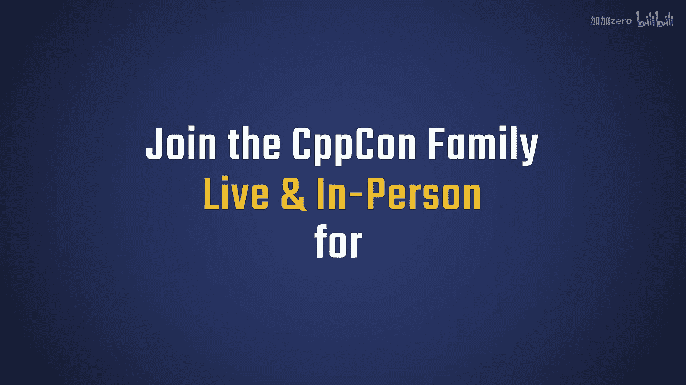
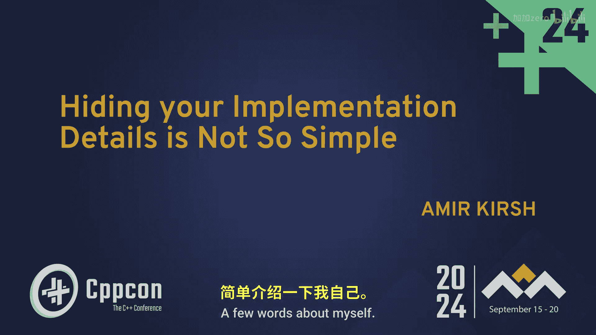
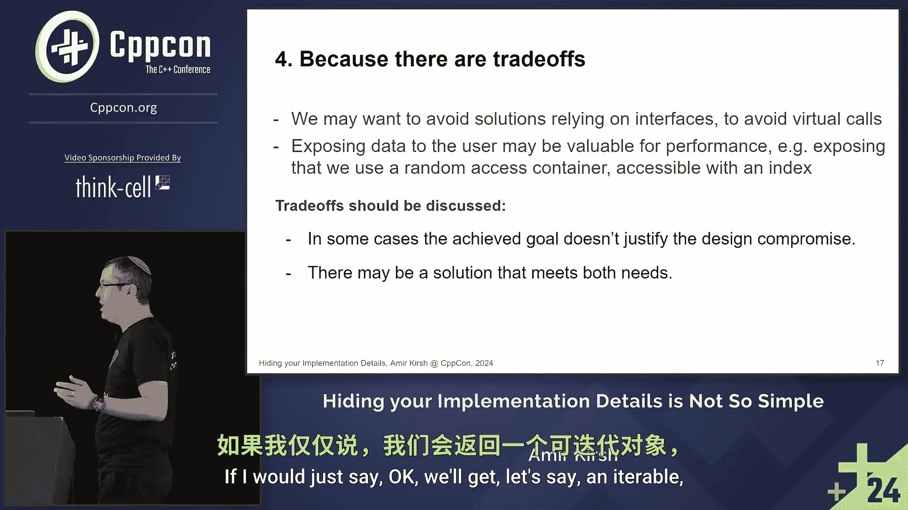

# 008：如何隐藏 C++ 实现细节

在本节课中，我们将学习如何有效地隐藏 C++ 代码中的实现细节。我们将探讨隐藏细节的重要性、实践中遇到的挑战以及具体的解决方案。通过理解这些概念，你将能够编写出更健壮、更易于维护和更安全的代码。

## 概述：为何要隐藏实现细节？

上一节我们介绍了课程主题，本节中我们来看看隐藏实现细节的重要性。

隐藏实现细节与封装原则密切相关。封装通过隐藏用户不应接触的代码部分来创造价值。这带来了多重好处：

以下是封装带来的主要优势：
*   **保护对象完整性**：确保对象内部状态不会被外部代码意外修改。
*   **提升易用性**：只暴露必要的接口，避免用户误用不应调用的函数或访问不应访问的成员。
*   **提高可维护性**：内部实现的更改不会影响外部代码。
*   **便于调试**：可以轻松地在函数内部添加断点，观察实际执行流程，而不是通过直接修改数据成员来追踪问题。

此外，隐藏细节也促进了**解耦**。一旦你隐藏了内部细节，只暴露对方真正需要的东西，你就将接口的使用与具体实现分离开来。所有不必要的细节不被暴露，因此无法被使用，从而减少了依赖关系。我不依赖于我没有暴露的东西。

这同样**便于后续修改**，因为改变外部未知的部分更容易。同时，它**增强了可复用性**，因为代码不会附带太多“噪音”，只包含必要的部分，从而更容易被其他场景复用和重新实现。最后，它**提高了稳定性**，因为我只需要测试我实际暴露的部分，无需测试那些被隐藏的内部实现。

## 挑战：为何隐藏细节并不简单？

既然我们理解了隐藏实现细节的重要性，并且通常也会尝试这样做（例如将成员设为私有），那么这是否足够？我们是否总能做到？实际上，这并不像看起来那么简单。

软件模块化思想的先驱之一 David Parnas 就曾指出，隐藏实现细节比看起来要困难。这在 20 世纪 70 年代是难题，在今天同样具有挑战性。

那么，是什么让这件事变得不简单呢？

以下是几个主要原因：
*   **惰性（或优先级问题）**：有时我们因为要处理其他更重要的事情，或者不确定某个设计是否真的重要，而暂时采用简单直接（但暴露细节）的设计，并打算以后有需要再改。但后期修改往往并不容易。
*   **未意识到暴露了细节**：例如，一个返回 `std::map<std::string, int>&` 的成员函数。虽然 `map` 成员本身可能是私有的，但这个 API 已经暴露了该类内部很可能持有一个 `string` 到 `int` 的映射这一事实。如果未来想改用其他关联容器，或者改变键的类型，修改将非常困难。
*   **技术限制**：有时我们想隐藏，但受限于语言特性而无法做到。例如，一个工厂方法 `create` 用于创建 `Foo` 对象。理想情况下，我们希望将 `Foo` 的构造函数设为私有，强制用户通过工厂创建。但是，工厂内部使用 `std::make_unique`，而 `make_unique` 需要调用构造函数，你无法将 `make_unique` 设为友元。这导致构造函数不得不保持公开，用户仍然可以直接调用它，违背了隐藏构造细节的初衷。
*   **权衡与有意暴露**：在某些情况下，我们可能有意暴露一些信息。例如，一个返回 `std::vector<T>` 的函数，我们可能希望用户知道返回的是向量，以便他们可以直接使用向量的相关方法。

## 总结

本节课中，我们一起学习了在 C++ 中隐藏实现细节的核心价值与主要挑战。我们了解到，良好的封装不仅能保护代码、提升易用性和可维护性，还能促进解耦和代码复用。然而，在实践中，惰性、无意识的信息泄露、语言技术限制以及必要的设计权衡，都会让完全隐藏细节变得困难。认识到这些挑战是迈向编写更优秀 C++ 代码的第一步。在后续的探讨中，我们可以针对这些具体挑战，寻找更巧妙的模式和解决方案。