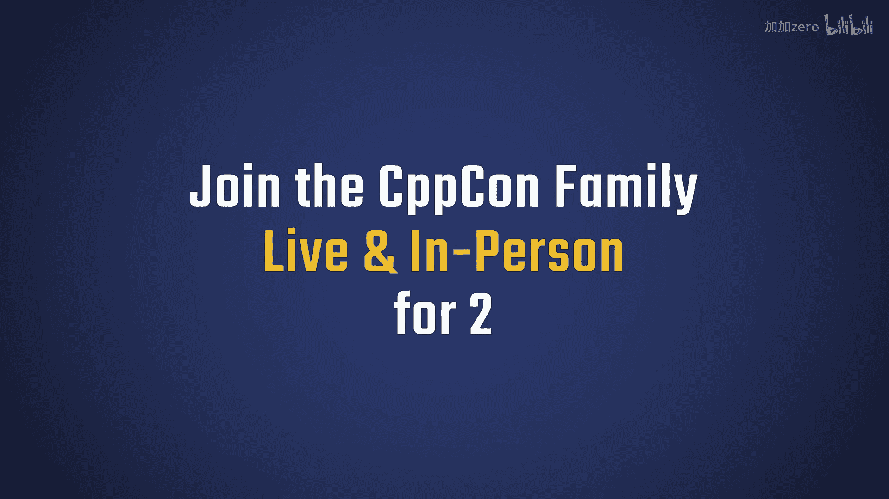
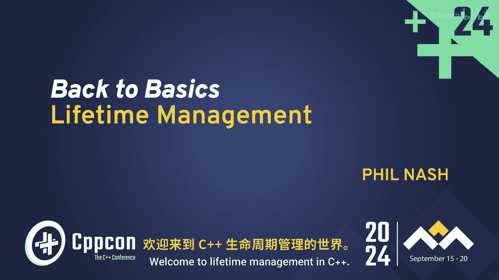
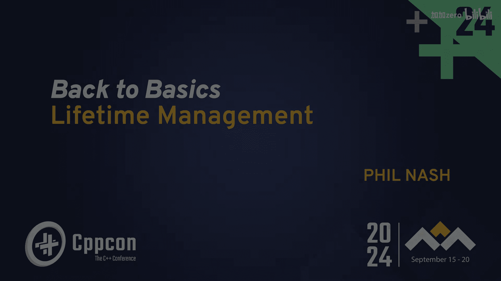
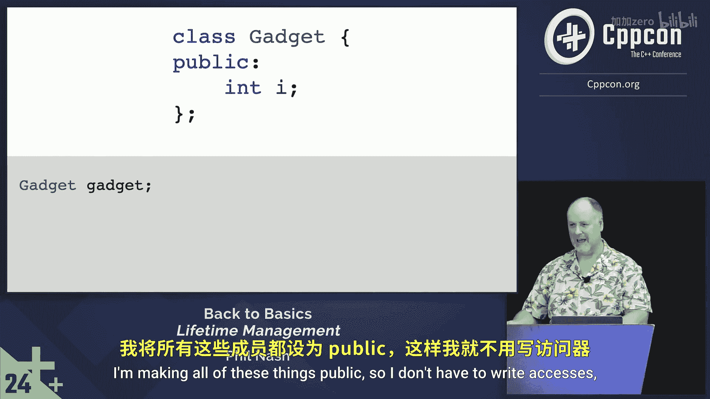

# 011：基础概念与原则 🧠

在本章中，我们将学习 C++ 中生命周期管理的基础概念。我们将从最简单的值类型开始，理解对象从创建到销毁的三个核心阶段，并探讨如何遵循 C++ 的设计原则来编写易于使用且不易出错的代码。

---

走廊里经常发生有趣的讨论。你走出一个会议，大家刚刚共同经历了一场演讲，于是走廊里就会自发地展开关于演讲内容的对话。

欢迎来到 C++ 的生命周期管理课程。这是“回归基础”系列的一部分。如果你是生命周期管理方面的专家，欢迎留下，但请不要打断。这个主题即使在基础层面讲解也颇具挑战性，所以请多包涵。在某些方面，这确实有点矛盾：生命周期管理是 C++ 中较为复杂的领域之一，但同时也是我们所有人都应该相当熟悉并能理解其运作原理的部分。

幸运的是，我们将探讨一些能让它变得更简单的方法。但我想先强调这个警告：C++ 是一门复杂的语言，原因很多，大部分是历史遗留问题，同时也因为它高度关注效率和性能。这些因素与历史交织在一起，共同造就了它的复杂性。生命周期管理正是这种复杂性的一个体现。

然而，有一件事将帮助我们简化理解：默认情况下，C++ 是基于值的语言。它像一门“值优先”的语言。它也支持其他模式，而复杂性正是从这里开始产生的。但如果我们能拥抱 C++ 基于值的本质，它将对我们大有裨益，因为值很简单。

让我们先看一个整数。我们知道如何使用整数。我们可以用一个值初始化它。如果它不是常量，我们可以给它赋一个新值。如果它位于某个作用域内，我们知道在那个作用域结束时，它就消失了。它没有需要管理的内存，你无法再访问它。这很简单，易于推理。这就是我们想要的。

即使是整数，我们也能看到它们经历的几个阶段：构造阶段（我们给它一个初始值）、可能的赋值阶段（我们可能给它赋一个新值），以及它离开作用域的时刻。虽然整数没有实际的析构函数运行，但那里确实存在一个销毁阶段——它变得不可访问。如果其他东西（比如指针或引用）指向它，此时就会出问题，因为它已经不存在了。

这些阶段同样适用于 `std::string` 和 `std::vector` 这样的类型。我们可以构造它们、给它们赋值，当然，在它们的作用域结束时，它们变得不可访问，并且实际上会运行析构函数来完成一些工作。它们都表现为值类型，你可以像值类型一样推理它们，尽管在底层有更复杂的事情发生。这些就是我们要遵循的模型。

到目前为止，这些内容都不应让人感到意外。即使是绝对的初学者，这可能也非常熟悉。这正是关键所在——我们希望这些行为是符合直觉的。

有多少人知道《Effective C++》这本书？这是一本较老的书（C++98 时代），但其中仍有很多智慧。我记得书中有这样一句话：“让类像 `int` 一样工作”。我们刚刚讨论了 `int` 如何工作，以及 `string` 和 `vector` 如何以相同的方式建模。这是一条非常好的建议。对于作者 Scott Meyers 来说，这非常重要，以至于在续作《More Effective C++》中他重复了这句话。

我想引用书中的几段话，因为它们值得深思：
*   **最小惊讶原则**：我们知道 `int` 如何工作，因此很大程度上也知道 `string` 和 `vector` 如何工作。我们对它们管理自身的方式不会感到惊讶。
*   **认识到人们会做任何他们能做的事**：他们会抛出异常，会将对象赋值给自身，会在给对象赋值前就使用它们。我相信我们都见过这些情况。我们需要能够处理这些事情。
*   **让你的类易于正确使用，难以错误使用**。这真是金玉良言。

但要真正遵循这些建议，我们需要真正理解生命周期如何运作，以及如何使用 C++ 提供的工具来管理它们。

智能指针也遵循相同的模式。指针本身也是值类型。指针本身只是一个地址，一个数字。它本身并不隐含所有权，所有权是我们附加在它之上的概念。记住这一点对我们也有帮助，因为指针是让事情变得棘手的原因之一。

所以，三个核心阶段：构造、赋值、析构。这相当简单。但接下来事情会变得有点混乱。

处理这些阶段有 8 种不同的方式，它们可以稍作细分：
*   **构造**：包括默认构造函数和自定义构造函数（即传递参数来初始化成员变量）。可以将默认构造函数视为自定义构造函数的特例。
*   **赋值**：这里出现了“拷贝”和“移动”的维度区分，包括拷贝赋值运算符和移动赋值运算符。
*   **析构**：只有一个析构函数，再次变得简单。

除了自定义构造函数，所有这些都被称为**特殊成员函数**。它们具有特殊的属性，最主要的是：如果你给编译器留出空间，它通常会为你自动生成这些函数。这是一件好事，也是我们希望发生的。但我们需要理解它是如何发生的，以及它生成这些函数时做了什么。

在理想情况下，我们不应该自己实现任何这些函数，这就是我们追求的“黄金标准”。当我们无法达到这个标准时，就需要知道如何自己实现它们。这就是警告所在，也是复杂性开始的地方。但请记住，一旦我们翻过这个坎，另一边将是平坦大道。

---

上一节我们介绍了生命周期管理的核心阶段和原则。本节中，我们将深入一个具体的例子，看看当类包含指针成员时，默认行为会带来什么问题，以及为什么理解构造函数的细节至关重要。

让我们深入兔子洞。回到我之前介绍的包含指针的 `Gadget` 类型。

最简单的类当然是空类。我们可以将其作为值类型在栈上实例化。它什么都不做，但可以工作，并且易于推理，只是没什么用。

所以让我们给它一个成员：一个整数。我们知道整数如何工作，因此我们现在也知道 `Gadget` 类型如何工作，因为它实际上继承了整数能做的事情。这是什么意思呢？

让我们问问 `Gadget` 它的整数值是多少，并尝试将其打印到流中。思考一下这实际上会做什么。你很可能猜对了：是的，这是未定义行为，因为我们没有初始化那个整数。我们知道整数的工作原理：如果我们不给它们初始值，它们就从内存中获取垃圾值。类本身并不会自动改变这一点。

编译器在这里为我们生成了一个构造函数，一个默认构造函数。它实际上调用了 `int` 的默认构造函数，但 `int` 没有默认构造函数，所以这实际上是一个空操作。

（为了节省版面，我将所有成员都设为 `public`，这样我就不用写访问修饰符了。）

---

在本章中，我们一起学习了 C++ 生命周期管理的基础。我们从最简单的值类型（如 `int`）出发，理解了对象生命周期的三个核心阶段：构造、赋值和析构。我们探讨了让自定义类型像内置类型一样工作的重要性，并引用了“最小惊讶原则”和“易于正确使用，难以错误使用”等关键设计思想。最后，我们通过一个包含未初始化成员的简单类，看到了默认构造函数可能带来的问题，为后续深入探讨特殊成员函数的自动生成与手动实现打下了基础。