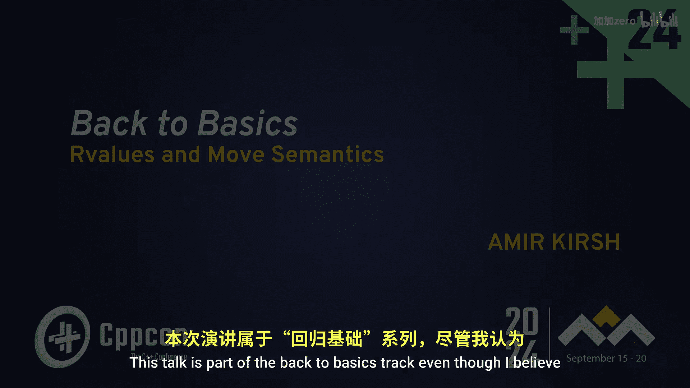
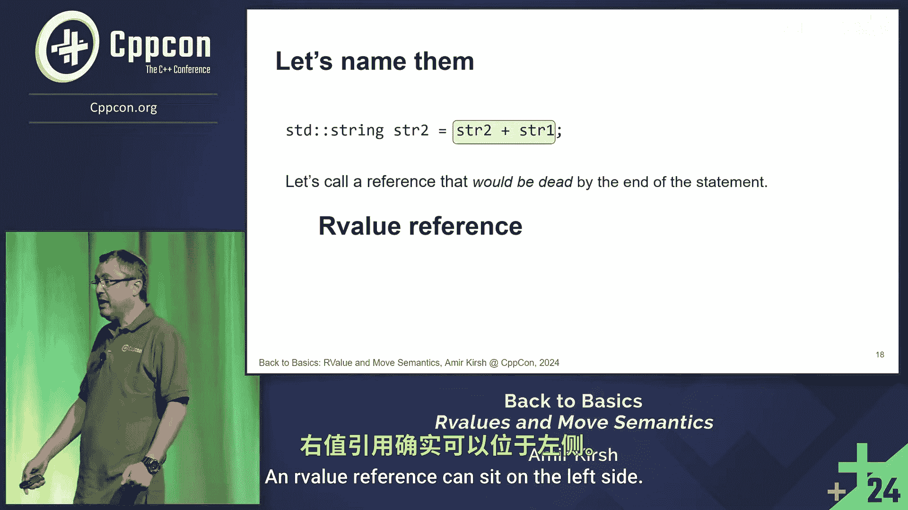

# 015：右值与移动语义 🚀


在本节课中，我们将要学习C++中一个核心且强大的特性：右值（Rvalues）与移动语义（Move Semantics）。我们将从理解其动机开始，逐步探讨其概念、术语以及如何在实际编程中应用它们，以提升代码效率。




## 动机：为何需要移动语义？💡

移动语义是C++11引入的一项重要特性。它的核心目标是避免不必要的对象拷贝，从而提升程序性能。让我们通过一个例子来理解其必要性。

假设我们有一个代表“哥斯拉”（Godzilla）的类，它是一个“大对象”，复制成本很高。我们有一个工厂函数来创建它：

```cpp
Godzilla createGodzilla() {
    Godzilla localGodzilla; // 在函数内部创建一个局部哥斯拉
    // ... 一些初始化操作 ...
    return localGodzilla; // 按值返回
}

int main() {
    Godzilla g1 = createGodzilla(); // 情况1：初始化
    Godzilla g2;
    g2 = createGodzilla(); // 情况2：赋值
}
```

在C++11之前，上述两种情况通常都会触发拷贝构造函数或拷贝赋值运算符，将函数内部创建的 `localGodzilla` 完整地复制到 `g1` 或 `g2`。然而，函数内部的 `localGodzilla` 是一个临时对象，在函数返回语句结束后就会被销毁。

**核心问题**：我们能否不进行昂贵的复制，而是“接管”这个即将销毁的临时对象的资源（例如其内部动态分配的内存）？答案是肯定的，这就是移动语义要解决的问题。

另一个常见场景是向标准库容器中添加元素：

```cpp
std::list<Godzilla> monsterList;
Godzilla tempGodzilla;
monsterList.push_back(tempGodzilla); // 情况A：传递左值
monsterList.push_back(Godzilla()); // 情况B：传递右值（临时对象）
```

在情况B中，我们直接向 `push_back` 传递了一个临时创建的 `Godzilla` 对象。在C++11之前，容器内部也会对其进行拷贝。有了移动语义，容器就可以“移动”而非“拷贝”这个临时对象的资源，从而避免不必要的开销。

**总结动机**：移动语义允许我们在对象是“将亡值”（即将被销毁的临时对象）时，将其资源“移动”到新对象，从而避免昂贵的复制操作。

## 核心概念：左值 vs 右值 📚

上一节我们介绍了移动语义的动机，本节中我们来看看如何区分“可以移动的对象”和“不可以移动的对象”。编译器通过“值类别”来识别它们。

考虑以下两个字符串操作的例子：

```cpp
std::string s1 = "Hello";
std::string s2 = "World";

std::string s3 = s1; // 情况1：s1 是左值
std::string s4 = s1 + s2; // 情况2：`s1 + s2` 的结果是右值
```

*   **情况1 (`s1`)**：`s1` 是一个有名字的变量，在赋值语句结束后它仍然存在并可被后续代码使用。我们**不能**移动它的资源，否则 `s1` 会处于无效状态。
*   **情况2 (`s1 + s2`)**：表达式 `s1 + s2` 的结果是一个临时的、无名的字符串对象。在完成对 `s4` 的初始化后，这个临时对象就会被销毁。我们**可以且应该**移动它的资源。

C++ 为这两种情况赋予了不同的术语：
*   **左值 (Lvalue)**：像 `s1` 这样的表达式。它代表一个持久存在、有标识（通常有地址）的对象。可以出现在赋值运算符的左边。
*   **右值 (Rvalue)**：像 `s1 + s2` 这样的表达式。它代表一个临时的、即将销毁的值。传统上通常出现在赋值运算符的右边。

**重要澄清**：
1.  “左值”并不意味着它必须出现在赋值号左边（例如 `x = y` 中的 `y` 也是左值）。它意味着它具有出现在左边的“潜力”，即代表一个持久对象。
2.  “右值”同样可以出现在某些赋值操作的左边（例如移动赋值）。其核心特征是“临时性”和“资源可被接管”。

编译器能够自动识别表达式的值类别。在C++11中，我们通过引用类型来利用这种识别：
*   `T&` 是 **左值引用**，只能绑定到左值。
*   `T&&` 是 **右值引用**，只能绑定到右值。

正是通过右值引用，我们得以编写特定的函数（如移动构造函数和移动赋值运算符）来高效地“接管”临时对象的资源。

## 总结 🎯



本节课中我们一起学习了C++中右值与移动语义的基础知识。我们首先探讨了移动语义出现的动机——为了优化性能，避免对临时对象进行不必要的深拷贝。接着，我们学习了区分“可移动对象”与“不可移动对象”的关键：**值类别**。左值代表持久的、有标识的对象，而右值代表临时的、资源可被安全接管的值。理解左值和右值是掌握移动语义、完美转发等现代C++高级特性的基石。在后续的课程中，我们将学习如何具体实现移动构造函数和移动赋值运算符。