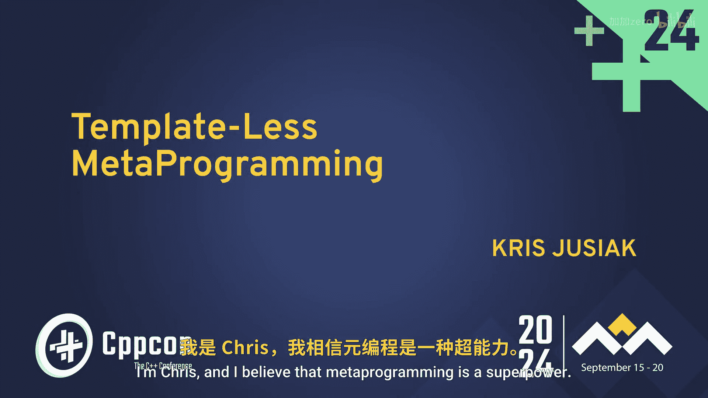

# 017：无模板元编程入门 🚀

在本教程中，我们将学习C++中一种被称为“无模板元编程”的技术。我们将探讨传统模板元编程的挑战，并了解如何利用现代C++特性编写更简洁、更易读的元程序。课程将从概述元编程的重要性开始，逐步深入到具体的技术实现。

---

C++社区联系紧密，举办此类活动非常棒，每个人都能沉浸其中，在社交和专业层面相互交流，同时也能学习到优质内容。

感谢各位的到来。我是Chris，我相信元编程是一种超能力，今天我将尝试与大家分享其中的一部分。

我并没有说“模板元编程”。但我们会谈到它。在开始之前，我们先明确一下今天要讨论的内容。

模板元编程是指在编译时生成代码的能力。实现这一目标有多种方式。其中一种方式被C++选择，这就是为什么我们从一开始就有模板，这也是本幻灯片上的第一个“T”。但这并不是C++真正困难或错误的地方。

`std::vector<T>`，以及特化模板，这些完全没问题。这是我们的设计。然而，我们今天要讨论的，也是本次演讲的主题，是这些类型列表（`Ts...`）和这些元函数，即操纵类型、从类型中提取信息的能力。这其中蕴含着巨大的力量，我将尝试展示并改进它。希望这听起来令人兴奋。

在深入之前，我想做个调查。请举手，如果你认为C++中的模板元编程太难或者可以变得更简单。好的，我注意到这些幻灯片是预编译的，所以我已有答案。我完全同意它很难。但另一方面，我们为什么要处理所有这些？我们为什么要做这些“技巧”？

在座有多少人认为模板元编程实际上很强大？谢谢。我们站在同一阵营。我相信编译时元编程可以变得更简单、更强大，同时还能获得清晰的错误信息和快速的编译速度。谁想要这样？每个人。抱歉，这毕竟是C++，但我们会看看能走多远。

在展示示例之前，我想指出，Sean Baxter在C++ Now 2022上做了一个关于C语言元编程的主题演讲。她是Circle编译器的作者，她提到“更好的元编程特性造就更好的库”。我认为这是关于元编程的一个非常重要的观点。元编程的重点不在于你的生产代码，而在于让库变得更好。C++在构建库方面很出色，但要实现更精妙的细节、更好的接口和更高性能，就需要元编程，因为我们有模板。如果没有强大的工具来做这件事，就会很困难。

那么，让我们开始吧。我将展示一些模板元编程被使用以及如何使用它的例子。

我们不必看得太远。让我们看看标准库。这是我从标准库中拿来的一个`variant`实现。它有一个`find_index`函数，我们有一个类型`T`和一个类型列表`Ts...`，我们想获取与`T`匹配的类型在`Ts...`中的索引。原理上很简单，但在元编程世界里有点困难。有很多解决方案，我不会一一展示，但你必须足够聪明才能实现它。这是例子之一，标准模板库中充满了这样的例子。

另一个例子。谁喜欢使用`tuple`？我相信你的编译时间正在爆炸式增长。`std::get<2>`在C++26引入`[]`索引之前，通常是通过模板递归实例化实现的，这是进行模板元编程最糟糕的方式。这是来自标准库的例子。

另一个来自微软STL的例子。即使是`RAII`也包含模板元编程。你必须强制类型相同，还有无数其他例子，我不会深入探讨，但你应该能理解，STL充满了模板元编程，因为它是一个库，而元编程赋予了库力量。

但有一个观察结果。标准模板库本身并没有一个标准的模板元编程库。我不知道你们以前是否注意到这一点，但这是事实。所有这些标准库的实现者，他们的实现非常强大，但要做得正确却非常棘手。他们需要很多“魔法”才能实现。顺便说一下，曾经有提案要将元编程库加入语言，由Boost.Mp11的作者Peter Dimov提出，但最终没有通过，因为C++正试图朝着不同的方向发展，我们稍后会讨论。这是一个非常有趣的观点。我认为，观察到STL本身有大量的模板元编程，却没有提供实际执行它的工具，因此实现者必须处理内部机制和技巧来实现它，这一点很重要。

另一件我非常关心的事情是性能。元编程能提升性能。

让我们看一个简单的`struct`内存布局的例子。`sizeof(MyStruct)`会是多少？答案是12。对于那些不理解的人，你可以查阅标准。但关键是，这个布局并不最优。如果你遵循数据驱动开发或数据导向设计，你可能会感到惊讶。如果我们有一个元函数，例如`pack`，它能为我们打包结构体，即解构`struct`然后重新打包，这不是很好吗？这由模板元编程驱动。如果你有反射，我们甚至可以从结构中获取字段名称。在反射之前，我们可以获取打包后的`tuple`，但有了反射，我们也能获取名称。这非常强大，能给我们带来更好的缓存利用率等好处。

性能很重要。我还有一张关于它的幻灯片，因为我非常关心它。

我主张，有远比我们想象的更多的事情可以在编译时完成，而这一点尚未被充分利用。我相信这是因为我们目前拥有的工具还不够。

例如，让我们看看这些协议。我们可能想添加一个运行时查找，将`string_view`匹配到相应的协议并返回。这是非常简单的事情。但如果你深入实现和开销，你会发现需要大量代码才能实现。但我想指出的是，如果你有基于内省的政策设计（由Andrei Alexandrescu设计），你可以根据你的关注点做出选择。你关心性能、关心大小、关心内存，你可以自己做出选择。

为了稍微“吓唬”一下大家，我将展示一些汇编代码，因为我认为这非常强大。这个“魔法查找表”，如果你对它的工作原理感兴趣，可以在会后找我，我会展示给你。请注意，顶部的第一个实现甚至没有查找表。它没有表。所有东西都在寄存器中。这是你能得到的最小的哈希表。没有查找，没有比较，什么都没有。它只是用几条指令就从协议中获取了信息。而另一个实现则需要额外的查找表，因此可能会有缓存未命中等问题。我认为这很强大。

最后，作为一个让你对元编程感到兴奋的例子，我想提一下状态机。我喜欢状态机，我认为它们非常强大。但要高效地实现它们有点困难。如果你使用`switch-case`和基于`variant`的解决方案，你会得到这种开销。但想象一下，我们有一个没有实际值的状态。