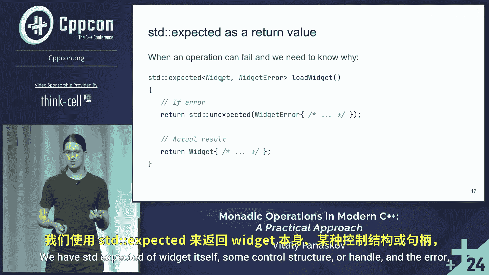

# 019：概述与动机 🎯

在本教程中，我们将学习现代C++中的单子操作，特别是`std::optional`和`std::expected`类的实际应用。我们将通过简单的示例，了解它们如何帮助处理可能失败的操作，并编写更健壮、更清晰的代码。

## 课程概述

大家好，欢迎来到关于单子操作的课程。今天，我们将讨论这种技术的实际应用方法。

首先让我介绍一下自己。我的名字是Vitaly，我从事C++开发已经相当长一段时间了，拥有超过10年的经验，开发过从框架库到VFX和地理空间系统等各种项目。目前，我在一家挪威公司Remarkable担任高级软件工程师，我们的主要产品是一款用于记笔记、画草图和制作图表的墨水平板电脑。

作为今天的议程，我们将简要讨论两个支持单子操作的类：第一个是`optional`，第二个是`expected`。本次课程主要关注`expected`的单子操作。然后，我们将简要讨论常见的用例以及一些技巧和窍门。这里不会涉及任何理论，甚至不会涉及范畴论。示例将全部来自C++，没有Haskell或其他函数式语言。我将展示大量实际示例。

## 技术背景

我们使用C++20开发产品，使用vcpkg作为包管理器。我们使用了30多个不同的第三方库，如ranges、fmt、expected和Catch2用于测试等。在设备上，我们使用Qt进行UI开发。

一个有趣的部分是它有两个“世界”：第一个是C++世界，我们在这里定义业务逻辑、与第三方库集成以及一些系统级或非平台特定的抽象。另一个是QML代码，QML是一种用于描述UI的声明性语言。在这部分代码中也可以有一些逻辑，比如与动画、状态相关的逻辑等。这两个部分之间存在连接，因为从C++代码可以创建和操作QML对象，而从QML对象可以使用以某种方式暴露的C++对象。

这种差异是我决定讨论这个特定系统的动机之一，因为在错误处理、代码工作方式以及范式方面，QML和C++完全不同。例如，在QML中，将所有错误、警告等信息打印到用户输出中是完全可以接受的默认行为，而在C++中，我们可以使用单子、抛出异常和错误代码等多种方式。

## 核心类介绍

上一节我们介绍了课程的整体背景和动机，本节中我们来看看我们将要使用的两个核心类。

### std::optional

`std::optional`最接近的抽象可以被认为是某种类型和布尔值的配对（尽管并非所有实现都如此）。它可以包含一个值，也可以什么都不包含。

我们可以把它想象成一个盒子。例如，这里有一个`optional<int>`盒子，我可以在里面放一个值，比如`42`，也可以什么都不放（`nullopt`）。然后我们可以从这个盒子里提取值。

我们通常在操作可能失败，但我们不关心失败原因时使用`optional`。例如，`std::vector`类的`find`方法可以返回一个`optional<iterator>`。如果元素未找到，则返回一个特殊的`nullopt`对象，表示结果的缺失；如果元素存在，则返回其迭代器。在这个特定案例中，我们并不关心失败的具体原因。

有时，我们也使用`optional`来传递一些额外的可选参数。例如，这里有一个解析URL的函数，它有一个可选的配置参数。如果提供了配置，我们就根据它来解析URL；如果没有，我们就使用一些默认设置。

从C++26或下一个标准开始，`optional`将成为一个范围视图。但有一个区别：其内容的生命周期与这个范围对象本身的生命周期绑定。这是一个有趣的功能，因为它将是一个包含零个或一个元素的范围。

### std::expected

`std::expected`与`optional`非常相似，但有一个关键区别：它可以包含一个类型为`T`的值对象，或者一个类型为`E`的错误对象。你可以把它想象成`std::variant<T, E>`或一个标签联合。

如果我们有一个`expected<int, Error>`盒子，默认情况下我们放入一个值。我们也可以放入一个错误（稍后会展示如何操作），然后我们可以从盒子中提取它。

我们在操作可能失败，并且我们可能想知道失败原因时使用它。例如，这里有一个加载小部件的函数，它返回一个`std::expected<Widget, LoadError>`。如果加载成功，我们得到小部件；如果失败，我们得到一个具体的错误对象，告诉我们哪里出了问题。

## 总结

本节课中我们一起学习了现代C++中单子操作的基本概念，重点介绍了`std::optional`和`std::expected`这两个类。我们了解了它们的设计初衷、基本用法以及适用场景：`optional`用于不关心失败细节的场景，而`expected`用于需要明确错误信息的场景。我们还了解了它们在实际项目（如结合C++和QML的UI系统）中处理错误范式差异的价值。在接下来的章节中，我们将深入探讨它们的单子操作（如`and_then`、`transform`、`or_else`等）的具体用法和实际案例。