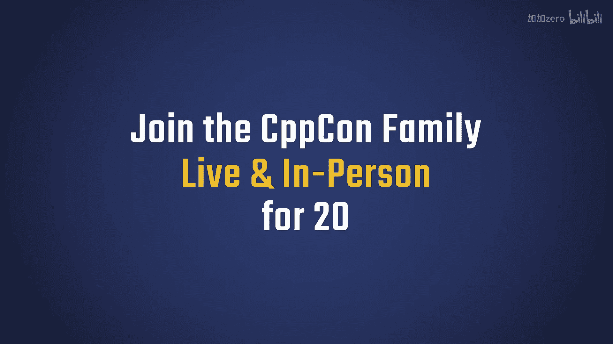
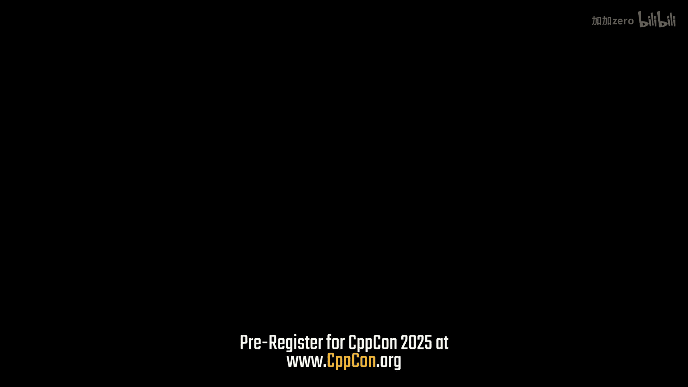
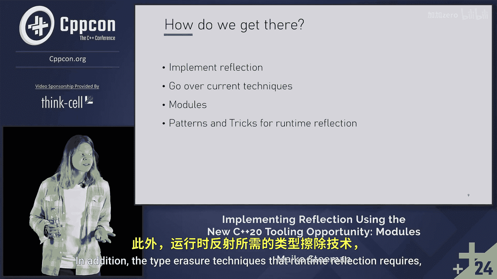

# 021：使用C++20模块工具实现反射







## 概述
在本节课中，我们将学习如何使用C++20的新工具——模块，来实现C++的反射功能。反射允许程序在运行时检查和操作其自身的结构，这对于序列化、UI绑定、脚本系统等高级功能至关重要。我们将从反射的基本概念讲起，逐步深入到具体的实现技术。

## 什么是反射？
反射是代码在运行时可用的元数据。它允许程序向自身提问，例如“这个类有哪些成员？”。

以一个简单的实体脚本为例：
```cpp
class EntityScript {
    int health;
    std::string tag;
public:
    void EatBurger();
};
```
通过反射系统，我们可以得知`EntityScript`类有两个数据成员：一个名为`health`的整型和一个名为`tag`的字符串。此外，还能知道它有一个名为`EatBurger`的无参数成员函数。

## 反射的用途
反射的核心价值在于编写不依赖于特定数据顺序或结构的系统，它只关心数据以某种形式存在。

一个典型的应用是序列化系统。该系统能将对象的内存表示扁平化为二进制流或JSON等格式，以便网络传输或磁盘存储。

以下是使用反射进行序列化的伪代码示例：
```cpp
void SerializeToJson(const ReflectionData& object, JsonValue& json) {
    for (auto& field : object.GetFields()) {
        json[field.GetName()] = SerializeValue(field.GetValue(object));
    }
}
```
更实际的实现会包含一个`ValueToJson`核心序列化函数，它能处理已知的基本类型（如整型、双精度浮点型、字符串）。通过递归进入复合类型（即包含这些基本类型的类），我们就能序列化任何已知类型的组合。

反射可以看作是类型系统的扩展。它允许我们基于代码结构信息自动生成其他系统，例如：
*   **UI绑定**：使用简单的声明式文本格式直接绑定到数据模型，类似于WPF的做法。
*   **语言绑定**：自动生成库到其他语言（如Python）的绑定，无需手动编写胶水层代码。
*   **插件系统**：在应用程序内部暴露API给小型脚本语言，实现自动化的插件功能。

在数据模型方面，反射可以用于自动生成完整的UI。例如，在游戏编辑器中，即使不知道组件内部的具体结构，编辑器也能通过反射理解并显示、编辑其值。

反射还能替代许多需要大量手动工作的传统系统。例如，撤销/重做栈通常需要为每个操作手动编写命令类和对应的撤销逻辑。使用反射，我们可以自动获取数据状态的快照，修改值后，通过比较两个状态的所有对象的差异，自动生成命令，从而实现完全自动且一致的撤销系统。

## 实现反射的步骤
上一节我们介绍了反射的概念和强大用途，本节中我们来看看如何实际实现它。

我们将按以下几个步骤进行：
1.  建立一个关于反射实现的心理模型。
2.  重点讨论运行时反射的实现技术（本教程主要聚焦于此，但相关技术也可用于编译时构造）。
3.  最终，介绍如何利用C++20的模块系统来构建反射系统，这种方法能解决当前许多其他技术的缺点。



## 总结
本节课我们一起学习了C++反射的基本概念、其广泛的应用场景（如序列化、UI生成、语言绑定和撤销系统），并概述了实现反射的路径。我们了解到，利用C++20的模块工具，可以构建一个强大的反射系统，以更优雅的方式解决许多工程问题。在接下来的章节中，我们将深入具体的实现细节。