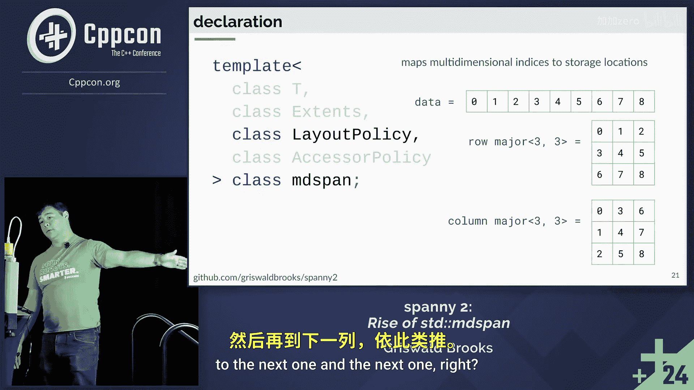

# 022：std::mdspan 的崛起 🚀


在本节课中，我们将学习 C++23 标准引入的多维视图类型 `std::mdspan`。我们将探讨其核心概念、定制点，并通过实际例子理解如何利用布局策略和访问器来灵活地处理多维数据。

---

## 1.1：历史与动机 📜

上一节我们介绍了课程概述，本节中我们来看看 `std::mdspan` 出现的原因。

我们是否已经在 C++ 中拥有多维数组？至少有两种常见方式：C 风格的多维数组和 `std::vector<std::vector<T>>`。

C 风格数组的**内存是连续的**，但其**维度是静态的**，必须在编译时确定。`std::vector<std::vector<T>>` 支持动态分配，但**行与行之间的内存不连续**，可能导致性能损失，并且无法保证每行的长度相同。

计算机内存本质上是线性的。我们通常通过一个类来手动映射多维索引到线性存储位置。例如，一个 `N x M` 的矩阵可以分配一个大小为 `N * M` 的 `std::array` 或 `std::vector`，并通过调用运算符计算索引。

然而，处理多维数据时，我们通常需要更多工具，例如：
*   **重塑**：将 `2x3` 的矩阵视为 `3x2` 或 `1x6` 的视图。
*   **降维**：将 `1x6` 的矩阵视为纯粹的 6 元素序列。
*   **切片**：查看矩阵中每隔一个的元素。

手动实现这些功能需要大量代码。因此，C++ 需要一个更灵活的多维视图类型，这就是 `std::mdspan` 的用武之地。

`std::mdspan` 是一个多维视图类型，对底层内存布局没有限制。与手动编写的代码类似，它定义了数据的**逻辑布局而非物理布局**。这意味着重塑视图通常不需要分配内存，实例化或复制 `mdspan` 的成本很低，并且它提供了通过策略进行定制的点。

---

## 1.2：核心模板与定制点 ⚙️

上一节我们了解了 `mdspan` 的动机，本节中我们来看看它的核心模板声明和定制点。

`std::mdspan` 的模板声明如下：
```cpp
template <
    class T,
    class Extents,
    class LayoutPolicy = std::layout_right,
    class AccessorPolicy = std::default_accessor<T>
>
class mdspan;
```

以下是各个模板参数的含义：

*   **`T`**：视图中元素的类型，例如 `int`、`double` 等。
*   **`Extents`**：描述数据形状的参数。它定义了：
    *   **秩**：维度的数量。
    *   **范围**：每个维度的长度。
    *   **索引类型**：用于表示维度的类型（如 `size_t`、`int`）。

`Extents` 可以是静态的或动态的：
*   **静态范围**：在编译时同时指定秩和每个维度的长度。
    *   示例：`std::extents<size_t, 2, 3>` 表示一个 `2x3` 的矩阵。
    *   示例：`std::extents<int, 100, 200, 800>` 表示一个 `100x200x800` 的三维数组。
*   **动态范围**：在编译时指定秩，但维度的长度在运行时确定。
    *   示例：`std::dextents<double, 3>` 表示一个三维数组，其每个维度长度在运行时设定，理论上可用于表示连续的三维空间。

第一个定制点是 **布局策略**。布局策略负责将多维索引映射到线性存储中的位置。例如，对于一个线性存储的 9 个元素，可以按**行优先**或**列优先**的方式将其解释为 `3x3` 矩阵。



第二个定制点是 **访问器策略**。访问器定义了如何从指针或类似指针的对象中读取或写入数据。默认访问器 `std::default_accessor` 假设数据是通过指针连续存储的，但我们可以定制访问器以支持更复杂的场景，例如处理跨步数据或特殊内存空间。

---

## 1.3：总结 📝


本节课中我们一起学习了 `std::mdspan` 的基本概念。我们了解到它是 C++23 中引入的灵活多维视图类型，用于解决传统多维数组（如 C 风格数组和 `vector of vectors`）的局限性。其核心在于通过 `Extents` 描述数据形状，并通过 `LayoutPolicy` 和 `AccessorPolicy` 这两个定制点，将多维索引灵活地映射到底层存储，支持重塑、切片等操作而无需复制数据。在接下来的章节中，我们将深入探讨如何具体使用和定制这些策略。