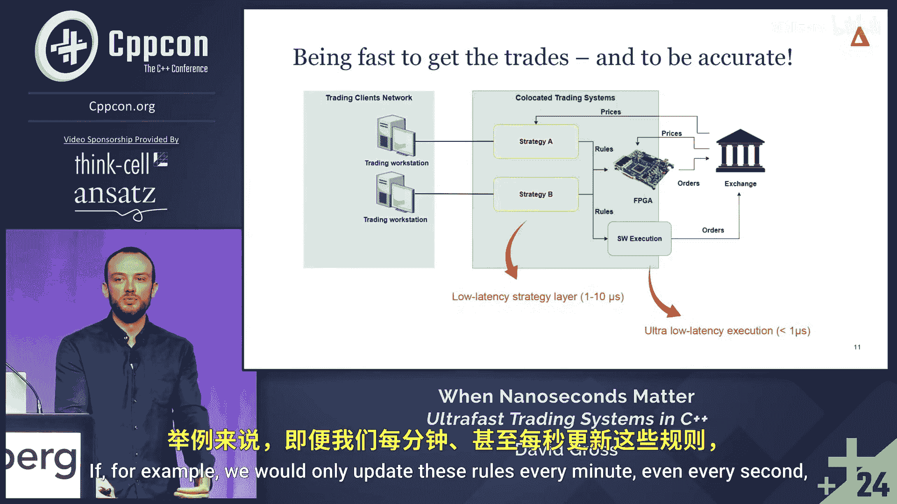

# 026：引言与背景 🚀

在本章中，我们将探讨低延迟交易系统的基本概念、其历史背景以及在现代金融市场中的必要性。我们将从古罗马的早期衍生品交易开始，逐步过渡到当今由C++驱动的高频交易世界。

## 概述

低延迟交易系统是现代金融市场的核心，尤其在市场做市和高频交易领域。本章将介绍为什么速度至关重要，并概述一个典型交易系统的架构。

---

## 从古罗马到现代市场

上一节我们提到了低延迟的重要性，现在让我们先回溯历史，看看人类如何管理不确定性。

古罗马帝国以其卓越的组织和规划能力而闻名。他们不仅擅长城市规划、军事行动，还组织大型活动，例如能容纳20万至30万人的竞技场庆典。

为了筹备这些大型活动，罗马人会提前一年向农民、酿酒师等生产者询价，约定未来的商品价格。这种做法实质上创造了最早的衍生品交易形式之一，被称为“罗马期货合约”。

罗马人发现，世界充满不确定性。人类在心理上对潜在损失的重视程度远高于潜在收益。这种对不确定性的管理需求，是衍生品交易诞生的核心原因。然而，这种方法并未完全解决流动性问题——在高度不确定的时期，人们往往更不愿意为远期交易定价。

## 现代市场与做市商

进入现代世界，市场做市商扮演了关键角色。作者本人就在一家做市商公司工作了约十年。

市场做市被形容为一场“失败者的游戏”。这意味着成功并非依赖于某个“银弹”解决方案，而是需要在**所有方面都持续保持优秀**。做市商通过提供买卖报价赚取微小价差，这本质上是对其承担市场风险（价格可能上下波动）的补偿。目标是避免重大亏损。

为什么可能亏损？因为做市商需要同时为数以万计的工具提供报价。当新闻事件发生时，如果报价未能及时更新，就可能以不利的价格成交，造成损失。因此，**持续的优秀表现**是生存的关键。

## 为何需要低延迟编程？

对低延迟的需求主要源于两个核心原因：

1.  **快速响应不确定事件**：这是最直观的原因。当新闻等市场事件发生时，系统必须快速反应，更新报价或取消订单，以避免损失。
2.  **确保决策的准确性**：这一点可能不那么直接。准确性同样与延迟密切相关。系统需要快速**摄入**信息流，基于最新、最准确的数据进行计算并生成报价。延迟会导致决策基于过时信息，从而影响准确性。

以下是现代交易系统的一个简化架构图：

## 软件与硬件的协同

一个常见的问题是：既然现场可编程门阵列（FPGA）速度极快，为什么我们仍然需要关注C++软件优化？

上图右侧展示了从交易所流入系统的数据。FPGA确实能以极快的速度处理这些数据流。然而，软件仍然不可或缺，原因有二：

1.  **成本与效益的权衡**：FPGA不仅硬件成本高，其开发、调试和运维的工程复杂度与成本也远高于软件。软件则更加灵活、易于迭代。两者是相辅相成的关系，关键在于为正确的问题选择正确的解决方案。
2.  **策略的复杂性**：请注意上图左侧的黄色“策略”模块。策略引擎负责向FPGA发送简单的**规则**。例如：
    `if (price > 10) { update_quote(); }`
    为了让FPGA保持极致的速度，其内部逻辑必须非常简单（尽管工程实现很复杂）。它主要执行“获取比特、比较比特、发送比特”的操作。更复杂的决策逻辑则由软件端的策略引擎完成。因此，**策略引擎本身也有低延迟需求**，因为它需要快速处理信息并生成这些简单的规则指令给FPGA。

---

## 总结

在本章中，我们一起学习了低延迟交易系统的历史渊源和核心需求。我们了解到，从古罗马管理不确定性的智慧，到现代做市商“失败者的游戏”，对速度和准确性的追求始终是核心。现代交易系统是软硬件协同的产物，C++软件在处理复杂策略和平衡系统灵活性方面扮演着不可替代的角色。在接下来的章节中，我们将深入探讨实现这种低延迟系统的具体工程原则和技术。