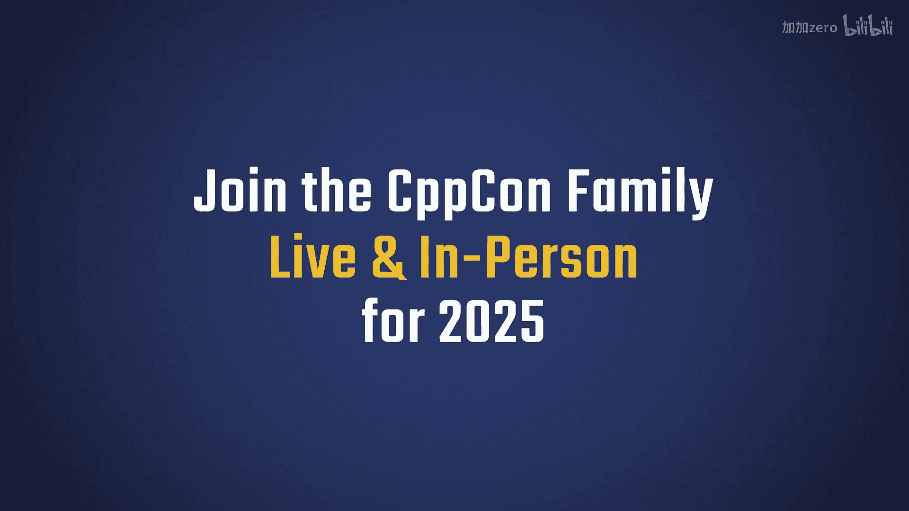
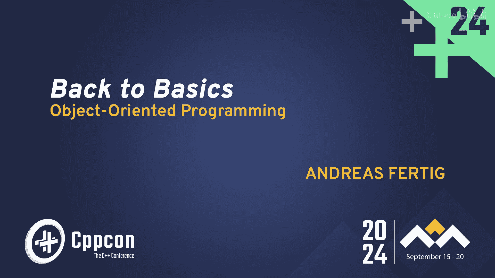
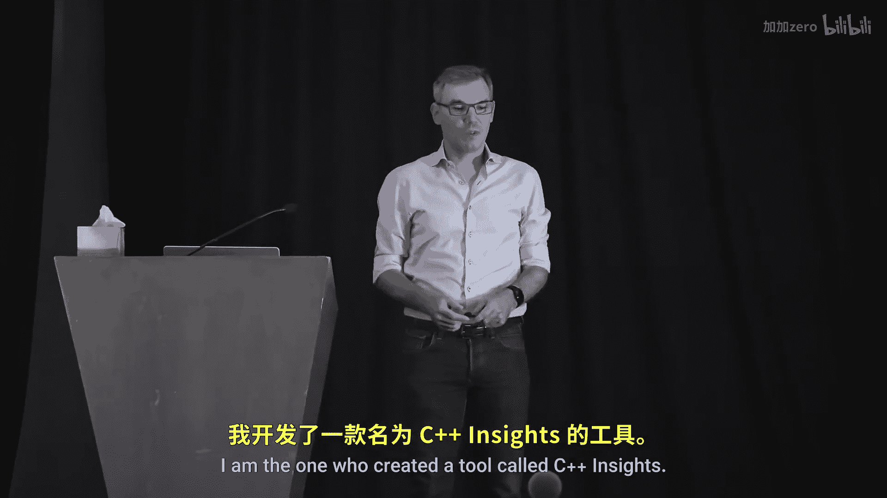
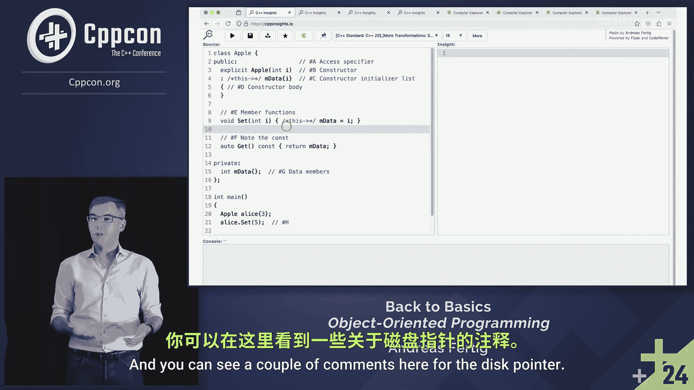

# 031：类与封装 🍎

在本节课中，我们将学习C++面向对象编程的基础，特别是类的定义、封装以及成员函数的使用。我们将通过一个简单的例子来理解如何创建类、初始化其成员，并控制对类内部数据的访问。

---

上一节我们介绍了课程概述，本节中我们来看看如何定义一个基本的类。

大家好，欢迎来到我的C++面向对象编程基础讲座。

我是Andreas Fertig。我创建了一个名为C++ Insights的工具。在本次讲座中，我们将多次使用它来窥探代码背后的机制。我还写了几本关于C++的书。我认为它们已经售罄，但你仍然可以在网上或亚马逊上找到它们。

我的日常工作是为企业提供培训服务，包括现场或远程的内部课程。我也与CPP Khan Academy合作，他们主办会前和会后研讨会。虽然时间很紧，但你仍然可以预订我明天和周日举行的关于高效C++的会后研讨会。你还有机会预订Nikolai Josuttis的课程，他的课程在周一举行，并且是在线的，所以更方便。如果你想按照自己的节奏学习，我有一门自学课程，它实际上是我关于C++20课程的录像，你也可以了解一下。我是德国人。在这次会议和其他会议上，我遇到了很多会说德语、是德国人或者至少懂一点德语的人。如果你不是，你可以把我的姓氏翻译成英语，意思是“完成”、“已经”或“结束”。我认为这是一个非常积极的名字。当然，在德语中它是一个常用的形容词。当我年轻的时候，我和朋友们开玩笑说，如果每次有人使用我们的姓氏我们都能得到一分钱，那我们全家就发财了。但这并没有发生。不过，每当我做这些讲座时，我都会更多地思考我的姓氏。我最近发现，在巴黎夏季奥运会上，他们开始比赛或游泳时的口令是“Ready, Steady, Go”。我刚刚告诉了你我姓氏的翻译，它可以翻译成“Ready”。所以，不仅在奥运会上，每次比赛开始时，他们都会以我的姓氏作为口令序列的开头。这很有趣。在我们深入C++之前，让我们继续这个语言小课堂。我刚刚教了你如何把我的名字翻译成英语。那么，如何把这个口令序列翻译成德语呢？你准备好了吗？在德语中，它是“Auf die Plätze, Fertig, Los”。你会翻译错，对吧？讽刺的是，我们从一个三个词的口令序列开始，在德语中你必须仔细听，否则你会过早开始比赛。而我的姓氏排在第二位。如果你深入研究语言，这是有道理的。但这只表明语言是有趣且复杂的，无论是口语还是我们在计算机上使用的语言。所以，让我们深入探讨你来这里可能想学的内容。我猜我在C++方面比在我的母语方面更擅长。

---

上一节我们了解了讲师和课程背景，本节中我们来看看面向对象编程的核心——类的定义。

面向对象编程是关于类的。我假设你已经熟悉了。我们通常从类开始，因为它是关于封装的。我们想要建模对象，所以我们使用关键字`class`，给类起一个名字，在我的例子中是`Apple`。接下来，我们需要决定将内容放在哪个访问区域。我们基本上有三种选择。我们可以将某些内容放在`public`作用域，这意味着它对所有人都是可见和可访问的。你也可以将其放在`private`作用域，表示它只对这个类可访问和可见。这是面向对象编程的主要内容。我们希望生活在一个有封装的世界里，我们可以拥有类的私有数据，并控制对这些单独成员的访问。这与C语言的结构体不同，在结构体中所有内容都是可访问的。技术上我们还有一个访问说明符`protected`，当我们从基类派生时，它会起作用。`protected`意味着在该作用域内的任何内容，除了声明它的类及其所有派生类之外，其他任何人都无法访问。这样，你可以给你的“亲属”比其他人更多的访问你私有数据的权限。假设你不会在Facebook上分享一切，这可能是你想要的做法。

---

上一节我们讨论了访问说明符，本节中我们来看看类的数据成员和构造函数。

由于类包含私有数据，我们也可以在这个类的底部看到，这里有一个私有数据成员。你应该总是有充分的理由才将数据成员声明为`public`，因为类的一个要点就是保持数据私有并通过访问函数来控制访问。因此，我们需要一个构造函数，你可以在这里顶部的D处看到。由于这是一个单参数构造函数，并且被标记为`explicit`，因为单参数构造函数也被称为转换构造函数，编译器在寻找转换序列时允许使用它们。为了避免这种情况不必要地或无意地发生，我们倾向于遵循最佳实践，将我们的单参数构造函数标记为`explicit`，除非我们真的希望这种转换发生。一旦到达这一点，就是关于初始化数据成员的问题。我在C处向你展示了这一点，我以冒号开始一个序列，这就是所谓的构造函数初始化列表。请务必在那里初始化你的数据成员。这是做这件事的地方。如果你类中有一个对象是可默认构造的，并且你将初始化移到了构造函数体内，它仍然会在构造函数的初始化列表中初始化，你无法阻止这一点。如果你的类中的类型不可默认构造，你会遇到编译器错误信息，因为编译器总是尝试在那里初始化对象。所以这是你应该放置它们的地方。否则，你只是冒险让初始化发生两次。这意味着，确实，在D处我们有构造函数体，构造函数体的目的是确保不变性，我们将在接下来的几张幻灯片中看到一个例子。

---

上一节我们介绍了构造函数初始化列表，本节中我们来看看成员函数。

然后我在这里有两个成员函数`set`和`get`。顾名思义，一个用于设置数据成员（这个类中我只有一个），另一个用于获取它的值。两者之间的一个区别是，`set`在这里像普通函数一样写出，而`get`在函数声明的末尾带有一个`const`。这向你的同行开发者、你自己和编译器发出信号：当我们调用这个函数时，这个对象的状态不会改变。这是你得到的承诺。所以这是有价值的东西。你可能会听到像“常量正确性”这样的术语，我们可以构建常量对象链。所以，每当你有一个不修改类状态的getter时，请友好地将其设为`const`，这是正确的做法。在下面的`main`函数中，你可以看到我使用了这个`Apple`对象。我在这里使用`Alice`作为一种苹果，我分别在这个`Alice`对象上调用`set`和`get`。

---

上一节我们看到了成员函数的实际使用，本节中我们使用C++ Insights工具来窥探代码背后的机制。

现在，让我们第一次在这里使用C++ Insights来窥探一下幕后的情况。对于那些没有见过C++ Insights的人，它是这样的。你也可以使用命令行版本。它的主要目的是：你在左边输入C++源代码，在右边得到C++源代码输出。这是一个绝妙的主意，对吧？价值百万美元的想法。到目前为止还没有人为它付过钱。C++ Insights真正做的是，它用你编译时使用的设置来注释它在右边输出的内容。在这个特定情况下，C++ Insights以Clang的视角看待一切。你有一个默认模式，可以翻译代码。我还启用了一个特殊模式，显示C++到C的转换。我在C++人群面前展示更多C代码表示歉意，但这里的目的是帮助你理解类在内部是如何真正工作的，你可以在这里看到一些注释。

---

本节课中我们一起学习了C++中类的基础知识，包括如何定义类、使用访问说明符（`public`、`private`、`protected`）实现封装、编写构造函数和成员函数，以及使用`const`成员函数来保证对象状态不变。我们还简要介绍了C++ Insights工具，它可以用来查看代码的底层转换，帮助我们更好地理解C++的机制。