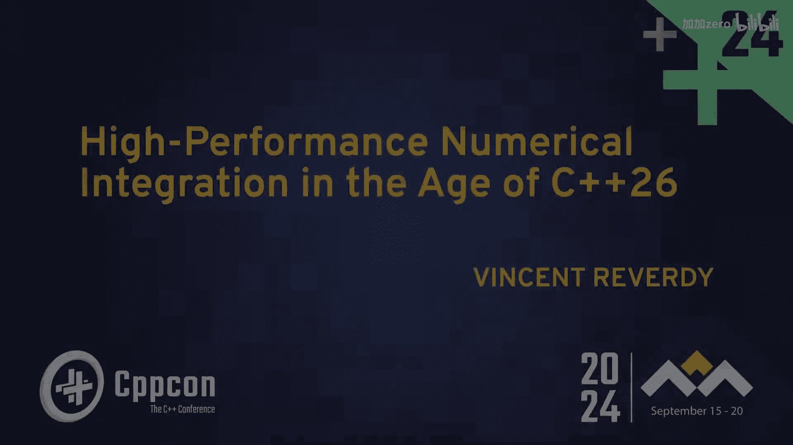
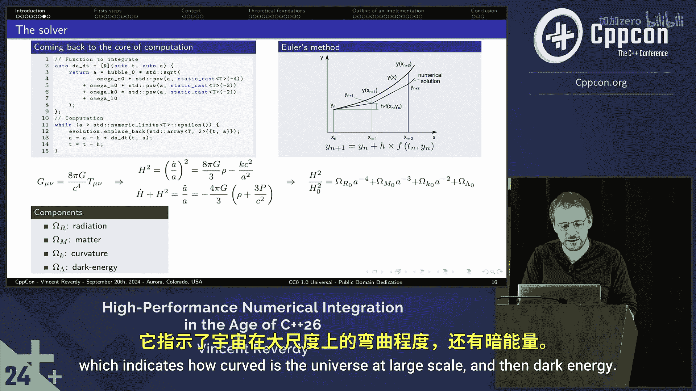

# 034：从零开始构建数值积分器


在本教程中，我们将学习如何在C++中从零开始实现一个基础的数值积分器。我们将通过一个计算宇宙年龄的具体例子，来理解数值积分的基本原理、实现步骤以及相关的物理背景。课程内容将尽可能简单直白，适合初学者。




## 概述

数值积分是计算数学和科学计算中的核心工具，用于求解无法获得解析解的微分方程。在C++中，我们常常需要自己构建这些工具。本节我们将从一个具体的物理问题——计算宇宙的年龄——出发，了解如何用简单的C++代码实现一个基础的数值积分器。

## 从示例开始

上一节我们概述了课程目标，本节中我们来看看一个具体的C++程序示例。这个程序的编码风格可能不是最优的，但其目的是帮助我们理解数值积分在做什么。

以下是示例程序的核心代码框架：

```cpp
#include <iostream>
#include <vector>
#include <cmath>

// ... 其他头文件和函数声明

int main(int argc, char* argv[]) {
    // 声明常数和类型
    // 获取参数（从输入或使用默认值）
    // 调用计算函数
    std::vector<double> evolution = compute(...);
    // 输出结果（例如，宇宙年龄）
    std::cout << evolution.back() / 1.0e9 << std::endl;
    return 0;
}

// 计算函数，执行积分
std::vector<double> compute(...) {
    double a = 1.0; // 尺度因子，当前时刻归一化为1
    double t = 0.0; // 时间
    std::vector<double> evolution;
    evolution.reserve(...);

    // 定义待积分的函数 f(a)
    auto da_dt = [&](double a) {
        return a * H0 * std::sqrt(Omega_r / (a*a*a*a) + Omega_m / (a*a*a) + Omega_k / (a*a) + Omega_lambda);
    };

    // 积分循环
    while (a > epsilon) {
        evolution.push_back(t);
        // 数值积分核心步骤
        a -= h * da_dt(a); // 向后积分（回到过去）
        t -= h; // 时间回溯
    }
    return evolution;
}
```

这个程序计算了一个关键数值。如果运行它，并将结果附上单位，输出大约是 **13.7839 billion years（138.39亿年）**。这正是我们当前宇宙的年龄。同时，程序计算出的 `evolution` 向量描述了宇宙从大爆炸至今的尺度因子演化过程。

## 数值积分的基本原理

上一节我们看到了一个能计算宇宙年龄的程序，本节中我们来剖析其核心——数值积分方法。

程序中使用的是最基础的数值积分方法，称为**前向欧拉法**（在本例中用于时间回溯，故可视为反向欧拉）。其核心公式如下：

**公式：`y_{n+1} = y_n + h * f(t_n, y_n)`**

其中：
*   `y_n` 是当前步的解（例如尺度因子 `a`）。
*   `h` 是步长参数。
*   `f(t_n, y_n)` 是微分方程定义的导数函数（在本例中是 `da_dt`）。

这个公式的含义是：利用当前点的导数，沿着该方向前进一小步（`h`），来估算下一个点的值。通过循环迭代这个过程，我们就可以近似求解整个微分方程。

在我们的宇宙学例子中，方程 `da_dt` 来源于对爱因斯坦场方程的简化。在假设宇宙是均匀且各向同性的前提下，可以得到弗里德曼方程。再假设宇宙内容物为理想流体混合物，就能推导出我们程序中积分的一阶常微分方程。

## 软件架构与C++实现考量

理解了基础算法后，本节我们探讨如何为数值积分器设计更好的C++软件架构。

目标是构建一个灵活、高性能且易于使用的积分器库。我们需要考虑以下几个方面：

以下是实现时需要考虑的关键组件：

1.  **微分方程定义**：如何让用户方便地定义任意的一阶常微分方程组 `dy/dt = f(t, y)`。
2.  **积分算法抽象**：将欧拉法、龙格-库塔法等不同算法抽象为统一的接口。
3.  **状态与结果管理**：高效存储积分过程中的状态和输出结果。
4.  **步长控制**：实现自适应步长控制，在保证精度的同时提高效率。
5.  **类型与单位**：使用模板支持不同的数值类型（如 `float`, `double`, `std::complex`），并考虑物理单位处理。

一个初步的类结构设计可能如下：

```cpp
template<typename StateType, typename TimeType = double>
class ODEIntegrator {
public:
    using DerivativeFunction = std::function<StateType(TimeType, const StateType&)>;

    struct Result {
        std::vector<TimeType> times;
        std::vector<StateType> states;
    };

    virtual Result integrate(const DerivativeFunction& f,
                             const StateType& y0,
                             TimeType t_start,
                             TimeType t_end,
                             TimeType initial_step) = 0;
    virtual ~ODEIntegrator() = default;
};

// 具体积分器实现：前向欧拉法
template<typename StateType, typename TimeType>
class ForwardEulerIntegrator : public ODEIntegrator<StateType, TimeType> {
public:
    typename ODEIntegrator<StateType, TimeType>::Result integrate(
        const typename ODEIntegrator<StateType, TimeType>::DerivativeFunction& f,
        const StateType& y0,
        TimeType t_start,
        TimeType t_end,
        TimeType initial_step) override {
        // ... 实现欧拉法积分循环
    }
};
```

## 展望：C++26的可能特性

上一节我们讨论了架构设计，本节我们简要展望未来C++标准可能带来的便利。

C++26及未来的标准可能会引入更多有助于科学计算的特性，例如：

以下是可能相关的特性方向：

*   **更强大的编译时计算**：`constexpr` 功能的持续增强，允许更复杂的微分方程在编译时被部分处理或优化。
*   **线性代数标准库**：如果提案被接受，将提供标准的矩阵、向量类型和操作，极大简化科学计算代码。
*   **改进的数值类型**：对自定义数值类型（如自动微分、区间算术、带单位的量）提供更好的语言支持。
*   **执行策略与并行算法的增强**：使得为数值积分器轻松添加并行化支持变得更加简单。

这些特性将帮助我们构建更强大、更易用且性能更高的数值计算库。



## 总结

本节课中我们一起学习了数值积分的基础知识。我们从一段计算宇宙年龄的具体C++代码出发，理解了最基础的欧拉积分法及其对应的数学公式 **`y_{n+1} = y_n + h * f(t_n, y_n)`**。我们探讨了该问题背后的物理原理——源自弗里德曼方程的微分方程。接着，我们讨论了如何设计一个更通用、更健壮的C++数值积分器软件架构，包括抽象积分算法、管理状态和结果。最后，我们展望了未来C++标准可能为科学计算带来的新工具。通过本课，你应该对如何在C++中从零开始实现并设计一个数值积分器有了初步的认识。