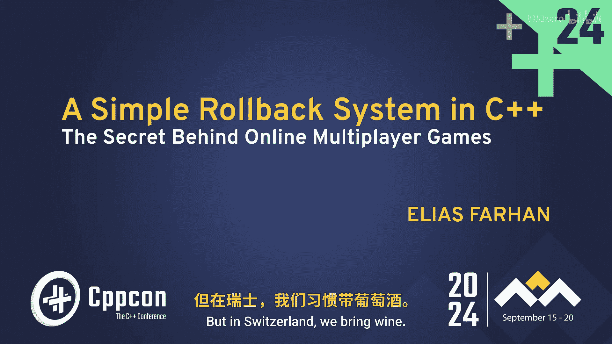
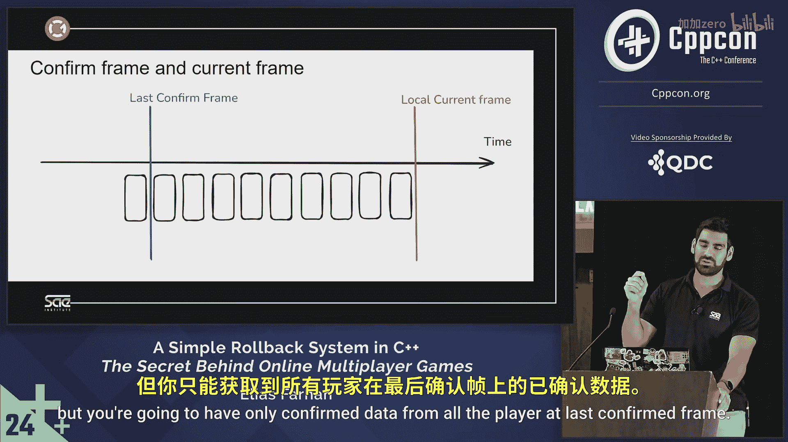

# 037：引言与挑战 🎮

在本节课中，我们将学习如何为快节奏在线多人游戏实现一个确定性的回滚系统。我们将从理解核心挑战开始，逐步深入到实现细节。

## 概述

在线多人游戏开发面临网络延迟的固有挑战。与本地游戏不同，玩家的输入需要时间才能传递到其他玩家的设备上。这意味着游戏状态必须基于过去的输入进行计算，这给保持所有玩家游戏体验的同步和流畅带来了巨大困难。

上一节我们介绍了课程的整体目标，本节中我们来看看开发快节奏在线多人游戏的具体难点。

## 为何开发快节奏在线多人游戏如此困难？

我们所说的“快节奏”游戏，通常指实体数量不多的游戏。例如，拥有数万个单位的庞大RTS游戏很难归入此类。我们更多考虑的是格斗游戏、FPS、赛车足球等物理驱动、要求低延迟的游戏。这类游戏实体不多，因为我们即将使用的技术要求游戏状态不能对普通计算机造成过大负担。

让我们谈谈互联网。因为当我们进行在线多人游戏时，必须经过互联网这个庞大的网络，我们会遇到所谓的**网络延迟**。

以下是几种我们必须处理的延迟类型：

*   **传播延迟**：这是光速限制带来的固有延迟。信息无法超越光速传播。
*   **处理延迟**：数据包在网络中传输时，需要经过路由器处理，这会增加额外延迟。
*   **排队延迟**：路由器上并非只有你的游戏数据包，它需要等待其他数据包发送完毕。
*   **传输延迟**：互联网所有线路的带宽限制也会造成延迟。

所有这些延迟叠加起来，就构成了巨大的网络延迟。

这意味着你的游戏必须等待其他玩家的输入，因为延迟会产生影响。这与本地多人游戏不同，在本地游戏中，虽然也有延迟，但在实现游戏时，你可以认为所有操作都是瞬间完成的。

换句话说，我们是在基于**过去**的输入数据进行工作。在本地，当你在玩游戏时，你处于“当前帧”。但在在线环境中，你只能获得过去时间窗口内的输入数据。

本节课中我们一起学习了在线多人游戏开发的核心挑战——网络延迟，它导致我们必须处理过去的输入数据。在接下来的章节中，我们将探讨如何通过确定性模拟和回滚系统来解决这一难题。