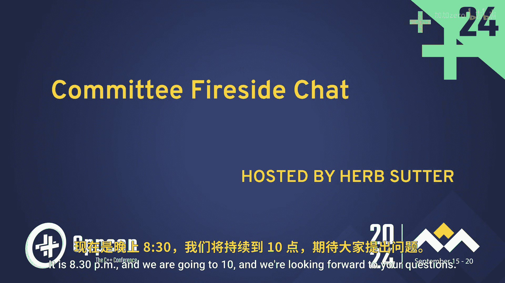

# 046：欢迎与介绍

在本节课中，我们将学习CppCon 2024年ISO C++标准委员会小组讨论的开场部分。我们将了解讨论会的背景、参与讨论的委员会成员，以及他们各自当前最关注的C++语言发展方向。

欢迎各位。现在是晚上8点30分，我们即将开始讨论，并期待大家提出问题。

委员会成员们稍晚到场，但你们已经表现出浓厚的兴趣，我们将尽力不辜负这份期待。

每年在CppCon大会上，我们都会举办一场委员会炉边谈话小组讨论，邀请部分委员会成员参与。成员构成多样，有些是大家熟悉的面孔，有些则是新面孔。我们这里汇集了对核心语言和标准库都感兴趣的人士。有些人深度参与某个特定主题领域，有些则在他们所工作的标准部分领域是广博的专家。有些人从事委员会工作已有四分之一个世纪，有些人尽管使用C++已有四分之一个世纪且在该领域非常杰出，但这仅仅是他们参加的第二次会议。因此，我们这里有一个多元化的组合。我将首先快速介绍一下，以便大家认识他们。他们中的大多数是本次大会的演讲者或曾出席过会议，所以你们可能认识他们。但我还是将逐一介绍，并请每位成员简要说明一两个他们目前最感兴趣的、委员会正在为C++26或更远版本研究的话题。

**Lisa Lipincott**，你在数值计算方面做了大量出色的工作，并且在这里做了一个关于契约的演讲，因为你在上次标准会议上做了一个非常精彩的演讲，所以我们邀请你在这里做一个更新版本。你最感兴趣的一两件事是什么？
当然是契约。我的意思是，Daisy会提到另一个特性，那也是一个非常好的特性，但契约是……（现在我很感兴趣）。

**Tamar Dalor**，你是委员会主席之一，担任契约小组的副主席，并且已经在这个委员会工作多年了。你最感兴趣的一两件事是什么？（我开始看到一种模式了）
我最兴奋的是契约。我已经为此工作了一段时间。我认为我们非常接近将其完善到可以加入标准的程度。我对此感到非常兴奋。我想可能还有另一个特性也相当令人兴奋，但我打算……让下一个人来谈论那个。我确实没有让他们提前准备这些“预告”。

**Daisy E. Holman**，她是Ranges研究组和库演进小组的主席，已经活跃了相当长的时间。你最喜欢的一两个特性是什么？
反射，以及反射。如果我们能有第三个，那就是反射。这简直会改变我们在C++中所做的一切。而且它已经酝酿了太久。

**Khalil Estell**，我们期待听到更多关于你正在进行的异常处理工作。那么，你目前最关注的一两件事是什么？
既然我们谈论的是委员会内部正在讨论的内容，那必须是契约和反射。我知道这是重复的，但我对这两个话题都非常兴奋。我相信它们将极大地改变语言的使用方式，并能在未来带来许多真正强大的能力。

**Deepak Majeti**，你在标准库领域活跃了很长时间。我的意思是，甚至在20年前，你就拥有自己的标准库实现，为委员会提供了参考。现在你又实现了发送者-接收者和执行器，因为你似乎总有空闲时间并且非常擅长开发所有这些。那么，你最感兴趣的一两件事是什么？
正如你刚才提到的，执行器词汇的标准化。这绝对是我的首选。我不太关心其他契约或反射，尽管反射可能有助于实现一些发送者……所以反射是第二选择。

**Andrei Alexandrescu**，我昨天提到过，这实际上只是你参加的第二次委员会会议，是在三个月前的六月。你从事C++已经……我想大概18个月了？自从你学习C++以来。显然你正在推动一些事情。现在你加入了委员会，从事反射方面的工作。你目前最关注的一两件事是什么？
对我来说，就像有些人，你知道，他们结婚、离婚、再结婚几次。我最喜欢的前三个是Daisy。我接下来的三个是反射、反射、反射。另外，我想说，如果你坐得离中间近一点，体验会非常不同，所以我鼓励你过来。我在喜剧表演中看到过，体验会根据你是在后排不关心还是在这里提问而大不相同。而且你离得越近，在这些灯光下我们越能看清你。

**Gabriel Dos Reis**，Mr. Constexpr， Mr. Modules，在微软现在和之前参与了许多其他工作。你最感兴趣的、目前正在积极进行的一两件事是什么？
富有想象力地说，是契约。以及内存和类型安全。

**Michael Wong**，在C++领域有什么是你没做过的吗？为什么这么问？不，只是你涉猎如此广泛，分享着SG12（研究组12）如何发展成拥有自己子委员会的委员会，并且现在还在进行并行性、机器学习、人工智能等方面的工作。感谢你所做的一切。那么，你最感兴趣的一两件事是什么？
首先，感谢你给我这个机会。我想我喜欢做那些深入具体的工作，比如机器学习。我们正在做一个图（graph）提案，我非常兴奋。但我也做方向组那种三万英尺高空的宏观视角，我们试图提前思考哪些障碍会阻碍C++的发展。所以我们一直在讨论很多关于安全性和保障性的话题，显然，以及其他事情，以及如何让委员会工作更有效率。

很好，我们看到开始有人排队提问了，我们将接受这边的问题。我认出了那位穿夏威夷衬衫的男士，那不是我。不，这正在成为我的品牌，Herb。我也非常期待契约和反射。但冒着显得有点调皮的风险……为什么花了这么、这么长的时间？

这是一个极好的问题。谁想回答？Lisa，你举手了。
我周四午餐后的演讲就是关于为什么契约花了这么长时间。我不想剧透，但我要说这很大程度上是视角问题。

Michael，我能从另一个三万英尺的高空视角再谈谈吗？我们注意到，特性，尤其是大型特性，通常需要很长时间。有些可能需要六年到十年。这是我们希望设法解决的问题。这背后有一个重要原因，当一个特性很大时，几乎我们过去所有的大型特性在推进过程中总会遇到一些情况，比如出现一个竞争性的提案，有时甚至在最后一刻。这不是他们的错。这是现实世界工作的现实情况。你可能无法预见到有人说，这个明天就要投票表决了。我可以在这里说出我们讨论过的每一个大型特性。情况就是这样。我不知道我们是否有办法让它变得更好，或者即使我们能做到，我们可能也不想。我很想听听其他人的看法，但我们注意到这个趋势已经很久了。我想说，目前最长的特性可能是网络，我想那已经接近15年了。

接下来请Daisy谈谈。
我想在反射方面，既然我显然是“反射女孩”，我认为很大一部分原因在于C++有如此多的实现，而且它们各不相同。不像其他语言有一个主导实现，你可以直接实现特性，向前演进，然后其他实现要么跟进要么过时，我们必须在所支持的语言实现的交集上工作，目前基本上是四个主要实现。这些前端实现都有不同的语法树处理方式。