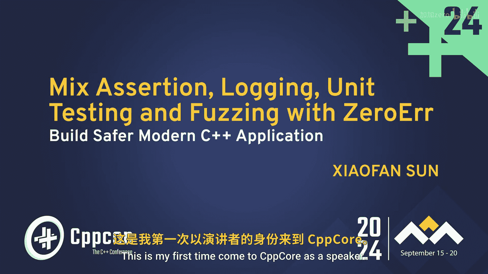
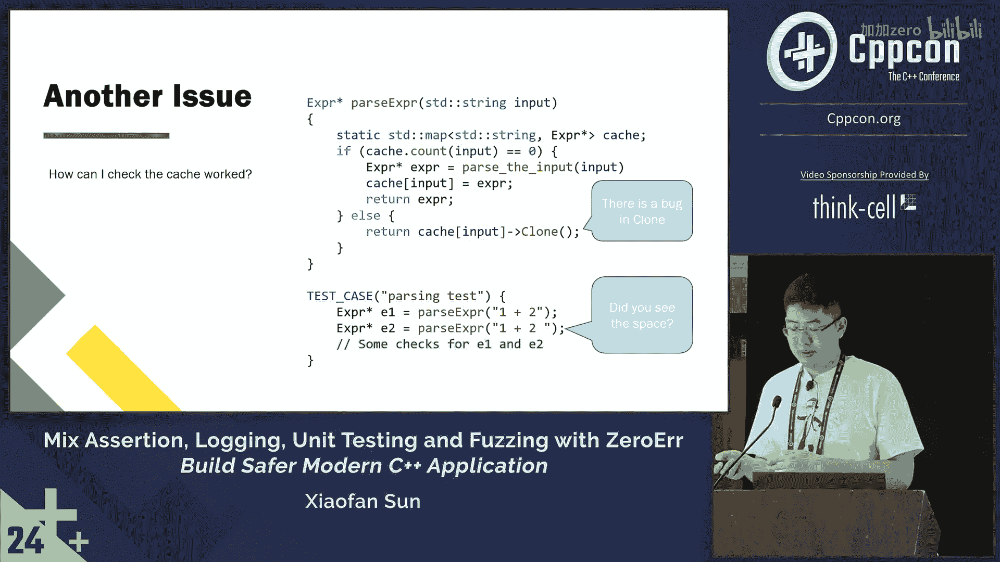

# 047：混合断言、日志、单元测试与代码覆盖率

在本节课中，我们将学习如何构建一个名为“零错误”的框架，该框架旨在通过统一断言、日志记录、单元测试和代码覆盖率分析，来帮助开发者构建更安全的现代C++应用程序。我们将从框架的起源故事开始，逐步探讨其设计动机和核心概念。

## 框架的起源故事

两年前，我还是一名博士生。作为一名研究者，那是一段美好的时光。我可以尝试最新的技术，真正做出一些能影响他人的成果。看到论文产生影响，是工作中最令人愉快的部分。

然而，事情总有两面性。对我来说，也有一些痛苦的时刻。举个例子，想象一下你是一名博士生，这是你毕业前的最后一个学期，再过两周你就要提交论文了。但在收集数据时，有一个实验的日志数据显示了错误代码。我别无选择，必须在截止日期前找出问题并修复它。

调试的难点在于，调试器有时无法正常工作，尤其是在处理复杂的数据结构时。节点之间有太多链接需要检查，信息量巨大。因此，我严重依赖打印这些信息的日志来调试。

## 日志打印的挑战

让我们看看我需要打印什么。有一些自定义的类结构数据，比如容器类，它们是最常见的。还有一些数据存储在通过字符串索引的映射中。此外，还有智能指针，以及像LLVM这样的第三方库，这是一个我使用的著名编译器基础设施库。

我需要打印许多不同类型的对象。当时，我使用日志库和智能断言库，以便输出既能用于日志也能用于断言。因此，我必须编写一长串打印函数，其中大部分是针对我的自定义数据结构或容器的。

于是我开始思考：我能否创建一个基于模板的库，专注于打印这些类型，并且可以在不同项目中复用？

## 流操作符的问题

然而，流操作符的实现存在许多问题。首先，存在命名空间污染。如果你编写这个函数，必须在全局作用域中定义它，有时很难控制何时使用这些函数。

其次，用模板实现也很困难。此外，它缺乏可扩展性。如果库定义了一个模板，用户就失去了定义自己的自定义模板来覆盖它的能力。

你无法轻松地为不同场景定制打印相同类型的行为。例如，如果你想打印额外的换行符，很难配置，因为这个函数不是静态的，也没有额外的参数可以传入。

因此我想到，也许我不应该使用流操作符。另一种方法是让日志使用一个带有格式化标签接口的字符串化函数，我们可以将其实现为一个有状态的函数。

## 统一打印接口的需求

我们注意到，无论是日志记录还是断言，甚至单元测试中的检查，它们都需要漂亮的打印功能。无论是在用户代码中还是在单元测试中，当测试失败时，如果能打印出错误信息，都会非常有帮助。

在这个例子中，断言会打印消息“a 不应为 0”以及输入值。我认为日志和断言宏正是我所寻找的。

因此我开始思考，也许我需要的是一个框架，让断言、单元测试和日志都使用相同的打印接口，而不仅仅是一个简单的字符串化库。

## 回到调试问题

当我处理紧急任务时，我有个坏习惯，就是容易跑题。你可能会问，那么你找到问题了吗？是的，实际上问题出在一个单元测试用例里。我以为已经测试过了，并且没有检测到错误。

那么问题来了：为什么测试通过了？以下是一个示例，展示了发生的情况。

假设我们有一个需要测试的“pass”函数。函数内部有一个简单的缓存系统，它会缓存结果以加速下次遇到相同输入时的处理。如果缓存未命中，我们将运行执行实际工作的“pass”函数。否则，我们将从缓存系统返回克隆的表达式。

这里有一个bug。我的意思是，每个人都可能犯这种错误。如果你在类中编写了一个克隆函数，一个月后，当你想快速修改一些东西时，你添加了一个成员变量字段，却忘了修改拷贝函数，那么就会丢失部分信息。这是我们可能遇到的常见错误。

然而，为什么测试通过了？这就是发生的情况。看明白了吗？是的，这里有一个空格，所以缓存没有生效，因此 E1 和 E2 都是从“pass”内部函数新创建的。当然，这个bug没有被检测到，因为你没有运行那段代码。

我应该单独测试克隆函数，但我当时想同时测试缓存系统，结果犯了个错误。然而，我的观点是，仅通过查看输出，无法检查缓存系统是否正常工作。

## 总结

在本节课中，我们一起探讨了构建一个统一断言、日志和单元测试打印接口的框架的动机。我们了解了传统流操作符的局限性，以及创建一个有状态、可配置的字符串化函数的必要性。我们还通过一个具体的调试案例，看到了单元测试覆盖不全可能导致的隐蔽bug。在接下来的章节中，我们将深入探讨这个“零错误”框架的具体设计和实现。