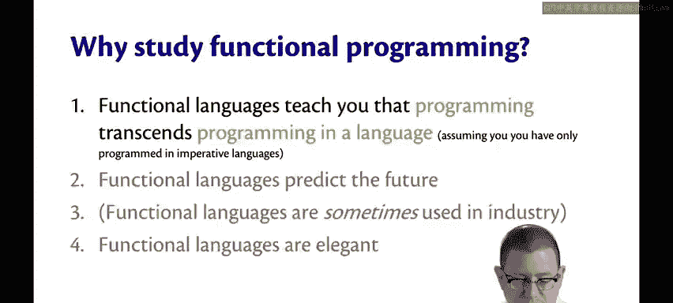
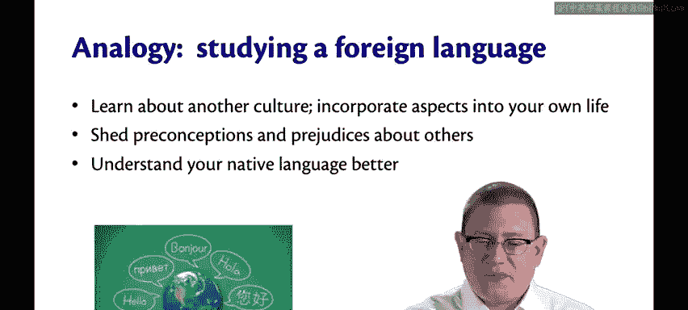
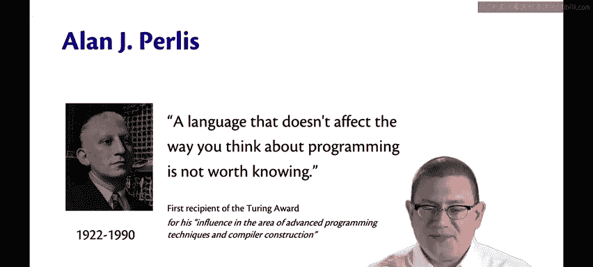
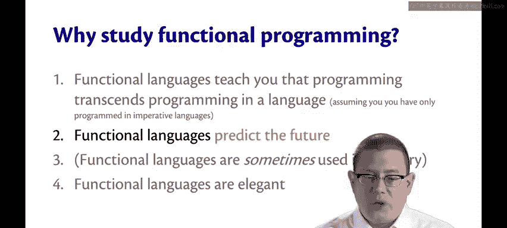
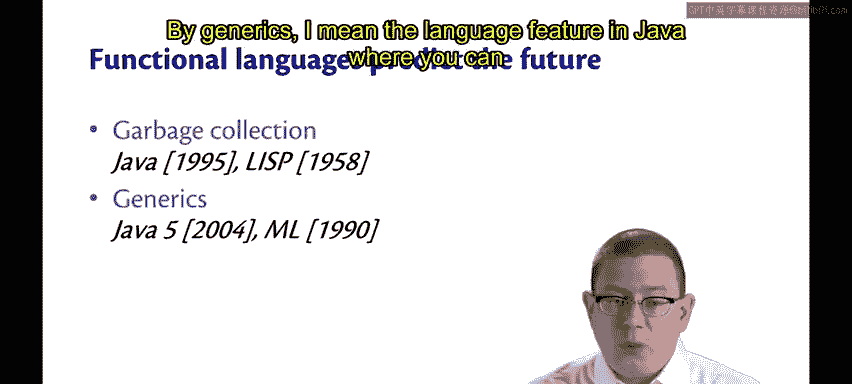
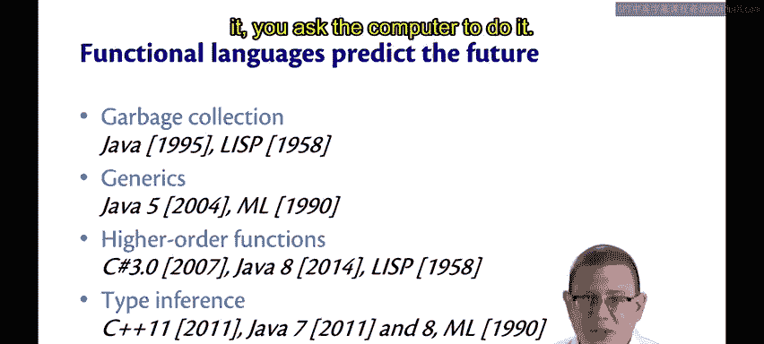
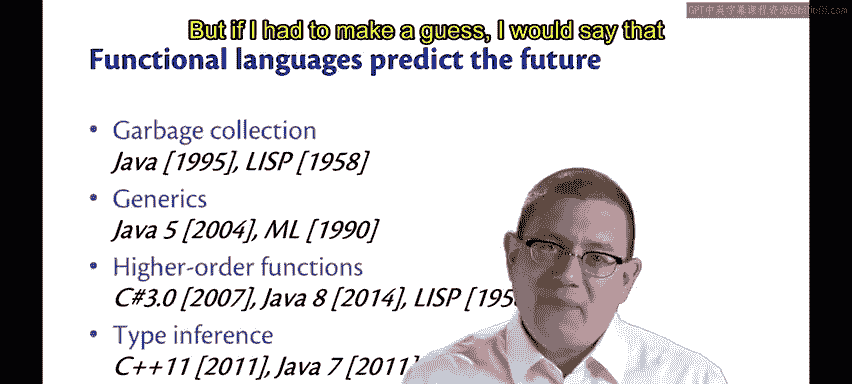
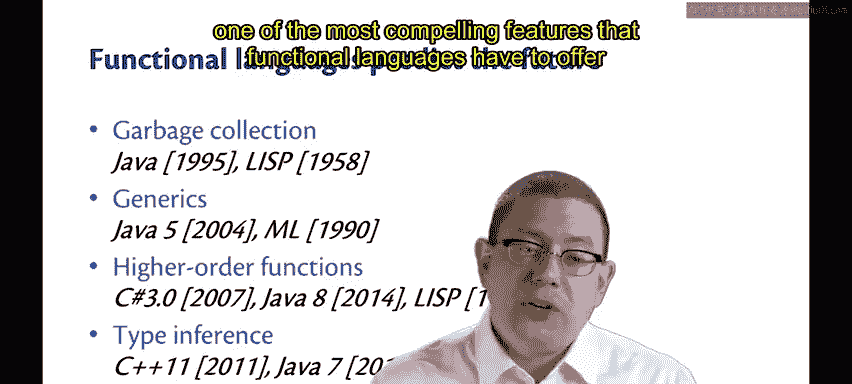
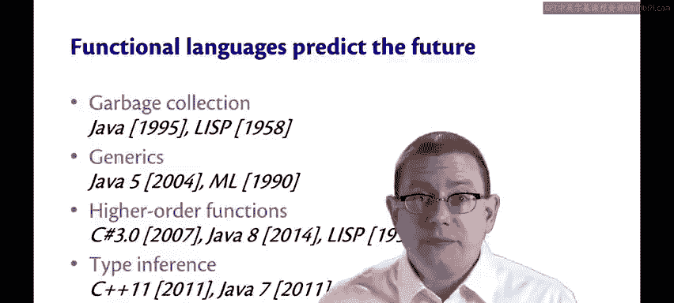

# 003：学习函数式编程的理由（第一部分）🎯

在本节课中，我们将探讨学习函数式编程的几个重要理由。理解这些理由有助于我们认识函数式编程的价值，并激发学习兴趣。

## 拓宽编程视野 🌍

第一个理由是，函数式语言让你认识到编程超越了特定语言的范畴。

如果你之前只使用过命令式语言，那么探索编程世界的另一面，了解其运作方式，对你而言是必要的。同样，如果一开始就学习函数式编程，我也会建议你去学习一门命令式语言。两者都至关重要。

让我用一个学习外语的类比来说明。

学习外语除了掌握语言本身，还有许多益处。你可以了解另一种文化，或许会发现值得欣赏和热爱的新事物，并将其融入自己的生活。它可以帮助你审视自己的先入之见，通过更好地理解他人来减少偏见。你甚至可以通过学习外语来更好地理解自己的母语。

我在高中学习西班牙语时就经历了这种情况。在那之前，我从未理解如何在英语中使用虚拟语气。直到我必须在西班牙语中学习它，我才在英语中更好地掌握了它。

让我引用艾伦·佩利斯的一句话。他是我所知道的最多被引用的计算机科学家之一。他说：“**一门不影响你编程思维方式的语言，不值得学习。**”

我向你保证，学习一门函数式语言将影响你的编程思维方式。希望你会发现它值得学习。顺便提一下，佩利斯是图灵奖的第一位获得者，该奖项被认为是计算机科学领域的诺贝尔奖。他因其在高级编程技术和编译器构建领域的影响力而获奖。因此，第一位图灵奖得主致力于编程语言，我认为这非常酷。

## 预测未来趋势 🔮

学习函数式编程的第二个理由是，函数式语言能够预测未来。

我的意思是，许多特性在函数式语言中出现的时间，远早于它们在命令式语言中出现的时间。

一个例子是垃圾回收。垃圾回收是指计算机自动为你管理内存。例如，在Java中创建许多对象时，理论上计算机可能会耗尽内存。然而，对象有生命周期，你使用它们一段时间后，最终会完成使用，并且程序中将不再触及它们。垃圾回收器是语言运行时的一部分，它回收那些永远不会再被使用的内存，从而可以循环利用这些内存用于其他目的。

Java的第一个版本大约在1995年推出，它拥有垃圾回收。但你知道吗？大约在40到50年前，函数式语言Lisp就已经拥有了它。Lisp是所有函数式语言的鼻祖，其语法特点是包含大量括号。因此，有个笑话称Lisp代表“大量恼人的愚蠢括号”。你可以找一天看看Lisp程序，看看你是否同意。Lisp之所以如此早地拥有垃圾回收，是因为这是实现该编程语言本身的唯一合理方式，因为幕后需要大量的内存管理。因此，在当时发明和设计它是必要的。

另一个函数式语言预测未来的例子是泛型。Java最初没有泛型，它们是在Java 5中添加的。我所说的泛型，是指Java中可以在类后写入类型参数的语言特性，例如，你可以写 `List<T>`，其中 `T` 是泛型参数，这就是参数化多态的一个例子。

Java语言设计的其他部分变得复杂和丑陋，因为泛型是在语言发布很久之后才被强行添加的。设计者不想破坏与旧代码和工具的向后兼容性，这使得Java泛型在某些方面不如其他语言（如微软的C#）有用。然而，在函数式语言社区中，泛型的参数化多态的能力和表达性早已广为人知，它在1990年就已经存在于一种名为ML的语言中。

更准确地说，ML不是一个单一的语言，而是一个语言家族，我们稍后会详细讨论。我们将在本课程中学习的语言就属于这个家族。

我还可以举出许多其他例子，但不会详细展开。简而言之，高阶函数是在C#和Java设计后期才添加的，而Lisp早在1958年就有了。类型推断在2011年添加到C++和Java 7中，而ML在1990年就有了。顺便问一下，为什么他们要将类型推断添加到C++中？因为对于程序员来说，为现代C++版本中所谓的模板编程写下非常复杂的类型变得太困难了。所以，当人类做起来太困难时，你就让计算机来做。

## 展望未来特性 🚀

那么，接下来会是什么？我没有水晶球，无法告诉你未来会怎样。但如果我必须猜测，我会说函数式语言提供的最引人注目的特性之一，但尚未在许多命令式语言中被采用的，将是模式匹配。

最近有一种名为Rust的语言添加了它。模式匹配是你将在本课程中熟悉并喜爱的一个特性，我认为它非常强大和有用。顺便说一句，别误会，我并不是说函数式语言是唯一发明新特性的地方，绝对不是。例如，面向对象的特性非常出色和酷炫，使我们能够构建非常庞大的软件，对于设计现在所有计算机都使用的GUI库非常有用。它们并非来自函数式语言社区。事实上，函数式语言也开始引入面向对象的特性，你开始看到这些特性的融合，Scala就是一个很好的例子。

所以，并不是一个语言家族比另一个更好。但函数式语言在预测未来方面确实有相当好的记录。这使得学习它们很有用。因为你本学期学到的特性，可能有一天会出现在下一个主流的命令式语言中。

## 总结 📝

本节课我们一起学习了学习函数式编程的两个核心理由。首先，函数式编程能帮助我们拓宽编程视野，理解编程的本质超越特定语言，并通过类比外语学习说明了其文化和技术价值。其次，函数式语言在历史上多次预测了编程语言的发展趋势，如垃圾回收、泛型、高阶函数和类型推断等特性都率先出现在函数式语言中，学习它们有助于我们把握未来的技术方向。下一节我们将继续探讨学习函数式编程的其他理由。