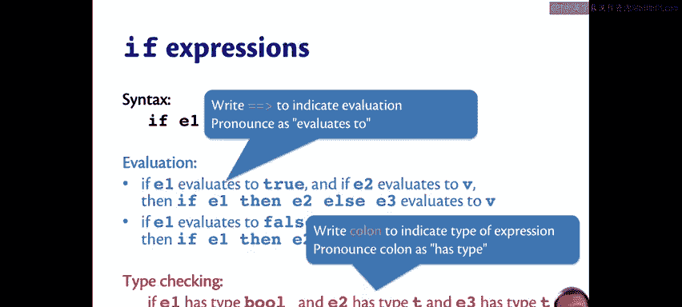
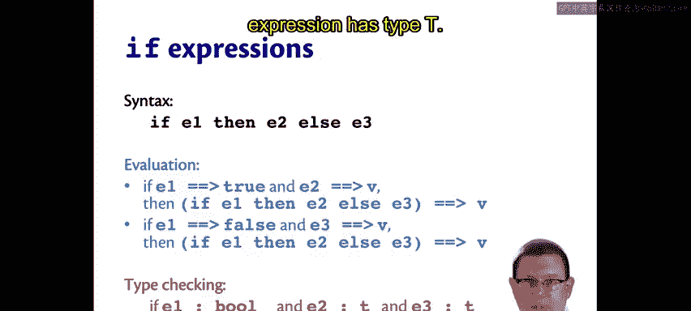
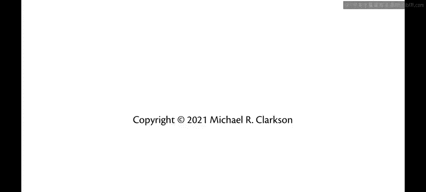

# 008：If表达式 🧠

在本节中，我们将学习OCaml中的`if`表达式。`if`表达式允许我们根据条件，在两个表达式之间选择执行哪一个。这是实现程序分支逻辑的基础。

## 概述

`if`表达式是控制程序流程的核心结构之一。它通过评估一个布尔条件（称为“守卫”），来决定执行两个分支中的哪一个。我们将详细探讨其语法、语义和类型规则。

## 语法与基本用法

我们可以使用关键字 `if`、`then` 和 `else` 来编写一个`if`表达式。其基本形式如下：

```ocaml
if condition then expression1 else expression2
```

例如，我们可以写：

```ocaml
if "Batman" > "Superman" then "Yay" else "Boo"
```

这个表达式将求值为 `"Boo"`。原因是OCaml中的字符串按字典序（即字母顺序）进行比较，而 `"Batman"` 在字典序上小于 `"Superman"`。

## 表达式求值规则

`if`表达式的求值遵循明确的规则。位于 `if` 和 `then` 之间的部分称为“守卫”，它必须是一个布尔表达式。

以下是`if`表达式的求值规则：
*   如果守卫求值为 `true`，则执行 `then` 分支的表达式，跳过 `else` 分支。
*   如果守卫求值为 `false`，则跳过 `then` 分支，执行 `else` 分支的表达式。

## 类型检查规则

OCaml对`if`表达式有严格的类型要求，这确保了程序的正确性。

以下是类型检查的关键规则：
1.  **守卫必须是布尔类型**：守卫表达式必须具有 `bool` 类型。不能将整数等其他类型当作布尔值使用。
2.  **分支类型必须一致**：`then` 和 `else` 两个分支的表达式必须具有相同的类型。整个`if`表达式的类型就是这个共同的类型。

例如，`if true then "Yay" else 1` 会导致类型错误，因为字符串和整数类型不匹配。

## 关于省略Else分支的说明

初学者应避免省略 `else` 分支。虽然语法上可能允许，但会导致类型错误或引入 `unit` 类型，目前我们暂不涉及。现阶段，请始终提供完整的 `if-then-else` 结构。

## 形式化定义与符号

为了更精确、简洁地描述求值和类型规则，我们引入一些数学符号。

*   **求值符号**：使用 `==>` 表示“求值为”。例如，`e ==> v` 表示表达式 `e` 求值为值 `v`。
*   **类型符号**：使用 `:` 表示“具有类型”。例如，`e : t` 表示表达式 `e` 具有类型 `t`。

使用这些符号，我们可以将`if`表达式的规则形式化地写出来：

**求值规则：**
1.  如果 `e1 ==> true` 且 `e2 ==> v`，那么 `(if e1 then e2 else e3) ==> v`。
2.  如果 `e1 ==> false` 且 `e3 ==> v`，那么 `(if e1 then e2 else e3) ==> v`。



**类型规则：**
如果 `e1 : bool`，`e2 : t`，且 `e3 : t`，那么 `(if e1 then e2 else e3) : t`。

这些形式化规则准确地捕捉了`if`表达式的核心行为。

## 总结





本节课我们一起学习了OCaml中的`if`表达式。我们了解了它的基本语法 `if...then...else`，掌握了其根据布尔守卫条件选择分支进行求值的工作方式。更重要的是，我们明确了其严格的类型规则：守卫必须是布尔值，且两个分支必须类型一致。最后，我们引入了 `==>` 和 `:` 符号来形式化地描述这些规则，为后续学习更复杂的语言结构打下了基础。