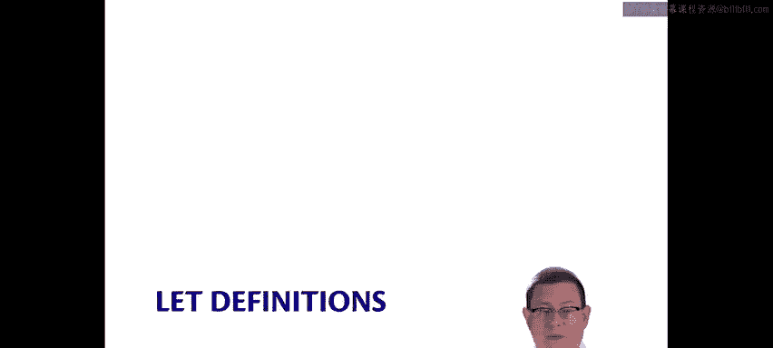
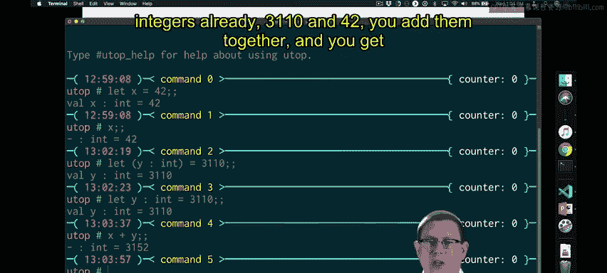
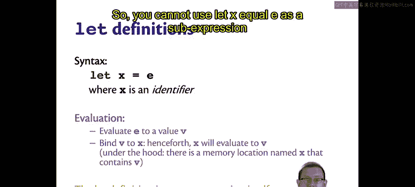
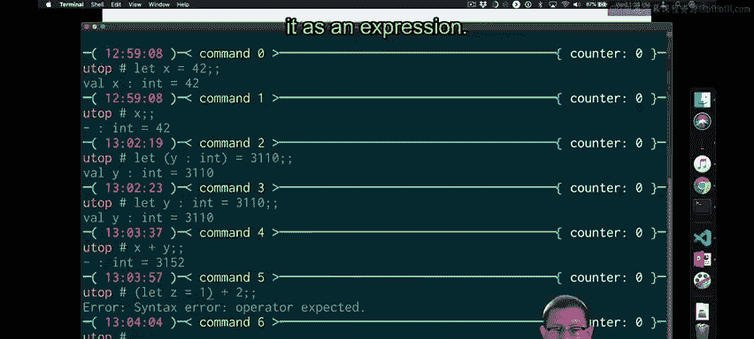
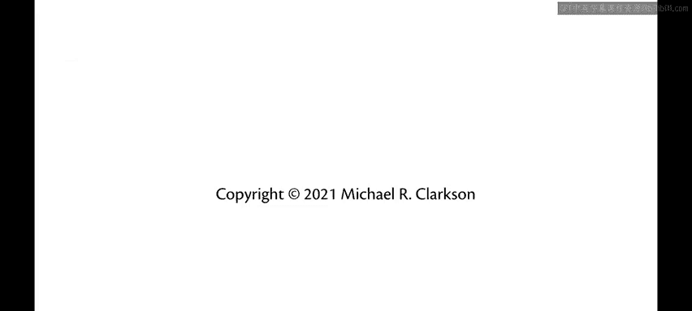

# 009：Let定义 🧩

在本节课中，我们将要学习OCaml程序的第二种基本构建块：定义。到目前为止，我们一直将表达式作为程序的基础。现在，让我们来看看如何通过定义来为值命名，并理解其语法和语义。

## 定义简介

定义允许我们为值赋予一个名称。这本质上类似于其他编程语言中的变量概念，但关键区别在于，这个“变量”的值一旦绑定，就不可更改。

例如，我们可以输入 `let x = 42`。系统会给出回应，现在 `x` 就代表 `42`。

让我们仔细看看这个回应。从右向左阅读：`let x = 42` 的结果是产生了一个值为 `42`、类型为 `int` 的结果，并且它被绑定到了名称 `X` 上（回应中的 `val x` 即表示此意）。因此，从左向右看，我们得到了一个名为 `X`、类型为 `int`、值等于 `42` 的值。

当我在下一个提示符中直接求值 `x` 本身时，我得到的是 `42`，它就是一个 `int`。`42` 是变量 `x` 的值，`x` 是名称。

我可以定义其他值，例如 `let y : int = 3110`。这里我添加了类型标注 `: int`。实际上，在这个类型标注中，括号是可选的，编译器可以推断出类型，因此并非必需。在这个特定的 `let` 定义语法中，由于语法足够明确，编译器即使没有括号也能理解我的意图。

现在 `y` 的值是 `3110`。有了这两个定义，我就可以进行运算，例如 `x + y`，结果是 `3152`。

## 深入理解定义

上一节我们直观地了解了 `let` 定义，本节中我们来看看如何更严谨地审视它们。

定义是为值命名的一种方式。但定义本身不是表达式，表达式也不是定义。在OCaml的语法中，它们是两个完全独立的类别。你不能把一个定义当作表达式来使用，反之亦然。

尽管如此，定义在语法上确实包含表达式。在我们之前的例子中，作为定义一部分写下的整数值，其本身就是表达式。

一个 `let` 定义的语法是 `let x = e`，其中 `x` 代表一个标识符。OCaml有形成标识符（可以理解为变量名）的规则，与其他语言非常相似。对于这些 `let` 定义，标识符必须以小写字母开头（后续我们会看到以大写字母开头的标识符例子）。OCaml对此有严格要求，如果你尝试以大写字母开头，将会收到错误信息。

这里的 `e` 可以是任何表达式，遵循我们已经见过或将要见到的任何表达式规则。

要评估一个 `let` 定义（即动态语义），步骤如下：
1.  首先，将表达式 `e` 求值为一个值 `v`。
2.  然后，将值 `v` 绑定到名称 `x` 上。“绑定”意味着将值 `v` 与名称 `x` 关联起来。此后，`x` 的求值结果永远是 `v`，它是不可变的。

如果你更喜欢从硬件层面思考，这里实际发生的是：计算机会分配一个新的内存位置，用名称 `x` 来指代它，并将值 `v` 存储在其中。

由于 `let` 定义本身不算作表达式，因此你不能将 `let x = e` 用作其他表达式的一部分。例如，你不能写 `let z = 1 + 2` 并期望 `let z = 1` 这部分先被求值。`let z = 1` 是一个定义，它绑定一个值到一个名称，但它自身没有值。你不能在期望一个值的上下文中（即作为表达式）使用它。如果你尝试编译这样的代码，将会得到一个语法错误，提示期望一个运算符，因为它无法将用作表达式的 `let` 定义解析出来。

## 定义与表达式的结合

如果你确实希望能够在表达式上下文中使用 `let` 定义，有一种方法可以实现，我们将在下一节中看到。

---

本节课中我们一起学习了OCaml中的 `let` 定义。我们了解到定义是为值赋予不可变名称的方式，其语法为 `let <标识符> = <表达式>`。我们明确了定义与表达式是语法上不同的类别，因此定义不能直接用作表达式的一部分。最后，我们提到了存在一种将定义融入表达式的方法，为后续学习留下了引子。