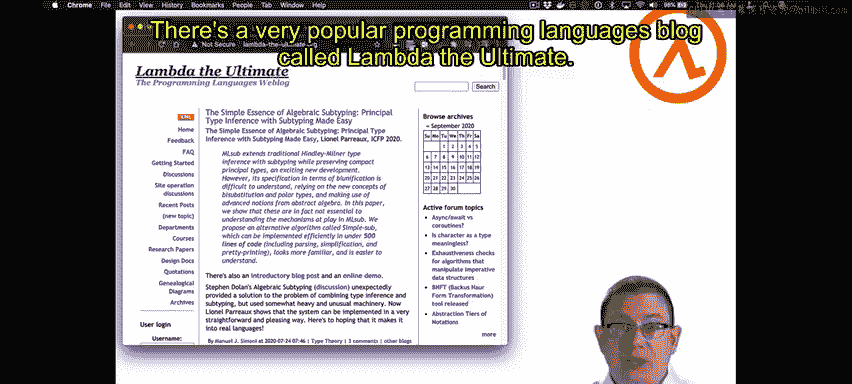
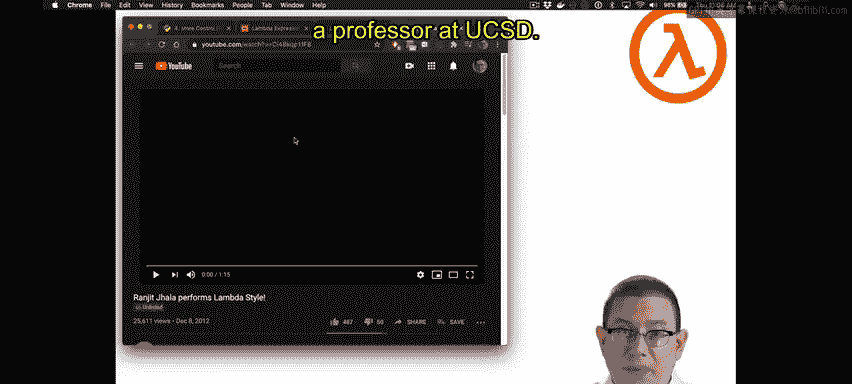
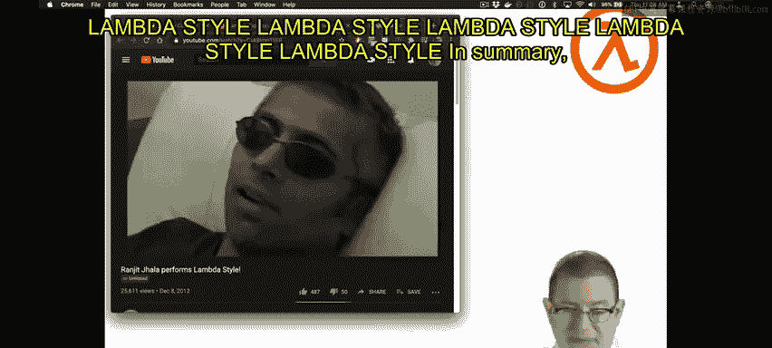
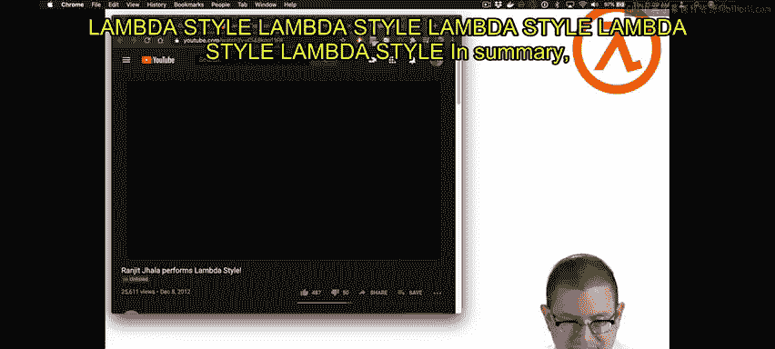
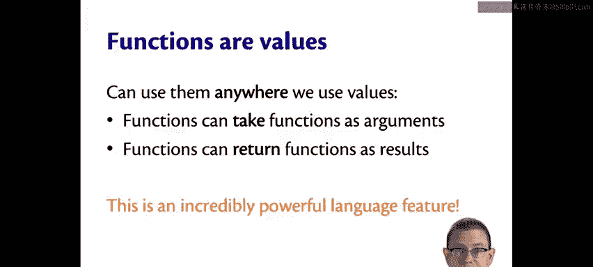

OCaml编程：2.9：匿名函数与Lambda表达式 🧮

在本节中，我们将深入探讨匿名函数的语法和语义，以及函数作为值的概念。

上一节我们介绍了函数的基本概念，本节中我们来看看匿名函数的具体语法和计算规则。

匿名函数表达式的语法以关键字 **fun** 开头。在OCaml中，**fun** 是一个关键字。其后是函数的参数，即参数名 `x1` 到 `xn`。这些参数名可以在函数体中被引用。参数名之后是一个箭头符号 `->`，它表示从输入到输出的转换。最后是函数体 `E`，它可以是任何表达式。

以下是匿名函数的语法结构：
```ocaml
fun x1 ... xn -> E
```

如何对函数进行求值？实际上，匿名函数本身就是一个值，就像整数、字符串或布尔值一样。在定义时，函数体 `E` 并不会被立即求值。根据OCaml的求值规则，函数体只有在函数被调用（应用）时才会被求值。因此，匿名函数在定义时就已经是最终值，无需进一步计算。

匿名函数在编程语言领域还有一个广为人知的名称：**Lambda表达式**。这个名称来源于数学中的Lambda演算记法 `λx. E`，其含义与OCaml中的匿名函数语法完全相同。这里的 `λ` 就相当于OCaml中的 `fun` 关键字。







Lambda表达式在各种编程语言和社区中无处不在：
*   Python使用 `lambda` 关键字创建Lambda表达式。
*   Java也支持Lambda表达式。
*   有一个非常流行的编程语言理论博客名为“Lambda the Ultimate”。
*   甚至还有以“Lambda Style”为主题的趣味文化作品。



既然函数是值，我们就可以像使用其他值一样使用函数。这意味着函数可以作为参数传递给其他函数，也可以作为其他函数的结果被返回。这是函数式编程的一个非常强大且显著的特征，它将带来深远的影响。



本节课中我们一起学习了匿名函数（Lambda表达式）的语法和语义，理解了函数在定义时即为值，且函数体在调用时才被求值的规则。更重要的是，我们认识了“函数作为值”这一核心概念，它是实现高阶函数和函数式编程强大表达能力的基础。