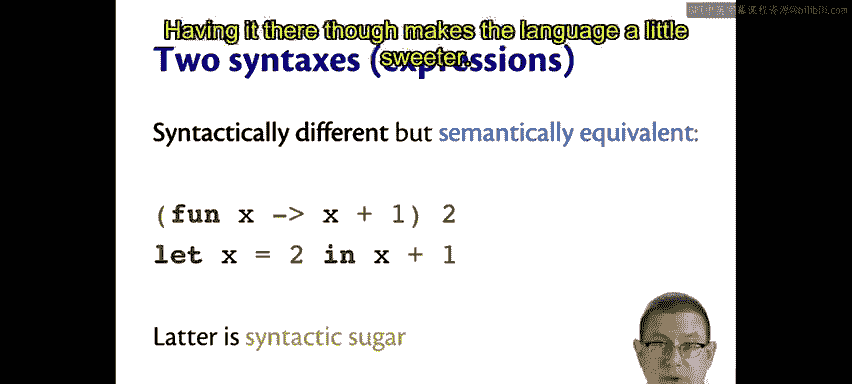

# 016：命名函数 🏷️

在本节课中，我们将要学习如何为函数命名。虽然匿名函数很有用，但在编程实践中，为函数赋予名称是组织代码和提升可读性的关键。

## 概述

上一节我们介绍了匿名函数，本节中我们来看看如何为函数命名。实际上，这与为其他值命名并无不同，因为函数本身也是值。

## 为函数命名

我们可以像绑定其他值一样，将一个匿名函数绑定到一个名称上。

例如，我们之前有一个递增函数：
```ocaml
fun x -> x + 1
```
我们可以为它命名：
```ocaml
let inc = fun x -> x + 1
```
现在，我们有了一个名为 `inc` 的函数，其类型为 `int -> int`。它可以对传递给它的任何参数进行递增操作。

## 简化的函数定义语法

总是书写 `fun ... -> ...` 语法会显得冗长。OCaml 提供了一种更简洁的方式来定义命名函数。

我们可以这样写：
```ocaml
let inc x = x + 1
```
这行代码与上面使用 `fun` 关键字定义的 `inc` 函数在语义上完全等价。它通过将参数直接放在等号左侧，省略了 `fun` 关键字和箭头，使语法更简洁。

让我们用这个语法重写求平均值的函数：
```ocaml
let average x y = (x +. y) /. 2.0
```
现在，我们可以计算两个数的平均值。当然，我们也可以用匿名函数语法来写，但大多数 OCaml 程序员会选择这种更便捷的形式。

## 语法糖

我们现在看到了两段语法不同但语义等价的代码。
- `let inc = fun x -> x + 1`
- `let inc x = x + 1`

它们含义相同，求值方式也相同。这种现象被称为**语法糖**。当一门语言中有两种不同的语法形式表达相同含义，但其中一种更易于使用时，后者就是前者的语法糖。

第一种带有 `fun` 关键字的形式是更基础的形式。第二种将参数置于左侧的形式则更“甜”，写起来更方便。没有它我们也能编程，但语言提供了它，让编程体验更佳。

OCaml 的设计使得许多复杂的表达式可以简化为更简单的形式，语法糖就是这一理念的体现。



以下是另一个例子：
```ocaml
(fun x -> x + 1) 2
```
在语法上不同于下一行：
```ocaml
let x = 2 in x + 1
```
但它们在语义上是等价的。根据各自的求值规则，两者最终都会进行相同的替换（用 `2` 替换 `x`）和计算，得到结果 `3`。因此，`let` 表达式在这里也是语法糖，它比使用匿名函数应用更易读。

## 深入理解求值过程

让我们更仔细地分析一个之前见过的例子。假设在顶层定义了函数：
```ocaml
let f x y = x - y
```
然后应用它：
```ocaml
f 3 2
```
我们知道，在顶层书写的 `let` 定义，实际上被理解为嵌套的 `let` 表达式。因此，这两行代码共同作用的方式如下：
```ocaml
let f = (fun x y -> x - y) in f 3 2
```
根据 `let` 表达式的求值规则，这意味着将 `f` 替换为那个匿名函数。于是我们得到：
```ocaml
(fun x y -> x - y) 3 2
```
再根据匿名函数应用的求值规则，我们取函数体 `x - y`，将 `x` 替换为 `3`，`y` 替换为 `2`，最终得到结果 `1`。

所以，当你在交互环境中键入 `let f x y = x - y` 然后应用 `f 3 2` 时，背后正是这些求值规则在运作，最终产生了值 `1`。

## 总结

本节课中我们一起学习了如何为函数命名。我们了解到：
1.  函数是值，可以像其他值一样被绑定到名称上。
2.  OCaml 提供了 `let func_name arg = ...` 这种简洁的语法来定义命名函数，它是 `let func_name = fun arg -> ...` 的语法糖。
3.  **语法糖**是指语法不同但语义等价的表达方式，它使代码更易于编写和阅读。
4.  通过分析 `let` 表达式和函数应用的求值规则，我们更深入地理解了代码执行背后的逻辑。


掌握命名函数是构建复杂程序的基础，它帮助我们更好地组织和复用代码。