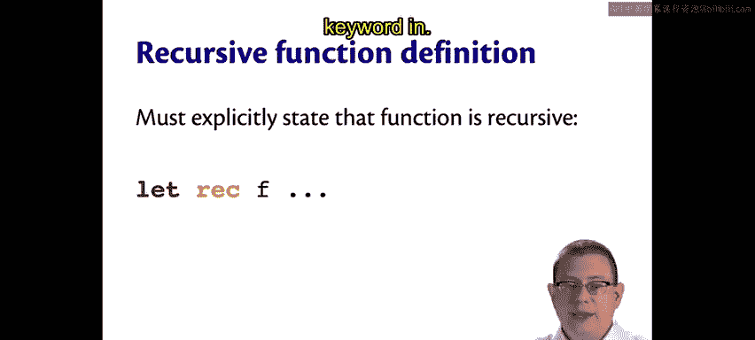
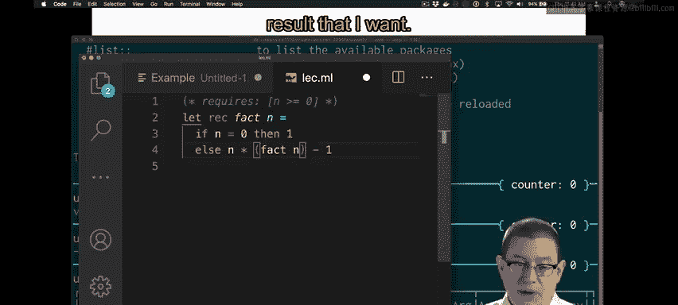
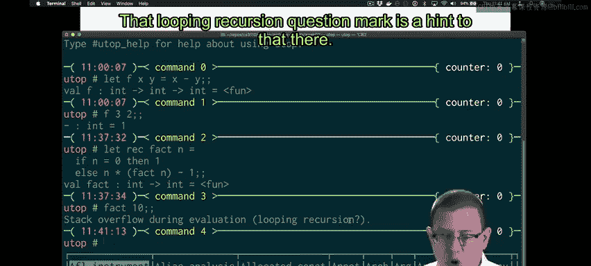
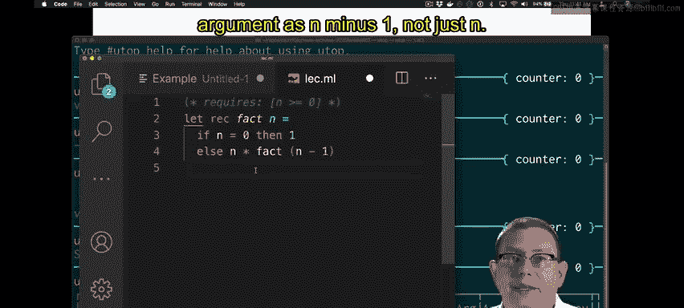
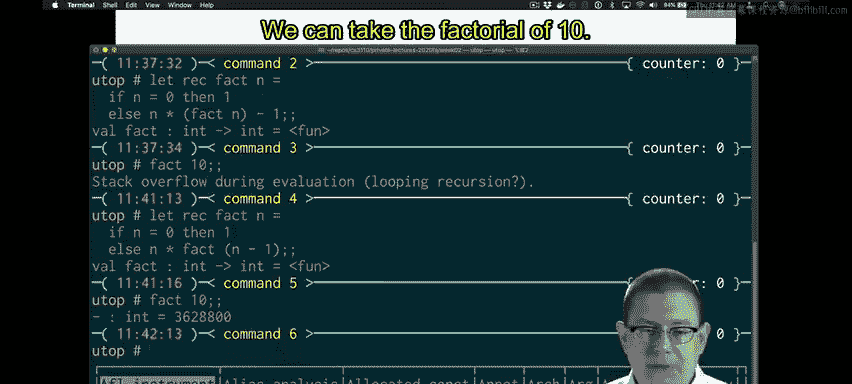

# 017：递归函数 🌀

在本节中，我们将学习OCaml中递归函数的定义方法，包括必须使用的`rec`关键字、递归函数的基本结构，以及编写递归函数时需要注意的常见语法问题。

---

## 语法要求：`rec`关键字

在OCaml中，定义递归函数时必须在`let`和函数名之间显式添加`rec`关键字。这是OCaml语言的设计选择，其他函数式语言可能有不同的设计。虽然支持这种设计的论点并不特别重要，但最重要的是记住添加这个关键字。

**代码示例：**
```ocaml
let rec function_name parameters = 
  (* 函数体 *)
```



---

## 编写阶乘函数

上一节我们介绍了`rec`关键字的基本语法，本节中我们来看看如何用它编写一个实际的递归函数——阶乘函数。

假设要编写阶乘函数`fact(n)`。阶乘的定义是：如果`n`为0，则`0! = 1`；否则，`n! = n * (n-1)!`。此外，应该注明前置条件：`n >= 0`，因为如果用户传入负数，函数行为将不可预测。

**阶乘函数定义：**
```ocaml
let rec fact n =
  if n = 0 then 1
  else n * fact (n - 1)
```

---

## 常见错误与注意事项

在编写递归函数时，有几个常见的语法错误需要注意。

以下是两个关键注意事项：

1. **忘记`rec`关键字**：如果忘记添加`rec`关键字，OCaml编译器会提示“未绑定的值”错误，因为函数在递归调用自身时尚未定义。

2. **参数括号的使用**：在递归调用`fact (n - 1)`中，括号是必需的。如果写成`fact n - 1`，OCaml会将其解析为`(fact n) - 1`，这将导致无限递归和栈溢出。

**错误示例导致的栈溢出：**
```ocaml
let rec fact n =
  if n = 0 then 1
  else n * fact n - 1  (* 错误：缺少括号 *)
```

执行此代码会导致栈溢出，因为函数会无限调用自身，直到调用栈耗尽。



---

## 正确实现与测试

为了正确实现阶乘函数，必须确保括号放在正确的位置，强制OCaml将`n - 1`整体作为参数解析，而不是仅将`n`作为参数。



**修正后的阶乘函数：**
```ocaml
let rec fact n =
  if n = 0 then 1
  else n * fact (n - 1)  (* 正确：使用括号 *)
```

现在，我们可以正确计算阶乘，例如`fact 10`将返回`3628800`。

---



## 总结



本节课中我们一起学习了OCaml中递归函数的定义方法。关键点包括：必须使用`rec`关键字显式声明递归函数；编写递归函数时要正确处理基准情况和递归步骤；特别注意参数传递时的括号使用，避免因解析错误导致的无限递归。掌握这些基础后，您就能开始编写自己的递归函数了。