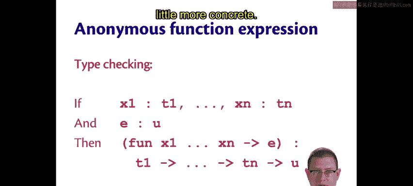
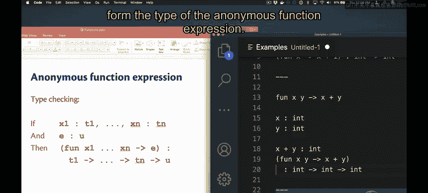
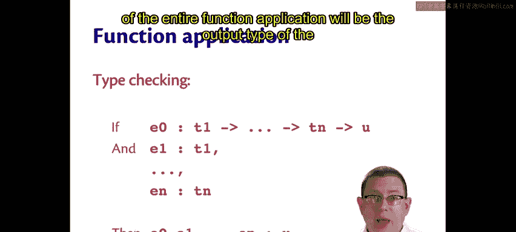
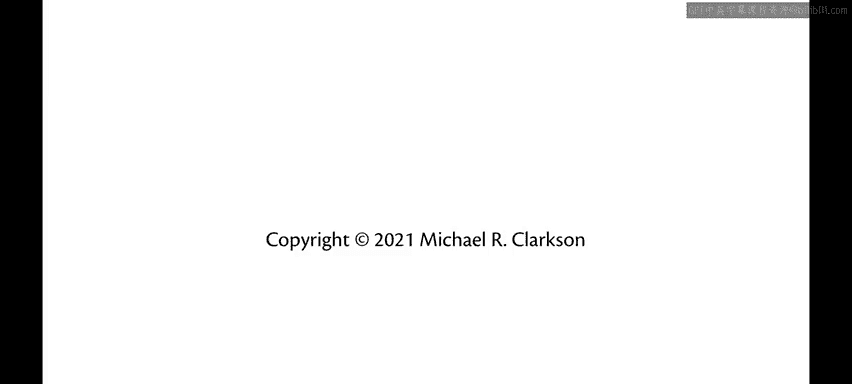

# 018：函数类型 🧮

在本节课中，我们将要学习OCaml中函数类型的静态语义，即类型检查规则。我们将探讨如何表示函数类型，以及如何对匿名函数表达式和函数应用进行类型检查。

---

## 函数类型表示

上一节我们介绍了函数的语法和动态语义（求值规则），本节中我们来看看函数的静态语义，即它们的类型检查规则。

一个函数类型使用箭头类型 `T -> U` 表示。这是一个函数的类型，它接受一个类型为 `T` 的输入，并返回一个类型为 `U` 的输出。

同样地，如果一个函数接受两个参数，其类型 `T1 -> T2 -> U` 表示该函数接受一个类型为 `T1` 的输入，再接受一个类型为 `T2` 的输入，并返回一个类型为 `U` 的输出。

因此，所有箭头链末尾的最后一个类型始终是函数的输出类型，而该链中在此之前的所有类型都是输入类型。通过这种方式，可以表示接受任意数量输入的函数。

注意，语言中的箭头语法在这里有双重用途。它既用于表示函数类型，也用于表示函数值（当我们使用匿名函数关键字 `fun` 时）。这很好，因为它表明这两者密切相关，它们都是一种将输入（或多个输入）转换为输出的变换概念。

---

## 匿名函数表达式的类型检查

匿名函数表达式的类型检查规则本质上表明，函数的类型就是其参数类型 `->` 其输出类型。

用数学方式表示，如果每个参数都能被赋予类型（即 `x1` 能被赋予类型 `T1`，一直到 `xn` 被赋予类型 `Tn`），并且匿名函数体 `e` 具有类型 `U`，那么匿名函数表达式 `fun x1 ... xn -> e` 的类型就是 `T1 -> ... -> Tn -> U`。

让我们看几个例子，使其更具体。

**示例1：单参数函数**

假设我们有匿名函数 `fun x -> x + 1`。我们知道，程序员本可以在 `x` 上写一个类型注解，说明 `x` 必须是整数。OCaml通过类型推断来弄清楚这一点。

暂时抛开类型推断的问题。我们人类当然可以通过观察函数表达式的右侧来说：如果 `x` 与 `1` 通过 `+` 运算符相加，那么 `x` 必须是整数。OCaml也大致是这样推断的。

因此，如果我们知道 `x` 的类型是 `int`，那么函数体 `x + 1` 的类型也是 `int`（因为它是将 `+` 运算符应用于两个整数的结果）。所以，整个匿名函数表达式 `fun x -> x + 1` 的类型是 `int -> int`（参数类型 `->` 输出类型）。

**示例2：多参数函数**

假设我们有 `fun x y -> x + y`。如果 `x` 的类型是 `int`，`y` 的类型是 `int`（同样，这是由OCaml的类型推断部分提供的假设，我们人类也能通过思考得出：`+` 运算符的类型是 `int -> int -> int`，因此 `x` 和 `y` 必须是整数才能使整个表达式成立）。

那么，函数体 `x + y` 的类型是什么？它必须是 `int`（同样因为 `+` 运算符）。因此，整个匿名函数表达式 `fun x y -> x + y` 的类型是 `int -> int -> int`。

我们通过假设参数类型必须是什么，找出函数体的类型，然后将它们组合起来形成匿名函数表达式的类型。

---

## 函数应用的类型检查

函数应用的类型检查规则非常相似。

如果被应用的函数（当然可以是一个表达式 `e0`）具有类型 `T1 -> ... -> Tn -> U`（即它具有类型为 `T1` 到 `Tn` 的参数，以及输出类型 `U`），并且如果每个参数表达式都具有与函数类型相匹配的正确类型，那么整个函数应用的结果类型将是函数的输出类型 `U`。

---

## 总结

本节课中我们一起学习了OCaml中函数类型的静态语义。我们了解了如何使用箭头语法 `T -> U` 表示函数类型，以及如何对匿名函数表达式（如 `fun x -> x + 1`）和函数应用进行类型检查。核心规则是：函数的类型由其参数类型和返回类型决定，而函数应用的结果类型就是被调用函数的返回类型。理解这些规则是掌握OCaml强大类型系统的基础。