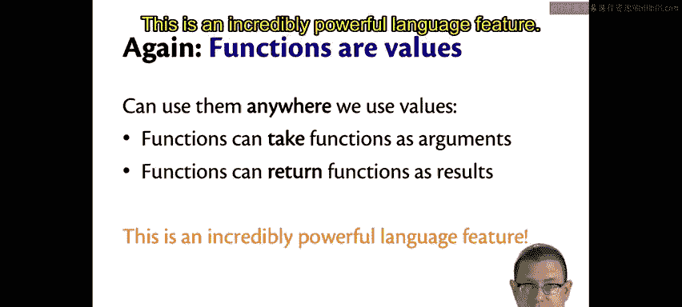
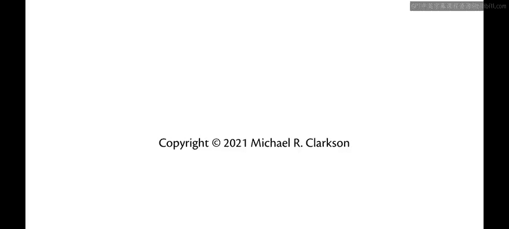

OCaml编程：2.14：部分应用

在本节中，我们将学习OCaml中一个称为“部分应用”的强大特性。这个特性可能与你之前在其他编程语言中见过的概念有很大不同，它允许我们只向函数提供部分参数，从而创建一个新的函数。

部分应用是函数式编程的标志性特性之一，它极大地增强了代码的表达能力和灵活性。

---

### 部分应用示例

让我们从一个简单的函数开始。以下是一个将两个整数相加的函数：

```ocaml
let add x y = x + y
```

这个函数接收两个参数 `x` 和 `y`，并返回它们的和。我们可以像往常一样调用它：

```ocaml
add 2 3 (* 结果为 5 *)
```

然而，在OCaml中，我们也可以只提供第一个参数：

```ocaml
add 2
```

这个表达式的结果不是一个整数，而是一个**函数**。Utop（交互式环境）的输出会显示这是一个类型为 `int -> int` 的函数。这意味着 `add 2` 返回了一个新函数，这个新函数接收一个整数，并返回该整数与2的和。

因此，我们可以这样做：

```ocaml
(add 2) 3 (* 结果为 5 *)
```
这里的括号将 `add` 和 `2` 组合在一起，先进行部分应用，生成一个新函数，然后再将这个新函数应用到参数 `3` 上。

为了更清晰地理解，我们可以分步进行：

```ocaml
let add2 = add 2
```
现在，`add2` 是一个函数，它将给任何输入值加上2。

```ocaml
add2 0 (* 结果为 2 *)
add2 10 (* 结果为 12 *)
```
这解释了为什么之前 `(add 2) 3` 的结果是5。

---

### 部分应用的原理

上一节我们通过示例看到了部分应用的效果，本节中我们来看看它为何能工作。这需要揭示一个关于OCaml函数的重要事实。

我必须坦白：我之前说OCaml有多参数函数，这并不完全准确。实际上，OCaml**没有**真正的多参数函数。

所有看起来像多参数的函数，都只是“语法糖”。它们实际上是**一系列嵌套的单参数函数**。

例如，我们写的 `add` 函数：
```ocaml
let add x y = x + y
```
实际上是以下代码的简写：
```ocaml
let add = fun x -> (fun y -> x + y)
```
或者更明确地：
```ocaml
let add =
  fun x ->
    fun y ->
      x + y
```

这意味着 `add` 是一个接收参数 `x` 的函数，它返回另一个函数。这个返回的函数接收参数 `y`，并最终计算 `x + y`。

这种设计之所以可能，完全得益于我们之前的核心决策：**函数是值**。函数可以像其他值一样被传递、返回和使用。部分应用正是“返回一个函数作为结果”这一能力的直接体现。

当我们写下 `add 2` 时，我们提供了第一个参数 `x`，于是得到了内部函数 `fun y -> 2 + y`。这就是部分应用。

---

### 核心概念总结

以下是部分应用与函数定义的核心要点：

1.  **函数定义的本质**：形如 `fun x y -> e` 的表达式是 `fun x -> (fun y -> e)` 的语法糖。
2.  **部分应用**：当向一个“多参数”函数提供少于其定义的参数时，会返回一个新的函数，这个新函数接收剩余的参数。
3.  **类型推导**：函数 `add` 的类型是 `int -> int -> int`。这可以理解为 `int -> (int -> int)`。应用第一个 `int` 后，结果类型就是 `int -> int`。

---

### 为何强大

部分应用是一个极其强大的语言特性。它允许我们轻松地从通用函数创建出特定的函数，促进了代码的复用和组合。这是函数式编程范式的基石之一，能够帮助你编写出更简洁、更模块化的代码。



---



本节课中我们一起学习了OCaml的部分应用。我们了解到，OCaml中看似多参数的函数实质上是柯里化的单参数函数链。部分应用允许我们固定函数的部分参数来创建新函数，这是实现函数组合和高阶抽象的关键工具。掌握这个概念，将为你打开函数式编程思维的大门。