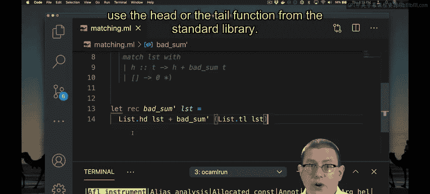
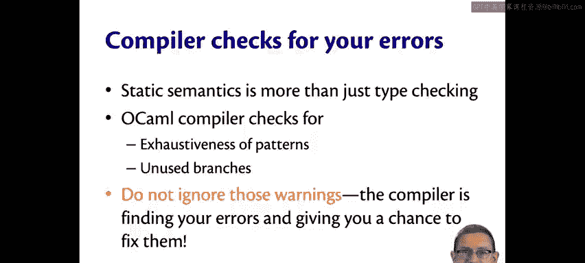

OCaml编程：3.12：模式匹配的静态检查 🧐

在本节课中，我们将学习OCaml编译器如何通过静态检查来帮助我们避免模式匹配中的常见错误。我们将看到编译器不仅能进行类型检查，还能检查模式匹配的完整性和冗余性，从而在代码运行前就发现潜在的问题。

---

我们已经多次讨论过静态语义。我之前提到过，静态语义通常涉及类型检查。

但静态语义的内容可以不止于类型检查。在模式匹配方面，OCaml所做的就不仅仅是类型检查。让我展示一些有趣的例子。

### 检查模式匹配的完整性

以下是一段用于判断列表是否为空的代码。我将其命名为 `bad_empty`。实际上，OCaml会给我一个警告。那个波浪下划线处，当我悬停时，会显示“警告：此模式匹配不完整。这里有一个未被匹配的例子：`_::_`”。（Merlin是帮助OCaml显示此信息的IDE插件。）

所以，对于被匹配的表达式 `lst`（一个列表），存在一种情况我没有覆盖到。我对数据可能形态的覆盖是不完整的。更简单地说，我遗漏了一个分支。`match lst with [] -> true`，但我忘记了处理非空列表的分支。

为什么这是个问题？这里的代码存在缺陷。事实上，如果我不小心，这段代码会引发异常。

让我们在终端中看看这种情况。使用那段匹配代码。你可以再次看到警告，但我将忽略它并尝试使用这段代码。

`bad_empty` 在空列表上返回什么？`true`，它是空的。但在包含一个元素的列表上呢？我得到了一个异常，一个匹配失败异常。我们不希望在运行时出现异常，它们会导致程序崩溃，让用户不满意。

因此，我们需要关注编译器给出的警告并修复它。这里，我应该意识到，哦，是的，对于任何其他列表，我应该返回 `false`。现在我得到了该函数的一个良好实现。

### 检查冗余的模式分支

让我们看下一个例子。这里我试图对列表元素求和，但我又犯了一个错误。OCaml会就模式匹配给我一个警告：“此匹配分支未被使用”。

OCaml的意思是，它已经推断出，无论被匹配的表达式 `lst` 的值是什么，这个特定的分支都永远不会被匹配到。

那么，为什么这里永远不会用到它呢？让我们仔细看看。

如果列表非空（即 `head::tail`），我们将把 `head` 加到剩余列表的和中。这看起来没问题。如果列表只有一个元素，那么单元素列表的和就是 `x`，这看起来也对。如果列表为空，其和应为 `0`，这也对。那为什么这个分支是未使用的？为什么它是冗余的？

请记住，列表的方括号表示法实际上只是语法糖。我本可以将其写为 `x::[]`。实际上，作为一个模式，它仍然是冗余的。事实上，那个匹配分支未被使用。但现在可能更清楚为什么它是冗余的了。

想想上面第一个分支会发生什么。那个模式将匹配任何具有头部元素和尾部的列表，无论尾部有多少个元素（10个、1个，甚至是0个）。而这正是第二个分支所考虑的情况：一个具有头部元素（无论我们称它为 `x` 还是 `h`）和一个空尾部的列表。

因此，当你尝试匹配只有一个元素的列表时，第一个分支总是会被触发，我们总是会匹配到它，并用 `bad_sum` 进行递归调用。

在这个例子中，这并不意味着代码有特别严重的错误。如果我们运行它：空列表的 `bad_sum` 是 `0`，列表 `[1;2;3]` 的 `bad_sum` 是 `6`。代码仍然产生了正确的结果。

但从代码质量的角度看，它并不好，因为这里有一些永远不会被执行的代码。它不应该存在于我们的代码库中，我们不需要维护它。通常，这意味着我们没有足够仔细地考虑某些情况，需要重新思考我们的代码。在这种情况下，我们可以直接删除整行来简化函数。

### 避免使用 `hd` 和 `tl` 函数

作为第三个例子，让我们看一段甚至没有模式匹配的代码。这是 `sum` 的另一个实现。让我们尝试运行它。我们有 `bad_sum_prime`。

如果我尝试对列表 `[1;2;3]` 求和，我得到了一个失败，一个异常。这是怎么回事？

这个版本的 `sum` 实现使用了两个库函数：`List.hd` 和 `List.tl`。正如你可能猜到的，它们代表头部（head）和尾部（tail），旨在给我们列表的头部和尾部。

所以，你可以取列表 `[1;2;3]` 的头部，得到 `1`。你可以取列表 `[1;2;3]` 的尾部，得到 `[2;3]`。

那么，当这些函数应用于空列表时会发生什么？对于空列表，你无法返回其头部；对于空列表，你也无法返回其尾部。因此，标准库在这两种情况下都会引发一个名为 `Failure` 的异常（我们将在下周更详细地学习异常）。

但这里 `bad_sum_prime` 的实现使用了 `hd` 和 `tl`，而不是模式匹配。它说：取列表的头部，并将其与对列表尾部进行递归调用的结果相加。

本质上，这正是 `bad_sum` 在这里所做的：试图将列表的头部与对尾部递归调用的结果相加。但通过不使用模式匹配，而使用 `hd` 和 `tl`，编写这段代码的人实际上遗漏了列表可能的一种情况：他们忘记了它可能是空的。

这有点类似于我们第一个例子中的相反情况，那里的程序员忘记了列表可能是非空的。这就是使用 `hd` 和 `tl` 的危险之处：它们可能导致在空列表上引发异常。

因此，作为一种良好的实践，**使用模式匹配来访问列表元素比使用 `hd` 和 `tl` 函数更好**。OCaml通过模式匹配提供的静态检查因此是一个优势，因为它有助于防止有缺陷的代码。虽然偶尔可能会有你想使用标准库中的 `hd` 或 `tl` 函数的情况，但这里的情况并非如此。

---

### 总结

本节课中，我们一起学习了OCaml编译器如何对模式匹配进行静态检查。我们看到了编译器如何检查模式匹配的**完整性**（避免遗漏分支）和**冗余性**（避免无用的分支）。我们还了解到，相比于直接使用 `List.hd` 和 `List.tl` 函数，使用模式匹配来解构列表是更安全、更受编译器保护的做法，因为它能在编译时强制我们处理所有可能的情况，从而避免运行时异常。

请务必不要忽略这些警告。编译器正在为你发现错误，并给你修复它们的机会。请充分利用这一点。