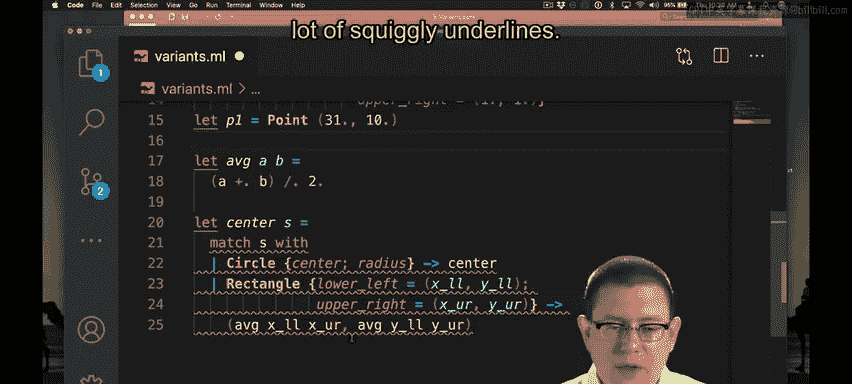
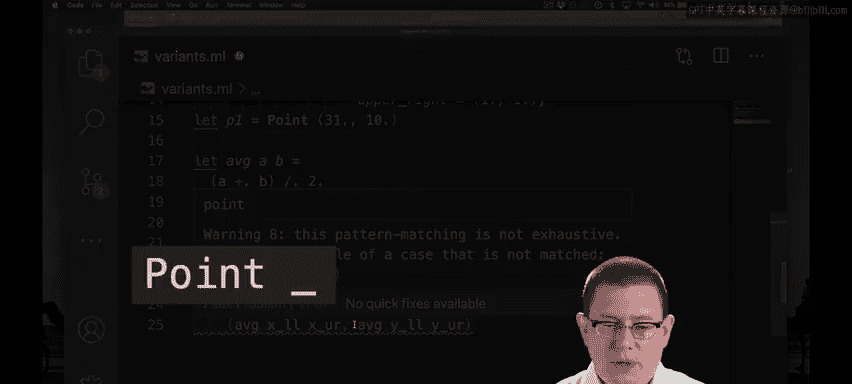
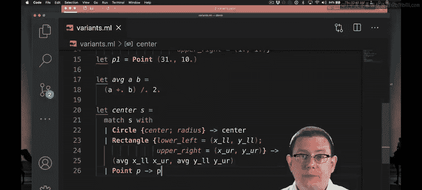

# 037：变体模式匹配（第二部分）🎬

在本节课中，我们将继续学习OCaml中的模式匹配，特别是如何通过嵌套模式来简化代码，以及当为变体类型添加新的构造函数时，如何更新模式匹配表达式以保证其完整性。

上一节我们介绍了如何使用模式匹配来获取图形的中心点。本节中，我们来看看如何通过嵌套模式来优化代码，并探索如何为图形类型添加新的形状。

## 优化矩形中心的模式匹配

在之前的代码中，为了确定矩形的中心，我们首先需要模式匹配以判断它是否为矩形。如果是，则从记录中提取左下角和右上角的坐标，然后进一步对这些点进行模式匹配以获取各自的X和Y坐标。

实际上，我们可以编写更复杂的模式。就像表达式可以嵌套一样，模式也可以嵌套在其他模式内部。

因此，对于左下角点 `lower_left`，我们可以直接在此处进行模式匹配，立即提取出该点的X和Y坐标。对于右上角点 `upper_right` 也可以进行同样的操作。

以下是优化后的代码示例：
```ocaml
match s with
| Circle {center; radius} -> center
| Rect {lower_left = {x = llx; y = lly}; upper_right = {x = urx; y = ury}} ->
    {x = (llx +. urx) /. 2.0; y = (lly +. ury) /. 2.0}
```
通过这种深层模式匹配（即将模式嵌套在其他模式中），我们不再需要中间的额外提取步骤。这有助于显著简化代码。

## 为图形类型添加新形状



当然，圆形和矩形并非世界上唯一的图形。让我们添加一种非常简单的形状：一个点。它甚至不是二维图形，而是一维的。这个构造函数将携带该点的坐标信息。



以下是添加新构造函数后的类型定义：
```ocaml
type point = {x: float; y: float}
type shape =
  | Circle of {center: point; radius: float}
  | Rect of {lower_left: point; upper_right: point}
  | Point of point  (* 新增的构造函数 *)
```
现在，我们可以创建一个点：
```ocaml
let p = Point {x=3.0; y=1.0}
```
当我们回到 `center` 函数时，编译器会立即提示问题。

## 处理非穷尽的模式匹配

编译器会警告：“此模式匹配不完整。这里有一个未被匹配的例子：`Point _`。”

这意味着模式匹配中缺少了一个构造函数。你还没有说明当传入函数 `center` 的形状 `s` 是一个点时应该做什么。这个点会携带一些额外的信息，即该点所在的坐标（小写的 `point` 类型）。下划线 `_` 指代的就是这个被携带的数据，它表示：“嘿，这是一个可以匹配到此处的模式示例，`Point` 构造函数携带了一些其他数据。” 因此，我们需要将其添加进去。

那么，对于点应该返回什么呢？点的中心就是它本身。我们可以通过模式匹配提取坐标后返回，但正如我们刚才所见，如果我们愿意，也可以直接在那里提取X和Y坐标并返回。

以下是更新后的 `center` 函数，包含了对 `Point` 的处理：
```ocaml
let center s =
  match s with
  | Circle {center; radius} -> center
  | Rect {lower_left = {x = llx; y = lly}; upper_right = {x = urx; y = ury}} ->
      {x = (llx +. urx) /. 2.0; y = (lly +. ury) /. 2.0}
  | Point p -> p  (* 点的中心就是它本身 *)
```
我们也可以写成 `Point {x; y} -> {x; y}`，但直接返回 `p` 更简洁。

需要注意的一点是，我们不能在这里使用下划线 `_` 来匹配 `Point`，因为那样会匹配并丢弃 `Point` 构造函数内部的数据。这样我们将不知道返回什么，最好的情况也只能返回一个无意义的值或导致失败。同样，你也不能省略该构造函数应该携带的数据而返回其他东西（例如一个虚拟值 `p1`），否则会得到错误：“此构造函数 `Point` 期望一个参数，但此处应用了零个参数。” 因此，我们确实需要说明与大写 `Point` 构造函数一起携带的那个点是什么。



本节课中我们一起学习了如何通过嵌套模式匹配来编写更简洁的代码，以及如何在扩展变体类型时，通过添加相应的分支来保持模式匹配的完整性，确保函数能够处理所有可能的输入情况。