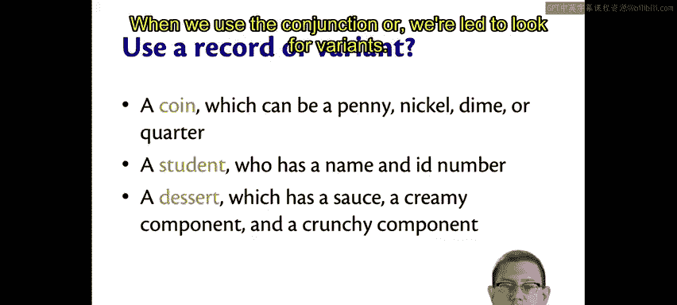
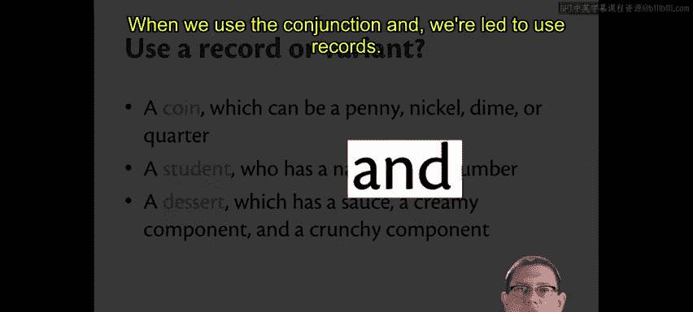
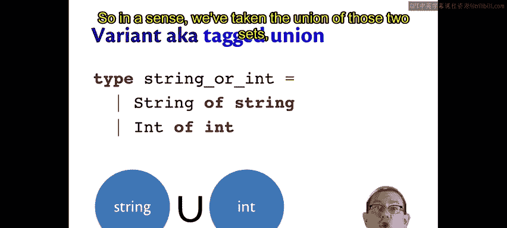
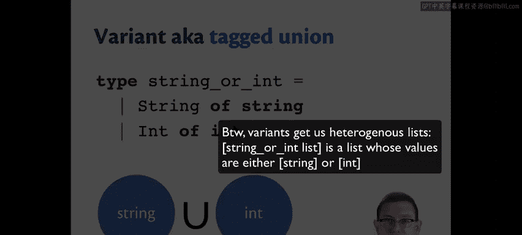
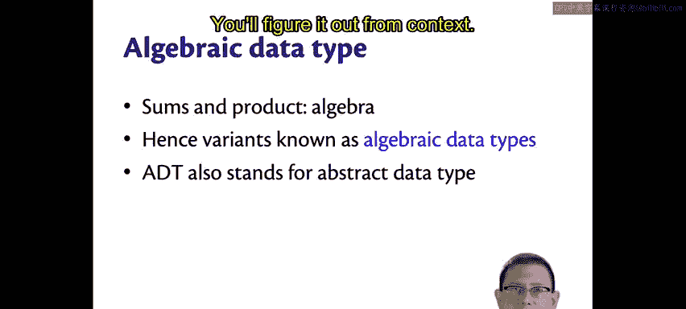

OCaml编程：第3章：代数数据类型 🧮

在本节课中，我们将深入学习代数数据类型。这是函数式编程的核心概念之一，它帮助我们以一种结构化的方式对现实世界的数据进行建模。

---

### 概述：记录与变体

我们已经接触过代数数据类型，现在让我们更仔细地审视它们。我们将通过尝试对现实世界中的数据进行建模来理解其本质。思考在以下每种情况下，你会选择使用记录还是变体。

---

### 硬币建模：使用变体

假设你想为硬币建模，并且这些硬币是美国货币：一分、五分、一角或二十五分。对于这种情况，使用记录还是变体更有意义？

我们正在尝试对可能是几种事物之一的东西进行建模。一枚硬币要么是一分、五分、一角，要么是二十五分，而变体允许我们做到这一点。它让我们拥有这四个不同的构造器，并且该类型的任何值都恰好是其中之一。

以下是硬币类型的定义：
```ocaml
type coin = Penny | Nickel | Dime | Quarter
```

---

### 学生建模：使用记录

接下来考虑学生。一个学生可能有一个名字和一个学号。对于这种情况，你会使用记录还是变体？

我会使用记录。因为我知道在为学生建模时，我希望拥有该学生的两个数据片段。我可以创建一个包含这两个字段的记录：一个用于学生姓名，另一个用于学生学号。当然，如果我尝试使用变体，并为姓名和学号各设一个构造器，那么我将永远无法同时拥有这两个数据片段。我需要同时拥有两者，这促使我选择记录。

以下是学生记录的定义：
```ocaml
type student = { name : string; id : int }
```



---



### 甜点建模：再次使用记录

现在考虑甜点。我曾经在康奈尔大学上过酒店管理学院的烹饪课，从中我了解到，一个合格的甜点需要包含酱汁、奶油成分和酥脆成分。那么，我会使用记录还是变体来为甜点建模？

我会使用记录。因为我知道它需要包含所有这三个成分，而不仅仅是恰好一个。这里需要注意的一个关键词是描述数据时使用的连词。

---

### 连词的关键作用：“或”与“和”

当我们使用连词 **“或”** 时，我们倾向于寻找变体。当我们使用连词 **“和”** 时，我们倾向于使用记录。

我们可以将其视为 **“其中之一”类型** 和 **“每一个”类型** 之间的区别。

*   **记录和元组**是“每一个”类型的例子，因为记录或元组的每个值都包含其他组件的每一个值。例如，代表学生的记录包含姓名和学号。这些也被称为**积类型**，其概念源于笛卡尔积。例如，你可以有浮点数与浮点数的笛卡尔积，这可以表示笛卡尔平面上的点。或者，你可以取任意两个类型（如字符串和整数）的笛卡尔积，这样你就得到了一个字符串和一个整数——这里又出现了“和”这个词。
*   **变体**被称为“其中之一”类型，因为变体的任何值都是一组构造器中的其中一个。例如，一个形状必须是圆形、矩形或点中的恰好一个。有时这些也被称为**和类型**。

---

### 变体作为标记联合

从数学上讲，它们被称为和类型的原因可能不如笛卡尔积那么为人熟知。其概念是我们在取两个集合的**并集**，而在笛卡尔积中，我们取的是两个集合的**乘积**。



这里有一个例子。我们可以定义一个变体类型，表示一个值要么是字符串，要么是整数。它有两个构造器：`String` 和 `Int`，每个构造器都携带一个适当类型的值。



```ocaml
type string_or_int = String of string | Int of int
```

现在，`string_or_int` 类型的任何值都将是字符串或整数中的恰好一个。因此，在某种意义上，我们取了这两个集合（这两种类型）的并集。

但这其中还有更多内容。它不仅仅是一个并集，因为构造器名称（或标签）告诉我们该值来自哪个集合。在我们正在查看的这个类型中，你大致可以分辨出它来自哪个集合，因为有两个不同的集合（字符串和整数是不同的）。但假设我们想创建一个要么是“蓝色整数”要么是“粉色整数”的东西。现在，我们取的是所有整数集合的两个副本，并将它们合并在一起。我们需要跟踪值来自哪个副本——是来自蓝色整数集合还是粉色整数集合——这就是标签告诉我们的信息。

这在数学上被称为**标记联合**，它被写成一个通常的集合并集，但在其中有一个小加号。这就是变体的本质：它们是标记联合，因为它们确切地告诉我们值来自哪个集合。这就是为什么它们有时被称为和类型，因为“联合”很像“求和”。

---

### 代数数据类型：和与积的结合

当你同时拥有“和”与“积”时，可能会让你联想到代数。确实，变体也被称为**代数数据类型**，因为它们允许和与积的组合，允许“每一个”类型和“其中之一”类型的组合。

代数数据类型的缩写是 **ADT**，这有点不幸，因为它与**抽象数据类型**的缩写发生了名称冲突。因此，从现在开始，ADT可能指代这两者中的任何一个，你需要根据上下文来判断。

---

### 总结

本节课中，我们一起学习了代数数据类型的核心概念。我们了解到：
*   使用连词 **“或”** 描述数据时，应选择**变体**（和类型/“其中之一”类型）。
*   使用连词 **“和”** 描述数据时，应选择**记录**或元组（积类型/“每一个”类型）。
*   变体本质上是**标记联合**，它明确标识了值所属的特定子集。
*   代数数据类型是函数式编程中结合了“和”与“积”的强大建模工具。



通过理解这些基本区别，你可以更准确、更有效地为各种数据场景选择合适的数据结构。