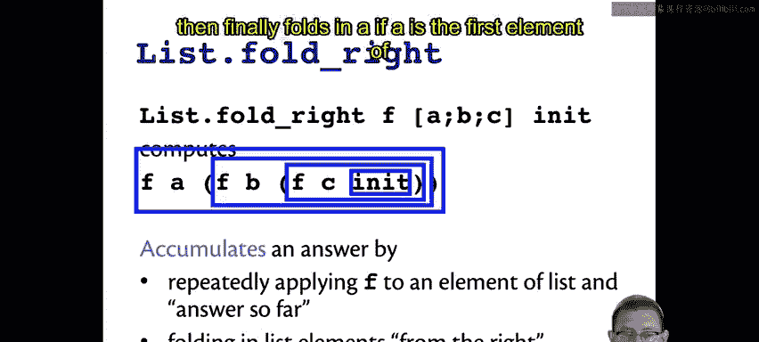
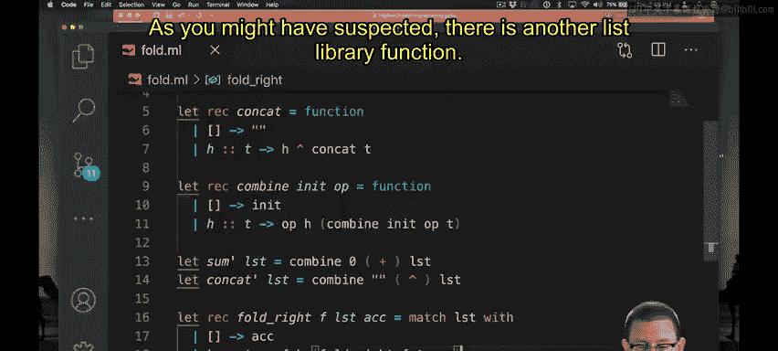
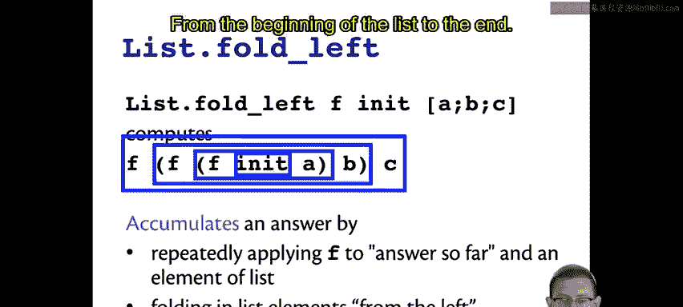
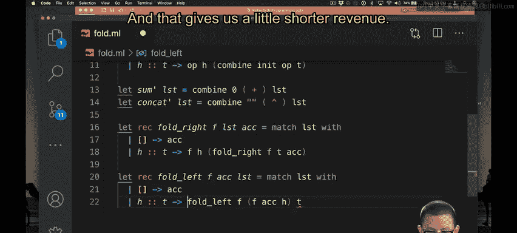

# 050：折叠函数 🧮

在本节课中，我们将要学习OCaml中两个强大的高阶函数：`fold_right` 和 `fold_left`。它们用于将列表中的所有元素通过一个给定的操作“折叠”或“累积”成一个单一的值。理解这两个函数的工作原理及其区别，对于编写简洁高效的函数式代码至关重要。

## 从右向左折叠：`fold_right` 的概念

上一节我们介绍了列表处理的基本模式，本节中我们来看看如何通过折叠操作来累积结果。`fold_right` 的核心思想是从列表的**最右侧**元素开始，向左逐个将元素“折叠”或“合并”到一个初始值中，从而累积出一个最终答案。



这个过程可以看作是反复应用一个函数 `f`，将列表中的每个元素与当前累积的结果结合起来。它从最右边的元素 `C` 开始，将其与初始值合并，然后向左移动到元素 `B`，最后是元素 `A`。


## 实现 `fold_right`

我们可以自己编写代码来实现 `fold_right` 的概念。它需要对列表进行模式匹配。

如果列表是空的，它需要返回那个初始值。我们现在开始称这个初始值为**累加器**，它代表了在折叠过程中不断累积的结果。`fold_right` 需要将这个初始累加器作为一个参数。

在匹配空列表之后，我们可以匹配非空列表。我们需要一个函数来组合元素，这个函数就是我们之前提到的操作符 `op`。应用这个函数到列表的头部元素，并继续在列表的尾部进行从右向左的折叠。

以下是 `fold_right` 的一个实现示例。需要注意的是，标准库中 `fold_right` 的列表参数位置有所不同，因此我们的模式匹配方式需要调整。

```ocaml
let rec fold_right f lst acc =
  match lst with
  | [] -> acc
  | hd :: tl -> f hd (fold_right f tl acc)
```

为什么这是从右向左折叠？因为我们直到对列表右侧所有元素的递归调用完成后，才将左侧的头部元素 `hd` 通过函数 `f` 合并进来。这使得折叠操作从列表的末端开始。




## 从左向右折叠：`fold_left` 的概念



正如你可能猜到的，列表库中还有另一个函数：`fold_left`。它的想法是从左向右折叠。

`fold_left` 首先将列表**最左侧**的元素合并到初始值中，作为当前累积答案的一部分。因此，我们先用函数 `f` 合并初始值和 `A`，然后是 `B`，最后是 `C`，沿着列表从头部开始向右移动。


## 实现 `fold_left`

让我们自己编写 `fold_left` 的代码。这里，标准库的参数顺序是：先接受累加器，然后是列表。有一个助记符可以帮助记忆：累加器位于列表参数的哪一侧。对于 `fold_right`，累加器在列表的**右侧**；对于 `fold_left`，累加器在列表的**左侧**。

我们可以对列表进行模式匹配。如果列表为空，我们返回累加器。如果列表非空，我们需要从左开始累积。这意味着我们将使用组合函数，将当前的累加器与头部元素结合。这样就得到了一个新的累加器值 `acc'`。然后，我们需要用这个新的累加器和列表的尾部继续进行折叠。

以下是 `fold_left` 的实现：

```ocaml
let rec fold_left f acc lst =
  match lst with
  | [] -> acc
  | hd :: tl -> fold_left f (f acc hd) tl
```

为什么这是从左向右折叠？因为每次我们应用执行累积操作的函数 `f` 时，都是先将其应用于头部元素和当前累积值，然后才使用这个结果继续折叠剩余的尾部。




## `fold_left` 与 `fold_right` 的区别

你可能会想，为什么需要 `fold_left` 和 `fold_right` 两个函数？它们真的有区别吗？毕竟，考虑用初始值 `0` 和操作 `+` 来折叠列表 `[1; 2; 3]`，无论从左到右还是从右到左，结果都是 `6`。

然而，并非所有操作符都像加法那样。如果你尝试用初始值 `0` 和操作符 `-` 来折叠列表 `[1; 2; 3]`：
*   从左向右折叠会得到 **-6**。
*   从右向左折叠会得到 **2**。

因此，一般来说，当操作符不满足**结合律**和**交换律**时，从左折叠和从右折叠会得到不同的结果。根据你想要实现的计算逻辑，有时可能需要从左开始，有时可能需要从右开始。

`fold_left` 和 `fold_right` 之间还有另一个重要区别：**尾递归性**。你能看出哪个是尾递归的吗？

在 `fold_left` 的实现中，递归调用之后没有剩余的工作需要做，函数直接返回递归调用的结果。这使其成为**尾递归**函数，因此它只需要**常数**级别的栈空间。

另一方面，`fold_right` 不是尾递归的。在递归调用之后，还有工作要做：需要应用函数 `f`。因此，`fold_right` 所需的栈空间与列表参数的大小成**线性**关系。

这个区别也可能影响你对使用哪个函数的选择。

> 如果你想要一个从右折叠的尾递归版本，通常可以先反转列表，然后进行从左折叠。是的，这需要额外的遍历时间，但通常不会增加算法的渐近复杂度，并且能提供一个不会导致栈溢出的实现。


## 总结

本节课中我们一起学习了OCaml中的两个核心折叠函数：
1.  **`fold_right`**：从列表的**右端**开始向左折叠，其实现**不是尾递归**的。
2.  **`fold_left`**：从列表的**左端**开始向右折叠，其实现是**尾递归**的，效率更高。


理解它们的方向差异、对非结合性操作符的影响以及尾递归特性，对于在适当场景下选择正确的工具至关重要。折叠函数是函数式编程中用于迭代和累积的基石，掌握它们能极大地提升你处理列表数据的能力。