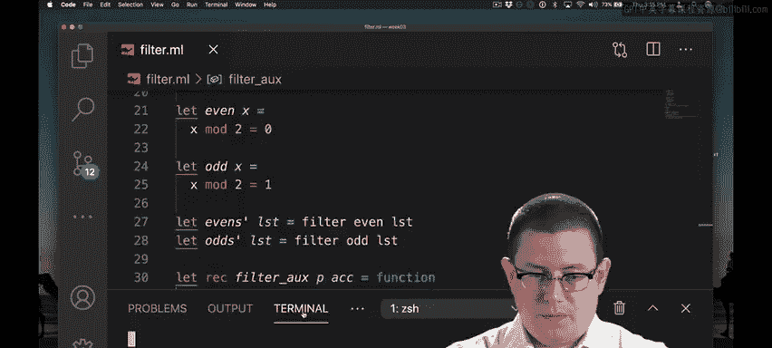

# 051：过滤函数 🧹

## 概述

在本节课中，我们将学习**过滤**（Filter）这一高阶函数。它是抽象原则的第三个重要例子。我们将了解如何从列表中筛选出满足特定条件的元素，并探讨如何实现其尾递归版本。

---

## 从具体需求到抽象

上一节我们介绍了`map`和`fold`。本节中我们来看看另一种常见操作：从列表中保留一部分元素，同时丢弃另一部分。

例如，你可能想从一个列表中提取所有偶数元素，或者所有奇数元素。这与`map`不同，因为`map`会处理并保留**每一个**元素。这也不是`fold`，因为`fold`通常会将元素以某种方式组合起来。我们这里的目标是**有选择地保留**元素。

首先，我们直接编写实现具体需求的函数。

```ocaml
let rec evens = function
  | [] -> []
  | h::t -> if h mod 2 = 0 then h :: evens t else evens t

let rec odds = function
  | [] -> []
  | h::t -> if h mod 2 = 1 then h :: odds t else odds t
```

编写`odds`函数时，我直接复制粘贴了`evens`的代码并稍作修改。这是一个强烈的信号，表明我们应该将其中**共同的功能抽象出来**。

---

## 抽象出过滤函数

我们真正在做的是根据某个条件“过滤”列表中的元素。让我们将这个函数命名为`filter`。提示一下，这也是OCaml标准库中这个函数的名字。

`filter`函数需要决定是否保留列表的头部元素。因此，我们让它接收一个**谓词**（predicate）`p`。这个谓词是一个函数，它接收一个元素，并返回一个布尔值（`bool`），告诉我们是否应该保留该元素。

```ocaml
let rec filter p = function
  | [] -> []
  | h::t -> if p h then h :: filter p t else filter p t
```

现在，我们可以用`filter`来简洁地重新实现`evens`和`odds`函数。首先，最好为判断奇偶性定义单独的函数。

```ocaml
let even x = x mod 2 = 0
let odd x = x mod 2 = 1

let evens lst = filter even lst
let odds lst = filter odd lst
```

这样，我们就得到了简洁、易读的一行实现，利用了高阶函数`filter`。

---

## 实现尾递归版本

上面的`filter`函数**不是尾递归的**。你可以看到，在递归调用之后，还有额外的工作（`h :: ...`）需要完成，然后才能返回结果。

如果你想实现一个尾递归版本的`filter`，也是可以的。构建尾递归函数的通用过程如下：

1.  为函数添加一个**累加器**（accumulator）参数。累加器用来存放结果，这样递归调用后就不需要做额外工作了。
2.  当到达基本情况（如空列表）时，返回累加器。

让我们尝试一起构建它。首先，我们添加一个累加器参数，并创建一个辅助函数来完成主要工作。

```ocaml
let filter p lst =
  let rec filter_aux p lst acc = match lst with
    | [] -> acc
    | h::t -> filter_aux p t (if p h then h :: acc else acc)
  in
  filter_aux p lst []
```

我们几乎完成了。但这里有一个关键问题需要检查。

---

## 顺序问题与修复

让我们运行一下这个尾递归版本的代码，看看还有什么问题。



```ocaml
(* 测试：filter even [1; 2; 3; 4] *)
(* 期望得到: [2; 4] *)
(* 实际得到: [4; 2] *)
```

我们得到了`[4; 2]`，顺序反了！这是因为我们是从左到右处理列表的。当我们发现第一个偶数`2`时，把它放到了累加器`acc`（初始为`[]`）的前面，得到`[2]`。然后发现`4`，又把它放到`[2]`的前面，最终得到`[4; 2]`。

解决方案是：在最终返回结果之前，**将累加器反转**。我们可以使用标准库中的`List.rev`函数。

```ocaml
let filter p lst =
  let rec filter_aux p lst acc = match lst with
    | [] -> List.rev acc (* 关键修复：反转结果 *)
    | h::t -> filter_aux p t (if p h then h :: acc else acc)
  in
  filter_aux p lst []
```

这是第二次我们讨论尾递归时提到反转操作。上一次（在讨论`fold`时）提到，你可能需要在输入列表前先将其反转。而这里的情况相反：在完成尾递归计算后，你可能需要反转结果列表，以得到期望的顺序。

再次强调，这个反转操作**不会增加函数的时间复杂度**（仍然是O(n)）。但它**改善了空间复杂度**，因为尾递归版本只使用常数级的栈空间，而不是与列表长度成线性关系。

---

## 总结

本节课中我们一起学习了：
1.  **过滤**（`filter`）函数的概念：根据谓词条件筛选列表元素。
2.  如何从具体函数（`evens`, `odds`）中抽象出通用的`filter`高阶函数。
3.  如何实现`filter`的基础递归版本。
4.  如何将`filter`转化为**尾递归版本**，以优化栈空间使用。
5.  在构建尾递归`filter`时遇到的**结果顺序问题**，以及通过`List.rev`反转列表来解决它。


`filter`与之前学过的`map`和`fold`一样，是函数式编程中用于处理集合的核心高阶函数，体现了强大的抽象能力。