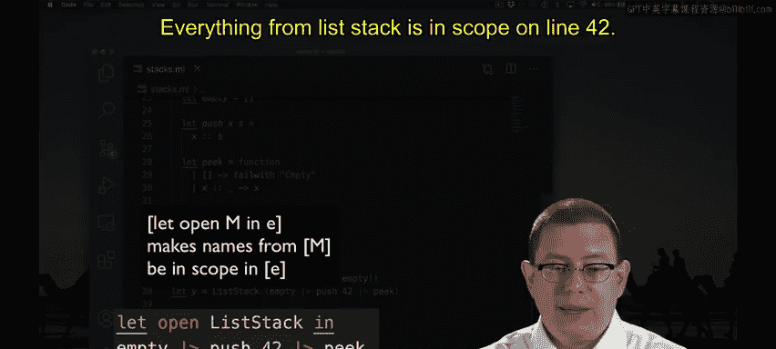

# 058：作用域与模块打开 🧩

在本节中，我们将学习如何更简洁地使用模块中的函数，避免重复书写模块名。我们将探讨几种不同的方法，包括局部打开和全局打开，并了解各自的优缺点。

---

当我们想要使用模块中的许多函数时，有时代码会显得冗长。

这里我创建了一个栈：先创建一个空栈，然后压入42，最后查看栈顶元素。

这导致我不得不写了三次 `ListStack`。这种重复并不好。

有多种方法可以消除这种重复。以下是其中一种。

我写了 `ListStack.(` 然后括号。在这些括号内部，来自 `ListStack` 的所有名称都将在作用域内。这意味着我不必在每个名称前重复书写 `ListStack.`。

顺便提一下，另一种编写此代码的好方法是使用管道运算符。

你能看到那里的管道吗？我取空栈，然后压入42，最后查看栈顶。编写相同代码的另一种方法是使用局部打开。

这是一种使用 `let` 表达式语法的特殊方式。

当你写 `let open` 然后跟一个模块名时，它会使该模块中的所有名称在该表达式的主体内部都处于作用域内。

所以 `ListStack` 中的所有内容在第42行都处于作用域内。

当你有一个很长的 `let` 表达式主体时，这很有用。你希望为该主体内部的所有行打开一个模块，而不仅仅是一行，这就是我们上面用括号语法所做的。

最后，编写此代码的另一种方法是进行非局部的、更全局的打开。

所以当我在顶部写 `open ListStack` 时，从此在这个文件的其余部分，来自 `ListStack` 的所有定义都将在作用域内。因此这里的 `empty` 指的是 `ListStack` 模块内部的 `empty`。

这种方法的问题以及不鼓励使用它的原因是，如果你打开了两个恰好定义了相同名称的模块，一个名称会遮蔽另一个。事实上，在这一点上，如果我想使用我的 `MyStack`。

上面的代码中，我遇到了一点麻烦。因为这里的 `empty` 现在将始终意味着 `ListStack.empty`。而如果我打开了 `MyStack`，那么 `empty` 将意味着 `MyStack.empty`。

所以我又回到了引入结构之前所处的境地。我遇到了名称遮蔽的问题。

因此，最好在OCaml文件中非常谨慎地使用这种全局打开。

我们定期这样做的少数情况之一是在测试文件顶部打开 `OUnit2`，因为我们知道我们需要它的OUnit运算符和测试函数的定义。

在你自己的代码库中，你可能会创建一些你知道可以安全打开的模块，那也没问题。但是全局打开数据结构模块通常会有问题，因为它们通常都会定义 `map`、`fold`，可能还有 `empty` 以及其他类似的名称。

---

## 总结

本节课中，我们一起学习了在OCaml中管理模块作用域的几种方法。我们了解了使用括号语法进行局部打开、使用 `let open` 进行表达式内打开，以及使用全局 `open` 语句。关键是要理解全局打开可能导致名称冲突和遮蔽，因此应谨慎使用，优先考虑局部打开或显式使用模块名来保持代码的清晰性和可维护性。