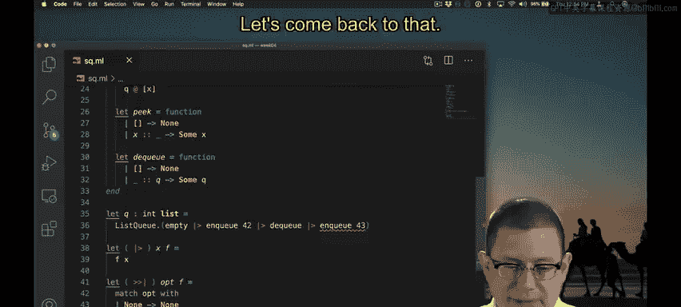
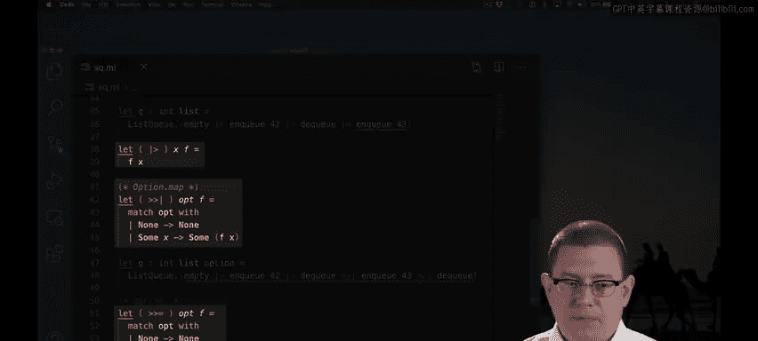
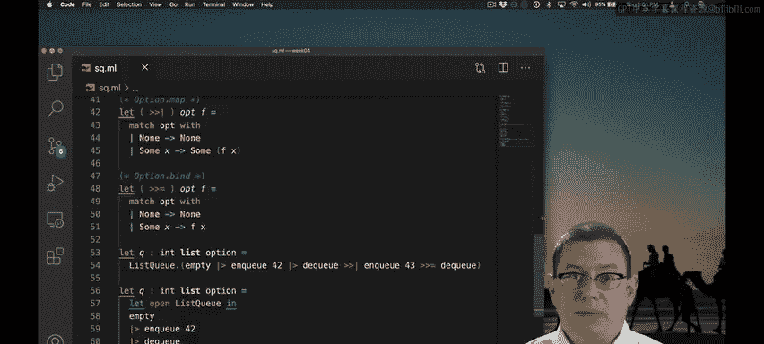

# 060：异常与选项及更多应用运算符 🚀

在本节课中，我们将学习如何使用列表实现栈和队列，并探讨在接口设计中异常（Exceptions）与选项（Options）的差异。我们还将介绍如何通过自定义运算符来解决选项类型在管道操作中带来的问题，使代码更加简洁和高效。

---

## 栈与队列的列表实现

我们已使用列表实现了栈和队列。以下是两种实现的并排展示，便于比较。

```ocaml
(* 栈的实现 *)
type 'a stack = 'a list

let empty_stack = []
let push x s = x :: s
let pop = function
  | [] -> failwith "Empty stack"
  | hd :: tl -> (hd, tl)

(* 队列的实现 *)
type 'a queue = 'a list

let empty_queue = []
let enqueue x q = q @ [x]
let dequeue = function
  | [] -> None
  | hd :: tl -> Some (hd, tl)
```

这两种实现非常相似。您可能注意到的主要区别在于异常与选项的使用。这并非数据结构本身的核心特性，而更多取决于接口设计的选择。

---

## 异常与选项在管道操作中的差异

异常使操作能够轻松地串联在一起。我可以不断添加新操作。选项则使这一点变得稍微复杂。

```ocaml
(* 使用异常的管道操作 *)
let result = empty_queue |> enqueue 1 |> enqueue 2 |> dequeue

(* 使用选项的管道操作（会导致类型错误） *)
let result = empty_queue |> enqueue 1 |> enqueue 2 |> dequeue
```



上述代码中，使用选项的版本会导致类型检查错误。因为 `dequeue` 返回一个 `'a list option`，而 `enqueue` 期望接收一个 `'a list`。选项类型在此阻碍了管道操作。

---


## 解决选项管道问题：Option.map 运算符

为了解决这个问题，我们可以编写一个新的管道运算符来处理额外的选项类型。以下是 `Option.map` 运算符的定义：

```ocaml
let (|>?) x f =
  match x with
  | None -> None
  | Some v -> Some (f v)
```

这个运算符接收一个选项和一个函数。如果选项是 `None`，则返回 `None`；如果是 `Some x`，则将函数 `f` 应用于 `x`。这类似于在列表中映射函数，但针对的是选项类型。

在标准库中，这个运算符以 `Option.map` 的名称提供。现在，我们可以使用它来修复之前的错误：

```ocaml
let result = empty_queue |> enqueue 1 |> enqueue 2 |>? dequeue
```

需要注意的是，整个管道操作的返回值现在被包装在选项中，因为 `dequeue` 可能返回 `None`。

---

## 进一步优化：Bind 运算符


如果我们想在管道中继续调用 `dequeue`，会遇到新的问题：

```ocaml
let result = empty_queue |> enqueue 1 |> enqueue 2 |>? dequeue |>? dequeue
```

上述代码会导致类型错误，因为 `dequeue` 期望一个队列，而不是一个选项队列。为了解决这个问题，我们需要另一个运算符，它能够处理选项参数，但不会在结果外额外包装选项。

以下是 `bind` 运算符的定义：

```ocaml
let (>>=) x f =
  match x with
  | None -> None
  | Some v -> f v
```

这个运算符类似于 `Option.map`，但它不会在结果外添加额外的选项包装。在标准库中，这个运算符以 `bind` 的名称提供。使用它，代码可以正常类型检查：

```ocaml
let result = empty_queue |> enqueue 1 |> enqueue 2 >>= dequeue >>= dequeue
```

---

## 代码格式化建议

当管道操作包含多个元素时，建议将每个元素放在单独的行上，以提高代码的可读性：



```ocaml
let result =
  empty_queue
  |> enqueue 1
  |> enqueue 2
  >>= dequeue
  >>= dequeue
```

这样，每一行代码都清晰地表示管道中的一个步骤，便于阅读和理解。

---

## 总结



在本节课中，我们一起学习了如何使用列表实现栈和队列，并探讨了异常与选项在接口设计中的差异。通过引入 `Option.map` 和 `bind` 运算符，我们解决了选项类型在管道操作中带来的问题，使代码更加简洁和高效。最后，我们还介绍了如何通过格式化代码来提高管道操作的可读性。掌握这些技巧将帮助您编写更优雅、更易维护的OCaml代码。