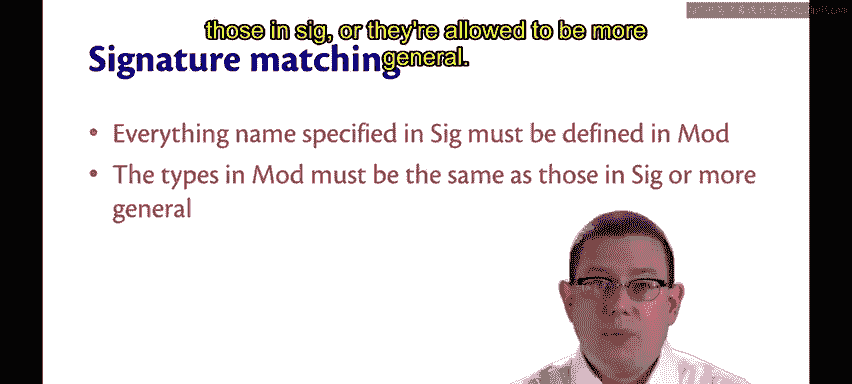
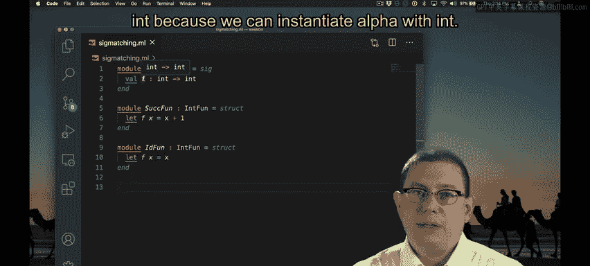

# 063：模块类型语法与语义 📘

在本节课中，我们将深入学习模块类型的语法和语义。我们将了解如何定义模块类型，以及类型检查器如何确保模块与其声明的类型相匹配。

---

## 概述

模块类型用于描述模块的结构。它定义了模块必须提供的组件，如值、类型和异常。通过为模块指定类型，我们可以确保模块的实现符合预期，并限制外部对模块内部细节的访问。

---

## 模块类型语法

模块类型的语法以关键字 `module type` 开头，后跟一个名称、等号、关键字 `sig`、一些规范说明，最后以关键字 `end` 结束。

```ocaml
module type ModuleTypeName = sig
  (* 规范说明 *)
end
```

值得注意的是，模块类型的名称不必像模块名称那样首字母大写，但为了保持一致性，通常还是会将其首字母大写。有一种较旧的命名习惯是全部使用大写字母和下划线，但这种写法现在已不常用。

---

## 规范说明的内容

模块类型中的规范说明可以包含多种组件：

*   **值**：指定模块必须提供的函数或变量。
*   **类型**：声明模块必须定义的类型。
*   **异常**：列出模块可能抛出的异常。
*   **嵌套模块类型**：在模块类型内部还可以包含其他模块类型。

---

## 模块定义语法的更新

上一节我们介绍了模块类型，现在我们可以回过头来更新模块的定义语法。在定义模块时，可以使用冒号为其指定一个模块类型。

```ocaml
module ModuleName : ModuleTypeName = struct
  (* 实现 *)
end
```

此外，你也可以将模块类型标注直接放在 `struct` 前面，这看起来更像我们一直使用的标准类型标注。

```ocaml
module ModuleName = (struct
  (* 实现 *)
end : ModuleTypeName)
```

---

## 模块类型语义

由于模块类型本身只是类型，因此没有求值语义，不需要对它们进行计算。但是，存在针对模块类型的类型检查语义。

当你为一个模块指定了类型后，类型检查器会执行以下两项主要任务。

### 1. 签名匹配

类型检查器会进行签名匹配。它确保在模块类型 `sig` 中指定的每一项，都在模块 `mod` 中有定义。并且，这些项的定义必须具有正确的类型。

### 2. 确保封装性

类型检查器会确保封装性。只有那些在 `SIG`（模块类型）中指定的内容，才能从模块 `M` 外部被访问。我们说模块在该签名下被“密封”了。

“密封”意味着你无法从模块中获取签名未列出的任何其他内容，只有那些在签名中被标识的名称才是可访问的。

---



## 签名匹配的规则

以下是签名匹配的具体规则：

*   `SIG` 中指定的每个名称都必须在 `MOD` 中有定义。
*   `MOD` 中定义的类型必须与 `SIG` 中声明的类型相同。

或者，`MOD` 中的类型可以比 `SIG` 中声明的更通用。

假设我们有一个模块类型，它指定必须有一个函数 `f`，其类型为 `int -> int`。

```ocaml
module type INT_FUNC = sig
  val f : int -> int
end
```

我们可以用一个确实具有该类型函数的模块来实现它。

```ocaml
module M1 : INT_FUNC = struct
  let f x = x + 1
end
```

我们也可以用一个具有更通用类型的函数来实现它。

```ocaml
module M2 : INT_FUNC = struct
  let f x = x (* f 的类型是 'a -> 'a *)
end
```

这里，我使用恒等函数 `ident` 来实现模块 `IDF`。恒等函数通常可以处理任何类型的值。它适用于布尔值、整数和浮点数。在这里，我可以用它来实现 `IntF`。

之所以允许这样做，是因为使用一个更通用的函数类型永远不会导致类型错误。这个恒等函数完全能够接受一个整数并返回一个整数，正如 `INT_FUNC` 所要求的那样。至于它是否也能处理其他类型的值，在这里并不重要。只要它能接受 `int` 并返回 `int` 就足够了。

因此，你可以看到，这里函数 `f` 的类型实际上是 `'a -> 'a`，但这足以实现一个类型为 `int -> int` 的函数，因为我们可以用 `int` 来实例化类型变量 `'a`。

---



## 总结


本节课中，我们一起学习了模块类型的语法和语义。我们了解了如何定义模块类型，以及如何用它来注解模块定义。更重要的是，我们探讨了类型检查器如何通过签名匹配来确保模块实现的正确性，并通过密封模块来保证封装性。记住，模块中实现项的类型可以比签名中声明的更通用，这为代码复用提供了灵活性。