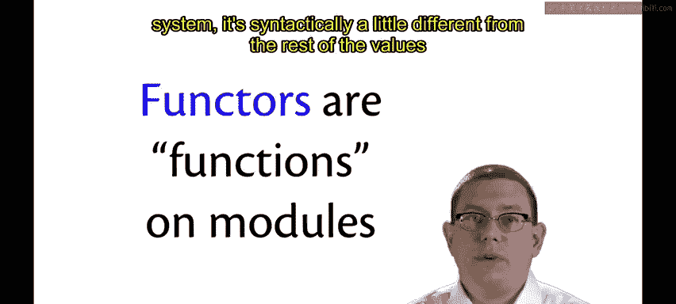
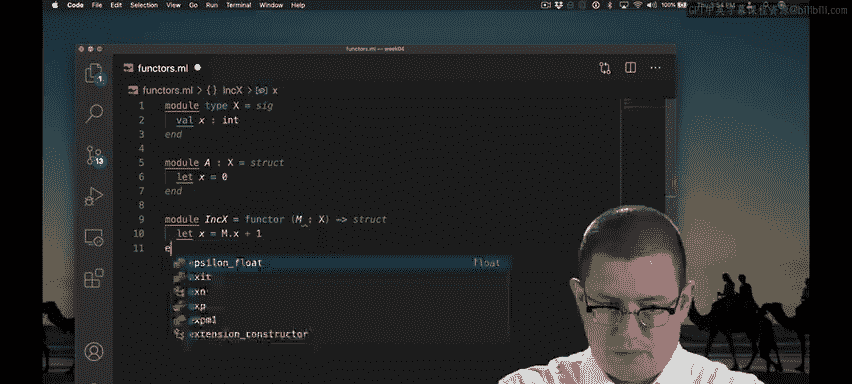
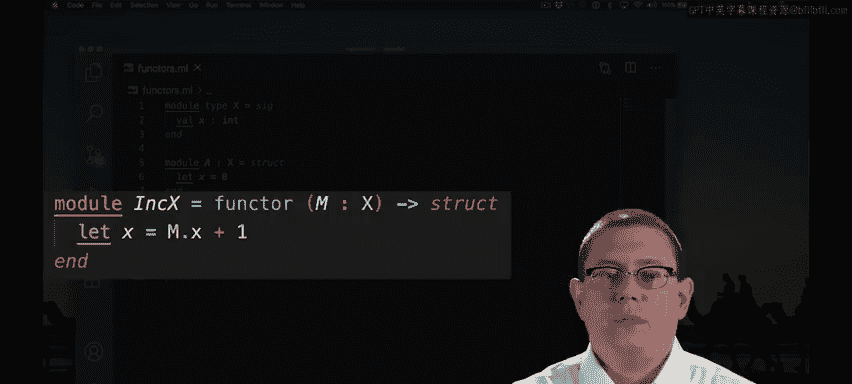
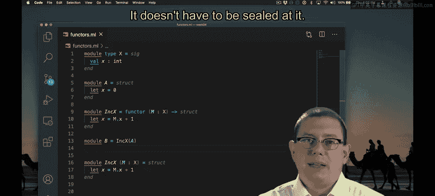

# 069：函子（Functors）🚀

在本节课中，我们将要学习OCaml中一个强大的模块级概念——函子（Functors）。函子允许我们编写以模块为输入并返回新模块的“函数”，从而极大地提升了代码的复用性和抽象能力。

## 概述

之前我们提到，在OCaml中，模块值和普通值是严格区分的，不能混用，因此不能有直接作用于模块的函数。虽然从技术上讲这是正确的，但OCaml提供了一种非常类似函数的功能，称为**函子**。函子本质上就是一个模块级别的函数，它可以接收一个模块作为输入，并产生一个新的模块作为输出。

## 函子的基本语法

与OCaml模块系统的其他部分一样，函子的语法与语言中的其他值略有不同。让我们从一个非常简单的例子开始，来理解函子的基本结构。



首先，我们定义一个简单的模块类型和一个模块：

```ocaml
module type X = sig
  val x : int
end

module A : X = struct
  let x = 0
end
```



现在我们有一个名为 `A` 的模块，它内部有一个值 `x`，其类型由模块类型 `X` 指定。

## 创建第一个函子

假设我们想创建另一个模块，它与模块 `A` 完全相同，只是其内部的 `x` 值要大1。我们可以通过函子来实现这个功能。

以下是函子的定义方式：

```ocaml
module Increment = functor (M : X) -> struct
  let x = M.x + 1
end
```

让我们来分解一下上面代码的各个部分：
*   `module` 关键字用于开始一个模块定义，就像 `let` 关键字用于创建和绑定普通值一样。
*   `functor` 关键字表明我们正在创建一个函子，一个从模块值到模块值的“函数”。
*   `(M : X)` 指定了函子的输入：一个名为 `M` 的局部模块参数，其模块类型必须为 `X`。
*   `-> struct ... end` 定义了函子返回的模块结构。在这个结构中，我们创建了一个名为 `x` 的值，并将其绑定为输入模块 `M` 中 `x` 的值加1。



本质上，这是在模块级别上实现了一个类似于“递增”的功能。普通的递增函数接收一个参数 `x` 并返回 `x + 1`。而这个函子接收一个包含标识符 `x` 的模块，并返回另一个包含标识符 `x` 的模块，只不过输出模块中的 `x` 值比输入模块中的大1。

## 应用函子

让我们尝试在交互式环境（utop）中应用这个函子。注意，我们不能直接在utop提示符下应用函子，就像不能直接在那里写匿名结构一样。

我们需要使用模块定义语法将函子应用的结果绑定到一个模块名：

```ocaml
module B = Increment(A)
```

现在，我们有了一个名为 `B` 的模块，其内部的 `x` 值是 `A` 中 `x` 值加1的结果（即1）。我们可以继续这个过程：

```ocaml
module C = Increment(B)
```

这样，`C` 中的 `x` 值就是2。你可以看到，我们可以像调用函数一样将这个函子应用到其他模块上，并得到新的模块作为结果。

## 函子的语法糖

就像我们学习函数时知道有关键字 `fun` 的语法糖一样，函子也有其语法糖。

虽然可以使用上面演示的匿名函子形式来编写，但你也可以将输入模块写在等号的左边：

```ocaml
module IncrementSugar (M : X) = struct
  let x = M.x + 1
end
```

这正好与匿名函数及其语法糖的对应关系相平行。然而，有一个关键区别：对于函子，**必须始终指定输入模块的类型**。你不能省略 `: X`。这是为了OCaml类型推断引擎的良好运行，它要求你明确指定函子的输入类型。

## 模块类型与密封

关于输入模块的类型，有一个重要的细节：我们传递给函子的模块 `A` 必须具有模块类型 `X`。但事实证明，只要该模块可以被赋予该模块类型，我们不一定需要将 `A` 密封（seal）在类型 `X` 下。

例如，即使我们在定义 `A` 时省略了模块类型注解，只要其结构符合 `X` 的要求，下面的代码也能完美编译：

```ocaml
module A = struct
  let x = 0
end

module B = Increment(A) (* 这仍然有效 *)
```



`A` 只需要匹配模块类型 `X`，而不必被密封为该类型。

## 总结


本节课中我们一起学习了OCaml中的**函子**。函子的语法是模块定义语法的直接扩展，你只需要在等号左边或右边使用 `functor` 关键字来编写输入模块及其类型即可。通过函子，我们可以实现高度的代码抽象和复用，构建出更加灵活和强大的模块化程序。