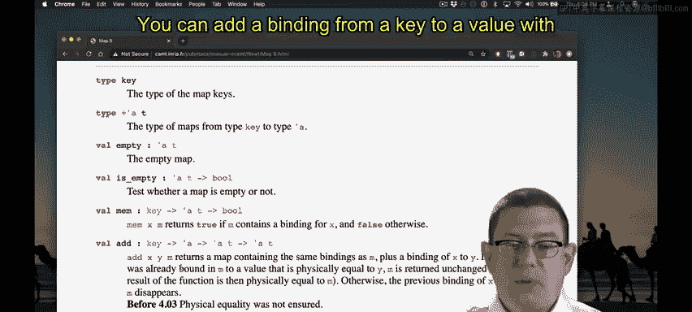
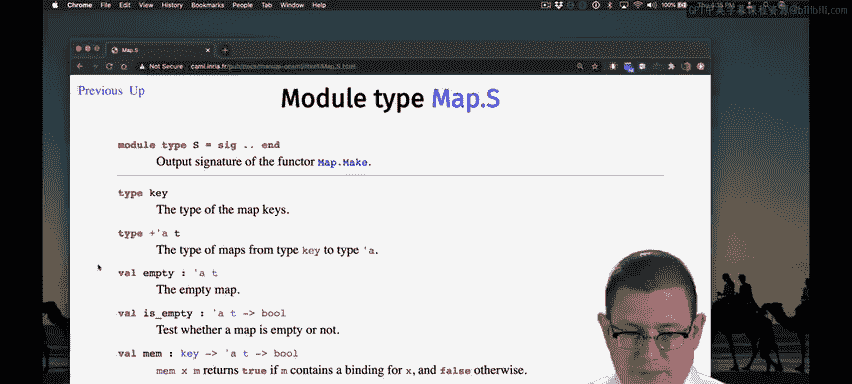

# 070：标准库Map模块 🗺️

在本节课中，我们将要学习OCaml标准库中的Map模块。Map是一种将键映射到值的数据结构，类似于Java中的TreeMap。我们将了解如何使用函子（Functors）来创建自定义的Map，并探索其核心操作。

## 概述

Map模块是函子在OCaml中应用的一个绝佳范例。这里的“Map”与Java中的`TreeMap`概念几乎相同，其核心抽象都是将键映射到值。Java的`HashMap`基于哈希表实现，而`TreeMap`则基于平衡二叉树。OCaml的Map模块同样采用平衡二叉树作为后端实现。

## 创建Map：使用函子

Map模块内部包含一个名为`Make`的函子，它用于基于输入结构创建一个Map数据结构。这个输入结构必须是一个“有序类型”（Ordered Type）模块。

因此，要创建一个Map，你必须向`Make`函子传递一个包含以下两部分的模块：
1.  键的类型。
2.  键的比较函数。

Map模块需要比较函数的原因在于其平衡二叉树的实现。它需要能够比较树中每个节点上的键。所以，你的任务就是告诉Map模块键的类型以及如何比较它们。

`Make`函子的输出类型是`S`。这个输出签名包含了字典（dictionary）中所有常见的函数。

以下是创建Map所需的关键组件：
*   **键类型**：例如 `type key = ...`
*   **比较函数**：`compare : key -> key -> int`，该函数在键相等时返回`0`，第一个键较小时返回**严格负数**，第二个键较小时返回**严格正数**。

## Map的核心操作



`Make`函子输出的模块提供了字典的标准操作。你可以使用`mem`函数测试字典中是否存在某个键的绑定，使用`add`函数添加从键到值的绑定，使用`remove`函数移除绑定，等等。该模块甚至提供了`map`和`fold`函数。

以下是部分核心函数：
*   `mem : key -> 'a t -> bool`：检查键是否存在于Map中。
*   `add : key -> 'a -> 'a t -> 'a t`：添加或更新键值对，返回新的Map。
*   `find : key -> 'a t -> 'a`：查找键对应的值，若键不存在则引发`Not_found`异常。
*   `bindings : 'a t -> (key * 'a) list`：返回一个由键值对组成的关联列表。

## 实践示例：创建星期Map

让我们创建一个以星期几为键的Map。首先，我们定义一个表示星期的类型和一个将星期映射为整数的函数。

```ocaml
type day = Mon | Tue | Wed | Thu | Fri | Sat | Sun

let day_to_int d = match d with
  | Mon -> 1
  | Tue -> 2
  | Wed -> 3
  | Thu -> 4
  | Fri -> 5
  | Sat -> 6
  | Sun -> 7
```

现在，假设我想创建一个键为`day`类型的Map。我需要创建一个模块来指定键类型和比较方法。

```ocaml
module DayOrdered = struct
  type t = day
  let compare d1 d2 = compare (day_to_int d1) (day_to_int d2)
end


module DayMap = Map.Make(DayOrdered)
```

`DayMap`现在必须使用`day`类型作为键，但它允许将这些键映射到我喜欢的任何值类型。例如，我可以将星期几映射到表示它们的字符串。

```ocaml
let m = DayMap.(empty |> add Mon "Monday" |> add Tue "Tuesday")
```

现在，Map `m` 将`Monday`映射到字符串`"Monday"`，将`Tuesday`映射到字符串`"Tuesday"`。

## 使用Map操作

注意，`m`是抽象的，我们无法直接看到其内部的树形实现。但我们可以使用`DayMap`模块提供的操作来检查它。

为了方便演示，我们可以打开模块：

```ocaml
open DayMap

let test1 = mem Mon m  (* 返回 true *)
let test2 = mem Sun m  (* 返回 false，因为我们没有放入Sunday *)

let val1 = find Mon m  (* 返回 "Monday" *)
let val2 = find Tue m  (* 返回 "Tuesday" *)
(* let val3 = find Sun m *) (* 会引发 Not_found 异常 *)
```

`find`函数的类型是`key -> 'a t -> 'a`。这里的`'a t`是什么？在模块顶部，`'a t`表示从`key`类型到`'a`类型的映射类型。键的类型在我们应用函子时就已经固定，因为我们需要确定如何对树节点进行排序比较。但值类型可以是整数、字符串、列表等任何我们想要的类型，这个值类型就是这里的`'a`。

## 函数式特性与关联列表



最后，这些Map是**函数式数据结构**，它们不是通过命令式方式更新的。

```ocaml
let m_prime = add Sun "Sunday" m
```

我向`m`添加了一个将`Sunday`绑定到字符串`"Sunday"`的绑定，并将结果新Map绑定到`m_prime`。但`m`本身并未改变，它仍然只包含`Monday`和`Tuesday`的绑定。`m_prime`则包含新的`Sunday`绑定。

`bindings`是Map模块中的另一个函数，它可以给你一个由键值对组成的列表。每个对的第一个元素是键，第二个元素是值。这被称为**关联列表**。标准库的List模块中也提供了处理关联列表的函数。

你可以在作业中使用Map，它们是函数式的，不受命令式特性禁令的限制。

## 总结


本节课我们一起学习了OCaml标准库中的Map模块。我们了解到Map是基于平衡二叉树实现的函数式数据结构，需要通过`Map.Make`函子并提供一个包含键类型和比较函数的模块来创建。我们探索了Map的核心操作，如`add`、`find`、`mem`和`bindings`，并通过创建星期Map的实践示例巩固了这些概念。记住，Map是纯函数式的，任何更新操作都会返回一个新的Map，而不会改变原有结构。