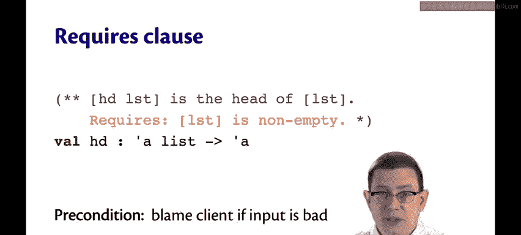
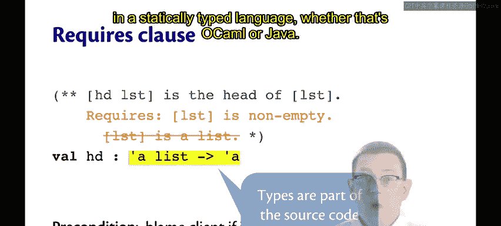
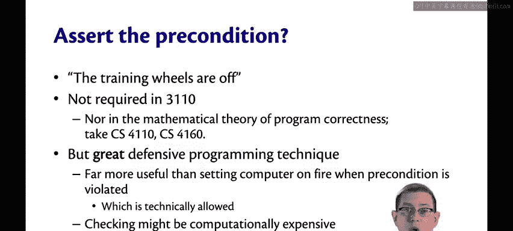
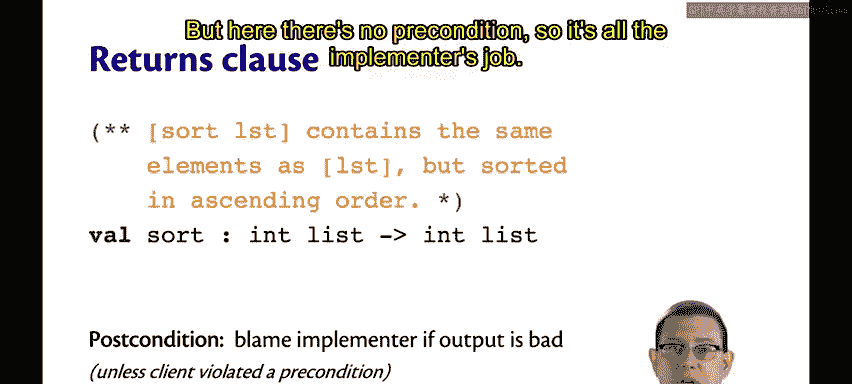
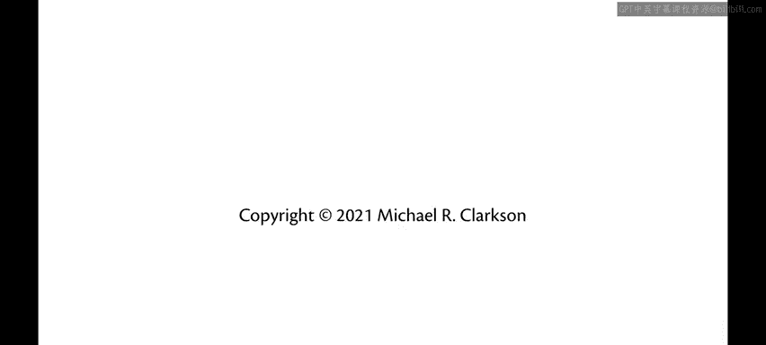

# 073：函数规范的组成部分 🧩

在本节课中，我们将详细学习函数规范的各个组成部分。我们将从 `requires` 子句开始，逐步了解如何编写清晰、完整的函数规范。

## 规范模板的组成部分

上一节我们介绍了函数规范的基本模板，本节中我们来看看模板中每个部分的具体含义和作用。

### `requires` 子句：前置条件

`requires` 子句定义了函数的前置条件。事实上，如果你愿意，完全可以用 `precondition:` 来代替 `requires:`。



以下是标准库中 `List.hd` 函数的一个假设性规范，该函数用于获取列表的第一个元素（如果存在的话）。

我们可以这样写前置条件：要求列表非空。

这个前置条件明确了当列表为空时，责任方是谁——是客户端的错。因为规范明确指出不允许传入空列表。

如果客户端确实传入了空列表，那么实现者可以自由地执行任何操作。



这里有一点需要注意，特别是Python程序员应该留意。

```ocaml
(* 错误的做法：在OCaml中，类型已经是函数声明的一部分，无需在前置条件中重复声明 *)
(* requires: lst is a list *)
```

这与Python不同，因为两种语言处理类型的方式不同。Python没有静态类型系统，因此你被迫在文档中写明这类前置条件，别无选择。

在OCaml中，类型检查在编译时完成，不可能将错误类型的值传递给函数。这就是为什么在静态类型语言（无论是OCaml还是Java）中，我们不在前置条件中编写这类子句。

### 关于断言前置条件的常见问题

你或许在CS 1110或其他入门编程课程中学过：是的，你必须总是断言前置条件。然而，正如我们在CS 2110中告诉你的，现在在CS 3110中我再次重申：训练轮已经卸下。

你并不总是必须断言前置条件。这是一个微妙的问题，让我详细解释一下。

在程序正确性的数学理论中，在函数被调用之前，前置条件必须得到满足。如果前置条件被违反，则没有任何保证。如果你想了解更多，可以选修像CS 4110或CS 4160这样的高级编程语言课程。

但数学理论与良好的编程实践之间存在差异。断言前置条件是一种极佳的防御性编程技术。抛开“把电脑点着”的笑话不谈，如果能在前置条件失败的那一刻立即引发一个断言错误，而不是导致更具破坏性的问题，这对所有人都有帮助。

问题在于，并非所有代码都像CS 1110的代码那么简单。在现实中，前置条件有时会变得非常复杂，以至于仅仅检查它们就会使你的代码效率低到无法接受。

例如，检查一个关于数据结构的前置条件可能需要查看该数据结构中包含的每一个值。这样一来，一个本应是常数时间复杂度的操作，因为断言了前置条件，就变成了线性时间复杂度。

因此，我们常常会省略检查前置条件的所有部分。也许你只检查其中计算成本较低的部分，或者只检查那些能在常数时间内完成检查的部分，而不检查其余部分。



又或者，你可以声明：如果客户端违反了前置条件，责任由他们承担。

### `returns` 子句：后置条件

接下来，我们看看 `returns` 子句。在我们的OCaml代码中，我们通常省略 `returns:`，而将返回子句作为规范的第一句话来写。但正如我们在 `List.sort` 中看到的，也有其他处理方式。

以下是一个用于整数列表的排序函数的假设性规范：

```
returns: a list that contains the same elements as lst, but sorted in ascending order.
```

这陈述了一个后置条件，它告诉我们如果输出结果不正确，责任方是谁——在这个例子中是实现者。除非，当然，存在前置条件且客户端违反了它（例如，客户端传入了一个错误的比较函数）。但这里没有前置条件，所以责任全在实现者。



### `examples` 子句：示例

规范的另一个组成部分可以是 `examples` 子句。它提供了输入和输出的示例，以便阅读规范的人在抽象的规范描述不够清晰时，有一个具体的概念可以参考。

这对于澄清边界情况、极端输入等特别有帮助。

对于排序函数，我写了两个示例：一个列表包含重复元素，以展示重复元素会被保留；另一个是空列表，展示空列表排序后仍是空列表。这对于我们人类大脑理解规范非常有帮助，即使规范本身在数学上是精确和清晰的，示例仍然至关重要。

### `raises` 子句：异常

`raises` 子句告诉我们OCaml函数可能引发的异常。

回到我们为 `head` 函数假设的规范，我们可以添加一个 `raises` 子句，说明当客户端违反前置条件时会发生什么：

```
raises: Failure "hd" if lst is empty.
```

这正是标准库函数实际所做的。这使得异常实际上成为了后置条件的一部分，因为它陈述了函数的一种行为，并且由实现者来确保该行为确实发生。如果当输入列表为空时，`head` 未能引发此异常，那就是实现者的错。事实上，客户端可能依赖这种行为，因此实现者必须确保它发生。

---



本节课中我们一起学习了函数规范的四个核心部分：`requires`（前置条件）、`returns`（后置条件）、`examples`（示例）和 `raises`（异常）。理解并正确使用这些部分，是编写健壮、可维护且文档清晰的OCaml代码的关键。