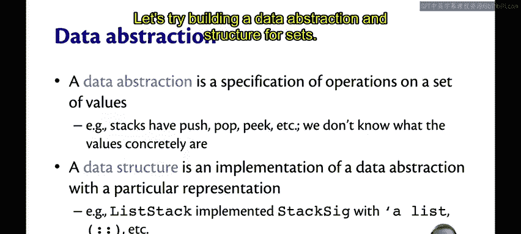
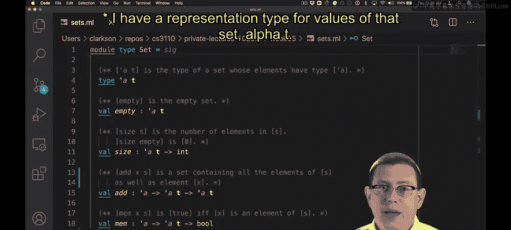
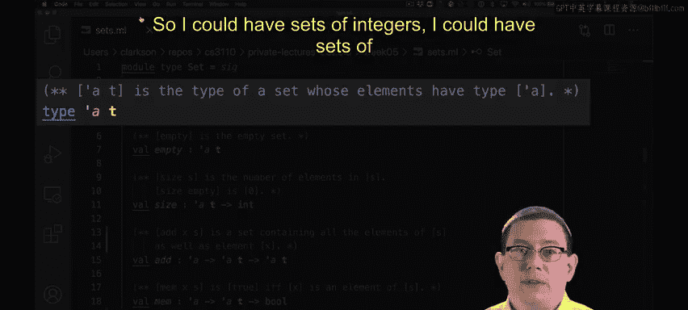
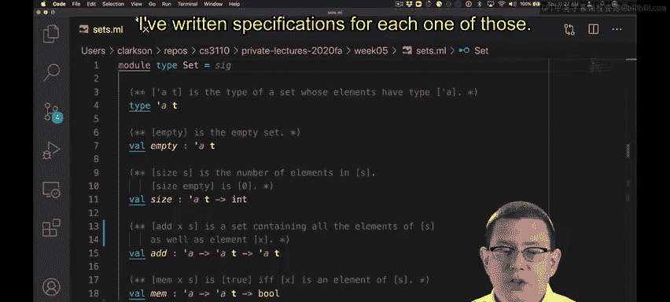
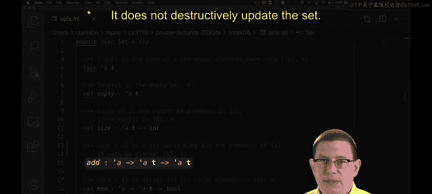
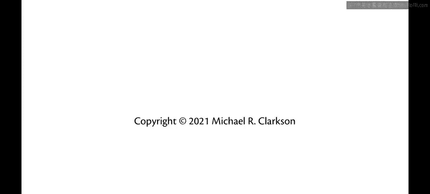

# 074：数据抽象与数据结构 🧱

在本节课中，我们将要学习编程中除函数之外的另一个核心概念：数据抽象。我们将探讨数据抽象的定义、它与数据结构的关系，并通过一个“集合”的实例来具体理解如何在OCaml中实现它们。

编程不仅仅是定义函数，数据抽象同样重要。

这里所说的数据抽象，指的是一组值及其操作的规范。这类似于我们在其他课程中提到的抽象数据类型。例如，我们之前学习过栈。我们知道栈有压入、弹出和查看栈顶等操作。我们知道这些操作的规范应该是什么，但如果我们用一个签名中的抽象类型来隐藏栈的具体值，我们就不知道栈的具体值是什么了。

因此，在OCaml中，一个数据抽象自然地对应于包含抽象类型的签名。

数据结构是使用特定表示方法对数据抽象的实现。例如，我们实现了列表栈。我们使用 `'a list` 作为表示栈的类型。然后，我们可以利用列表的其他操作来实现这些栈操作本身。

所以，在OCaml中，一个 `.ml` 文件或一个结构体自然地对应于一个数据结构。

让我们尝试为“集合”构建一个数据抽象和数据结构。

---

## 集合数据抽象规范 📋

以下是一个名为 `Set` 的数据抽象的规范。这里的集合是计算机科学意义上的集合。我为该集合的值定义了一个表示类型 `'a t`。因此，`Set.t` 是集合的类型构造器，它由一个类型变量 `'a` 参数化。这个类型变量 `'a` 是集合中元素的类型，所以我可以有整数集合、布尔值集合、字符串集合等。

*   `empty` 表示空集。
*   我定义了三个操作：`size`、`add` 和 `mem`。
*   我为每一个操作都编写了规范。

以下是这些操作的详细说明：

*   **`size s`**：返回集合 `s` 中元素的数量。作为规范的一部分，我特别说明空集的大小为零。
*   **`add x s`**：返回一个包含集合 `s` 中所有元素以及新元素 `x` 的新集合。
*   **`mem x s`**：当且仅当 `x` 是集合 `s` 中的元素时返回 `true`。我选择 `mem` 这个名字是为了与OCaml标准库中一些使用类似名称的数据抽象保持一致。

从 `add` 的类型可以看出，这是一个函数式数据结构。它接收一个旧的集合值，并返回一个新的集合值，而不是破坏性地更新原集合。

---

## 总结 ✨

本节课中我们一起学习了数据抽象与数据结构的核心概念。我们明确了数据抽象是一组操作的规范，而数据结构是这种规范的具体实现。在OCaml中，签名定义了数据抽象，而结构体则实现了具体的数据结构。我们以“集合”为例，详细分析了其抽象规范，包括空集、计算大小、添加元素和判断成员关系等操作，并特别指出了函数式数据结构不可变的特性。理解这两者的区别与联系，是设计和实现健壮、模块化程序的关键。