# 083：软件缺陷的术语与概念 🔍

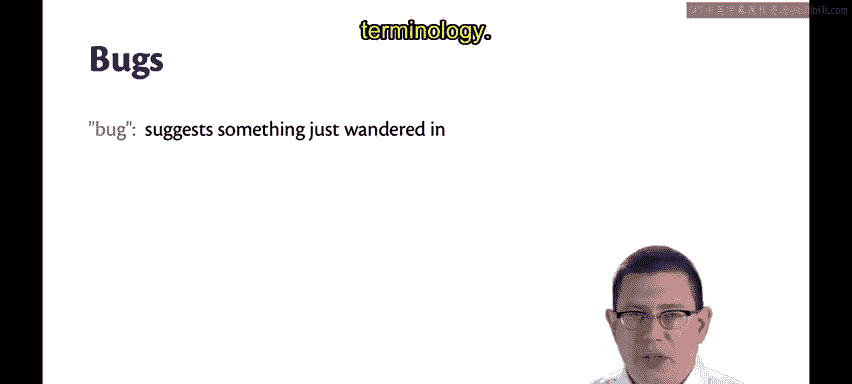

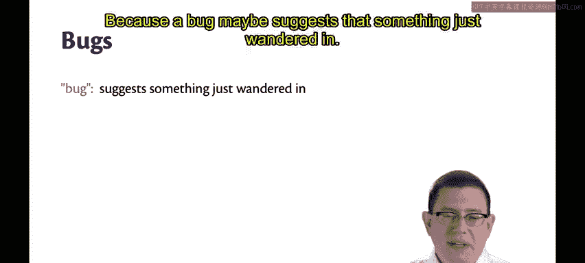

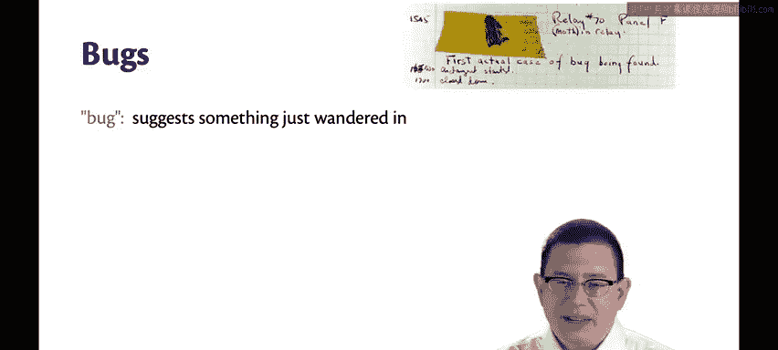

在本节课中，我们将学习软件工程中关于“缺陷”的术语，理解“错误”、“故障”和“失效”之间的区别与联系，并探讨其背后的因果关系。

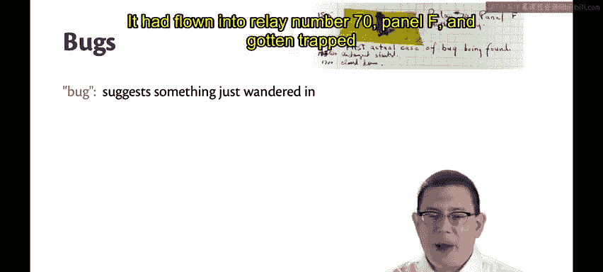

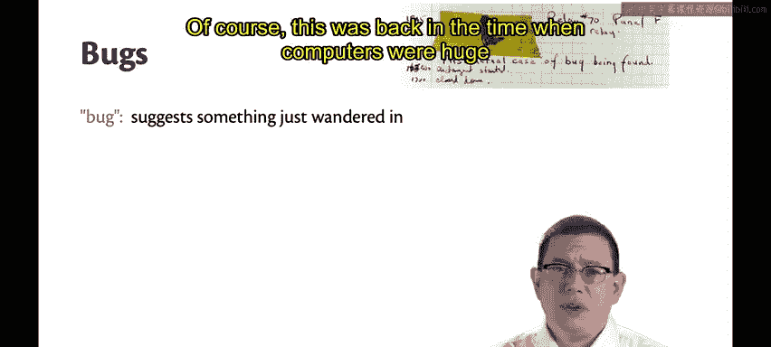

## 概述

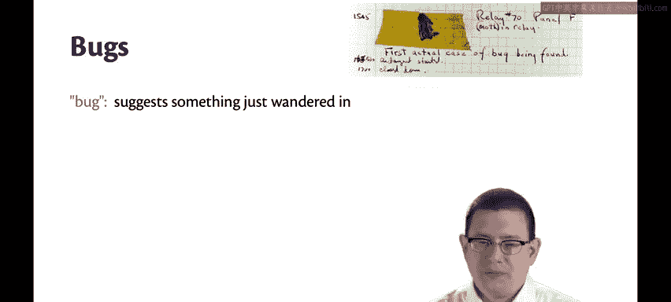

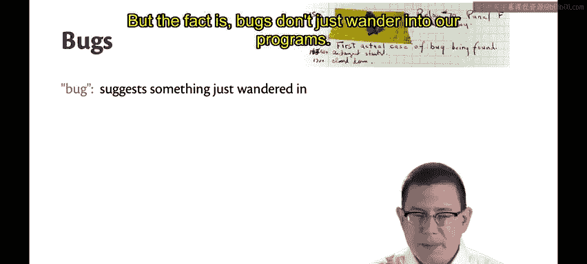

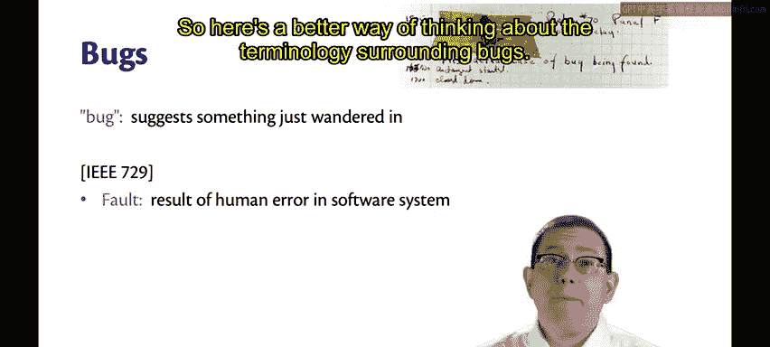

“缺陷”这个术语在历史上是一个不太准确的表述。它可能暗示着有什么东西“溜进”了程序。例如，格蕾丝·霍珀发现的第一个计算机“Bug”，是一只飞入继电器并被卡住的真实飞蛾。这发生在计算机还是房间大小的时代。

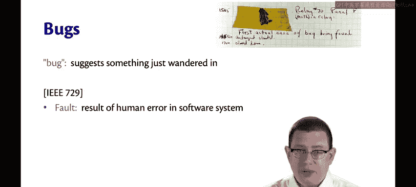

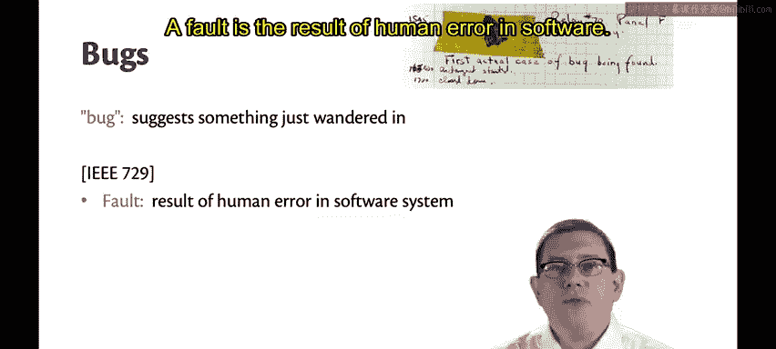

但事实是，缺陷并非自行“溜进”我们的程序，而是我们将其置于其中。因此，我们需要一套更准确的术语来描述相关问题。

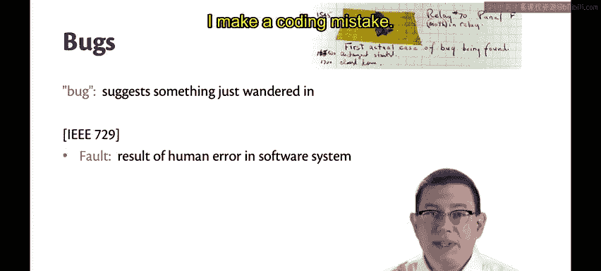

## 核心概念：错误、故障与失效

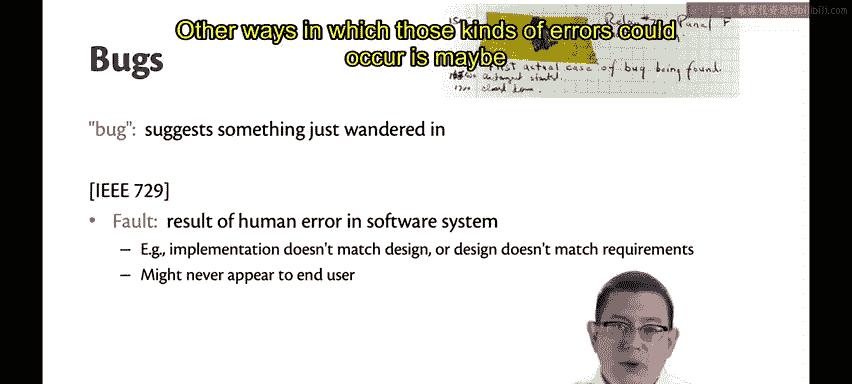

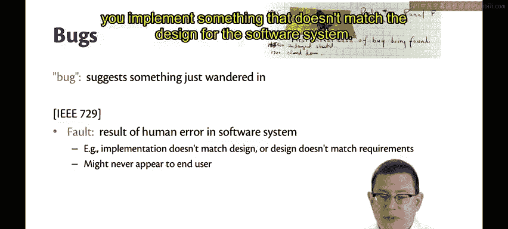

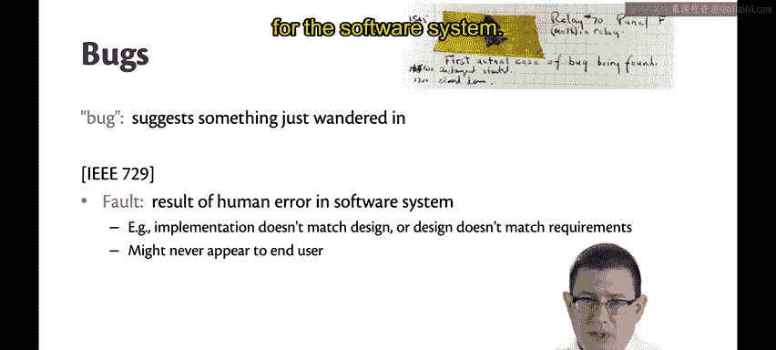

上一节我们提到了“缺陷”一词的历史渊源，本节中我们来看看更精确的术语体系。这套术语来源于ITEE标准729。

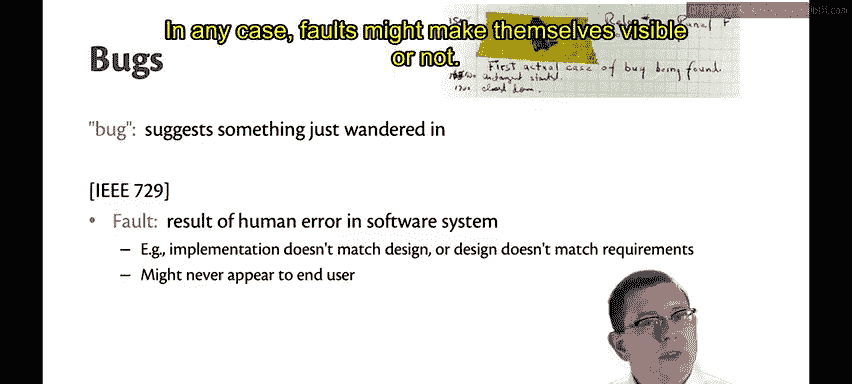

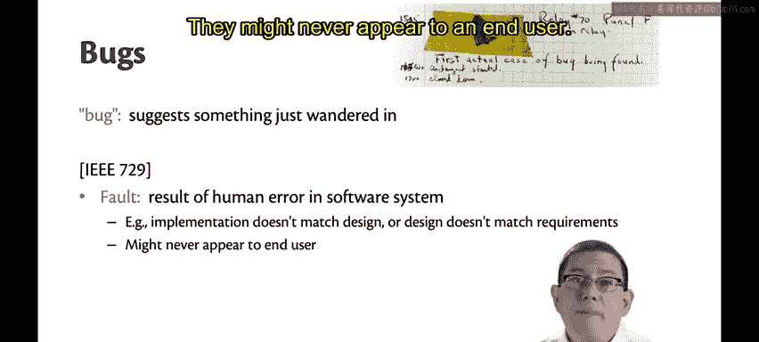

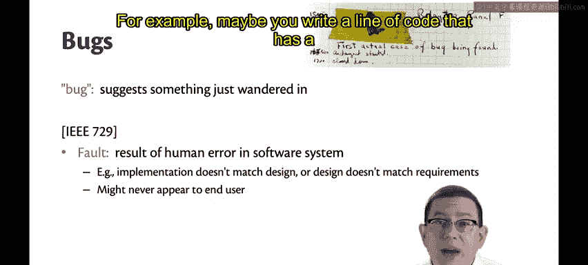

以下是三个核心概念的定义：

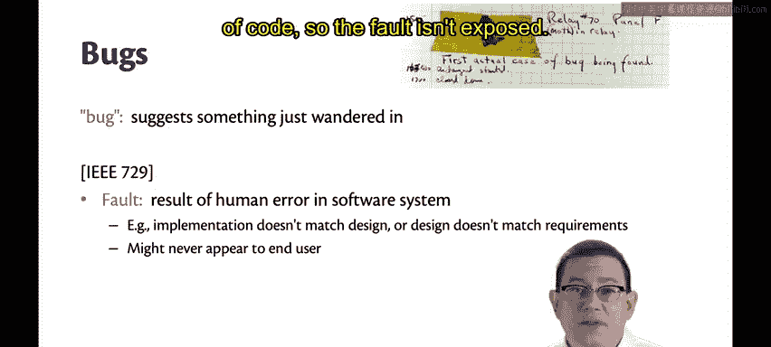

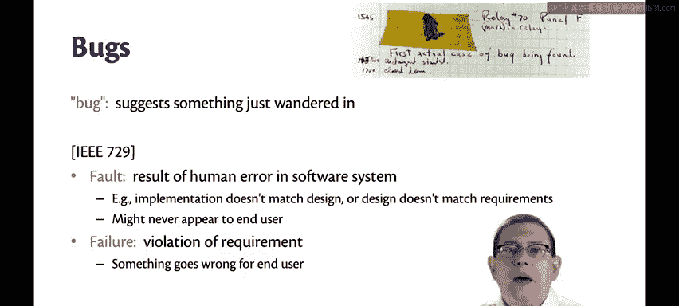

*   **错误**：软件中人为失误的结果。最常见的例子是编码错误。其他可能的情况包括：实现与软件系统设计不匹配，或者设计与用户对软件系统的需求不匹配。
*   **故障**：错误在代码中的具体体现。故障可能显现，也可能保持潜伏和隐藏状态，永远不会被最终用户发现。例如，某行代码存在故障，但从未被执行到，因此该故障未被触发。
*   **失效**：对需求的违反。即最终用户所期望的系统行为方式未能实现。当失效发生时，最终用户会察觉到出了问题。

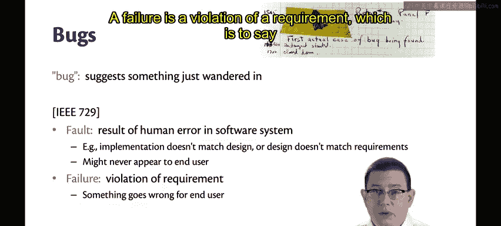

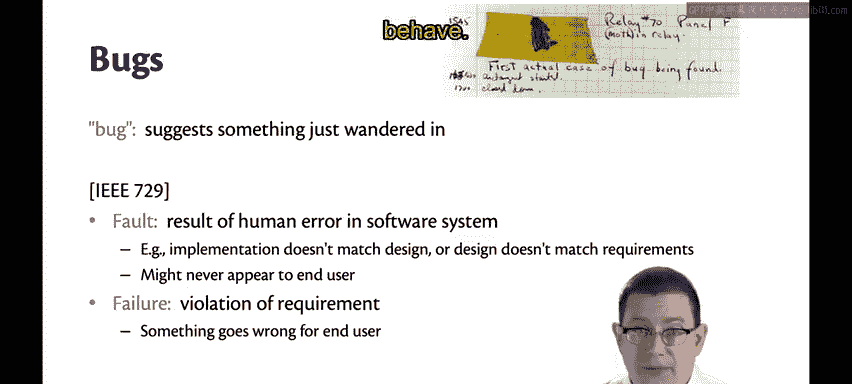

## 事件链与总结

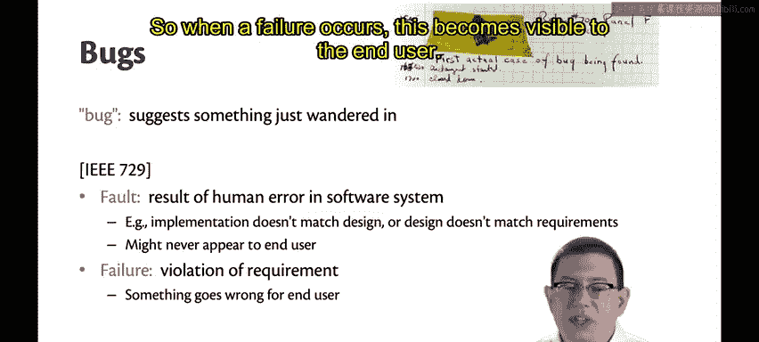

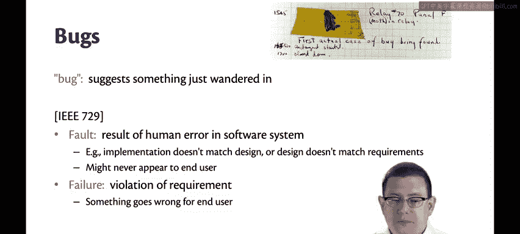

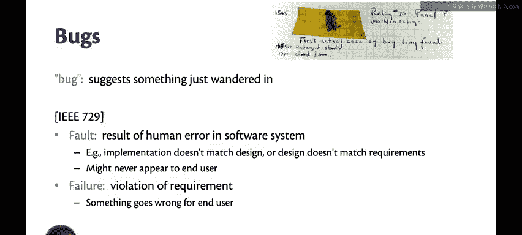

请注意这里的事件链：**人为错误** 导致了 **代码故障**，而故障最终可能引发 **系统失效**。这种看待软件系统问题的方式，比笼统地使用“Bug”一词更为精确。

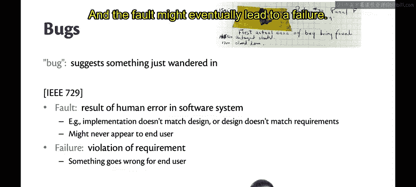

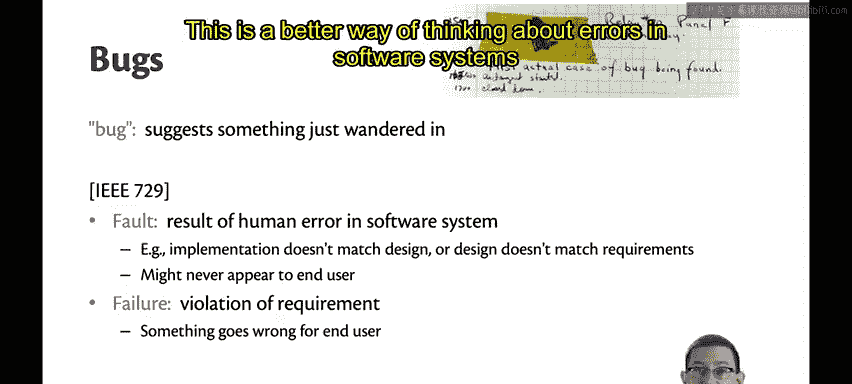

尽管如此，“Bug”已成为一个广泛确立的术语，我们可能仍会继续使用它。但了解这些更精确的术语仍然很有益处。

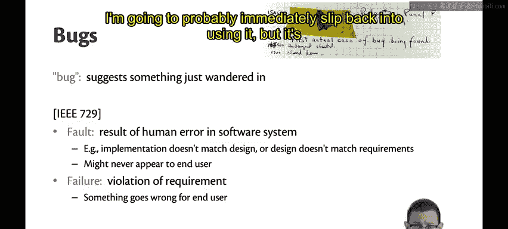

在本节课中，我们一起学习了软件缺陷的精确术语体系，明确了“错误”、“故障”和“失效”的定义及其因果关系，这有助于我们更清晰地思考和讨论软件开发中的问题。