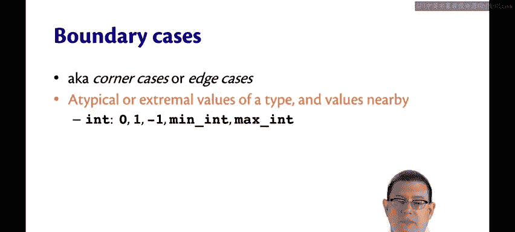
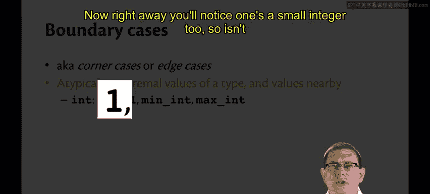
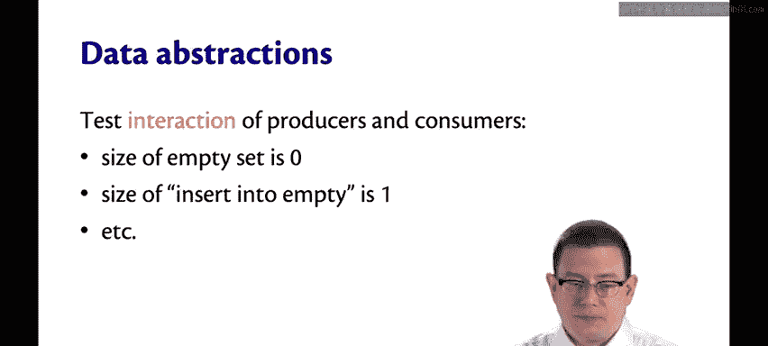

# 086：黑盒测试 🧪

在本节课中，我们将学习黑盒测试的概念及其主要方法。黑盒测试是一种仅依据函数规范来编写测试用例的方法，不依赖于具体的实现代码。

## 概述

黑盒测试的编写完全基于函数的规格说明。这种方式具有多个优点。由于测试者只查看规范，而不查看实现，因此他们不会因为阅读了实现代码而产生任何先入为主的假设。由于实现对他们来说是未知的，他们不会受其影响。这意味着创建的测试对于实现的变化具有鲁棒性，因为这些测试并非基于对实现的任何了解。此外，任何评审者或质量保证团队的成员都可以阅读和评估这些测试，他们只需判断这些测试对于该规范是否良好，而无需额外查看实现代码，因为测试本身并非基于实现。

## 黑盒测试的主要类型

黑盒测试主要有四种类型。规范中提供的示例输入，我们之前讨论过如何记录这些，它们应该始终成为黑盒测试的一部分。另外三种类型，我们现在将逐一详细讨论，它们是：典型输入、边界情况以及规范路径。

### 典型输入

典型输入是指一个类型中常见、简单的值。以下是针对不同数据类型的典型输入示例：

*   **整数**：测试一个接收 `int` 作为输入的函数时，使用一个在1到10范围内的小整数。
*   **字符**：使用简单的字母或数字。
*   **字符串**：一个典型值可能是长度较小（即短字符串）且所有字符本身都是典型的字符串。
*   **列表**：与字符串类似，可以测试一个元素数量较少，且每个元素都是其类型典型值的列表。
*   **记录和元组**：每个字段或组件都应具有典型值。
*   **变体**：测试任何典型的构造函数（如果这对于我们讨论的变体有意义的话）。

以上都是类型的常见简单值，如果你正在对函数的规范进行黑盒测试，可以使用它们。

### 边界情况

边界情况指的是像这条推文中所展示的值（这是我最喜欢的推文之一）：“一个质量工程师走进酒吧，点了一杯啤酒，点了零杯啤酒，点了9999杯啤酒，点了一只蜥蜴，点了负一杯啤酒，点了一个盘子。这就是良好的边界值测试的样子。测试那些看起来可能有点荒谬的东西。”边界情况是指那些非典型或极端的类型值，以及附近的值，所以有时这些也被称为角落情况或边缘情况。以下是一些边界情况的例子：

*   **整数**：一些好的边界情况是零以及它附近的一些值，如 `1` 和 `-1`。最小值和最大值也是很好的边界用例。
*   **字符**：一个非典型字符可能是零字节字符或全为1的字符，也许是空格字符或删除字符，这些字符确实可能扰乱某些系统。
*   **字符串**：可以测试空字符串、单字符字符串，或者一个不合理的长字符串。
*   **列表**：一些边界值可能是空列表、单元素列表，或者元素数量足以在非尾递归函数上触发栈溢出的列表。顺便说一下，无论是OCaml还是面向对象语言，程序员都可能编写会导致栈溢出的函数。
*   **记录和元组**：可以查看非典型值的组合。
*   **变体**：可以查看其所有构造函数，看看是否有符合边界条件的。

现在，你马上会注意到，`1` 是一个小整数，那么它既是边界情况又是典型情况吗？是的。我并不是说这三种不同类型的黑盒测试是正交的，它们不是。这些只是生成良好黑盒测试的好方法，你最终可能会得到一些属于多个类别的测试，这没关系。

### 规范路径

第三种黑盒测试是规范路径测试。这可能有点不太熟悉。我所说的规范路径实际上可以有几种不同的形式，其中一种形式是**针对输出类别的代表性输入**。

这里有一个函数 `is_prime` 的规范：`is_prime n` 为真，当且仅当 `n` 是质数。现在，你可能会想到各种值来测试这个函数。但这个函数只有两类输出：`true` 和 `false`。因此，触发 `true` 输出的一个代表性输入将是一个质数，例如 `13`。触发 `false` 输出的一个代表性输入将是一个非质数，例如 `42`。所以这是两个很好的黑盒测试，因为它们都旨在产生不同类别的输出。

其他例子包括列表标准库中的 `compare` 函数，它有三类输出。因此，如果你正在测试一个 `compare` 函数，可以设计三个不同的黑盒测试来测试该规范的路径。任何返回变体类型值的函数都将有多个输出类别，因此可以生成触发每个可能构造函数的黑盒测试。

我们可以用黑盒方式测试的另一种规范路径是**满足前提条件的所有不同方式**。当然，可能有许多不同的输入满足一个前提条件。让我们看看这个规范，它是一个平方根函数：它计算 `x` 的平方根，精度为 `n` 位有效数字。这里的前提条件是 `x >= 0` 且 `n >= 1`。同样，我们可以向它传递许多不同的输入。但实际上有四种代表性的方式来满足这个前提条件，这与“大于或等于”有关。要么 `x` 等于 `0`，要么大于 `0`；要么 `n` 等于 `1`，要么大于 `1`。因此，我们可以为满足前提条件的每种方式编写四个不同的测试用例。这为我们提供了一组通过该前提条件及其所有满足方式的黑盒测试。

测试规范路径的另一种方式与**异常**有关。你可以为每种引发或不引发异常的方式创建代表性输入的黑盒测试。这里有一个函数 `pos` 的规范：这是列表中第一个等于 `x` 的元素的从零开始的位置，如果 `x` 不在列表中，则引发 `Not_found` 异常。同样，你可以想象在这里测试许多不同的输入。但是，对于引发或不引发 `Not_found` 异常的代表性方式，我们可以只创建两个黑盒测试：一个用于当 `X` 将在列表中找到时，一个用于当它找不到时。请记住，通过在此处声明 `raises` 子句，规范制定者正在承诺此函数应如何行为——如果 `x` 不在列表中，它必须引发异常，这是后置条件的一部分。

最后，测试数据抽象会引出另一种发明黑盒测试的方法。如果你考虑数据抽象中的操作，有些函数会产生该类型的值。回想一下我们的集合抽象，`empty` 产生一个集合值。其他一些函数则消费该抽象的值。例如，`size` 和 `mem` 接收集合作为输入，但它们不产生集合作为输出。然后还有一些函数两者都做，它们既产生又消费该抽象的值。`add` 函数就是这样一个例子，它接收一个集合并返回一个集合。如果我们添加一个 `remove` 函数，它也会做同样的事情。因此，在为数据抽象发明黑盒测试时，可以测试生产者和消费者所有可能的交互，类似于取它们的笛卡尔积，并为该积中的每个元素创建一个黑盒测试。例如，你可以测试空集的大小为零，以及向空集插入元素后的大小为一。这测试了消费者 `size` 应用于两个不同的生产者 `empty` 和 `insert`。

## 总结

本节课我们一起学习了黑盒测试的核心思想及其四种主要方法：利用规范示例、选择典型输入、设计边界情况以及探索规范路径。通过仅依赖函数规范来设计测试，我们可以创建出不受实现细节影响、更具鲁棒性的测试用例，这对于保证代码质量和应对未来变更至关重要。