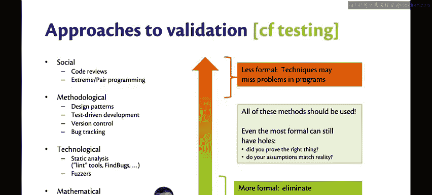
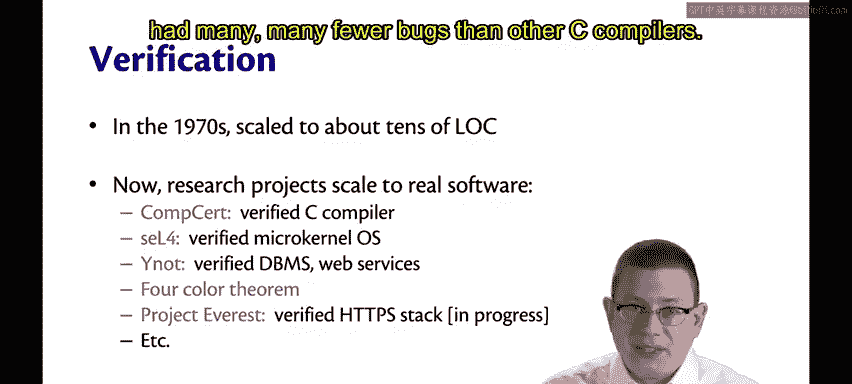
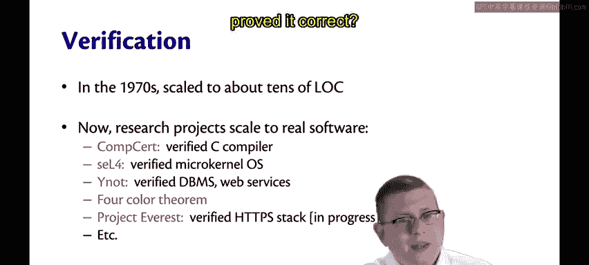
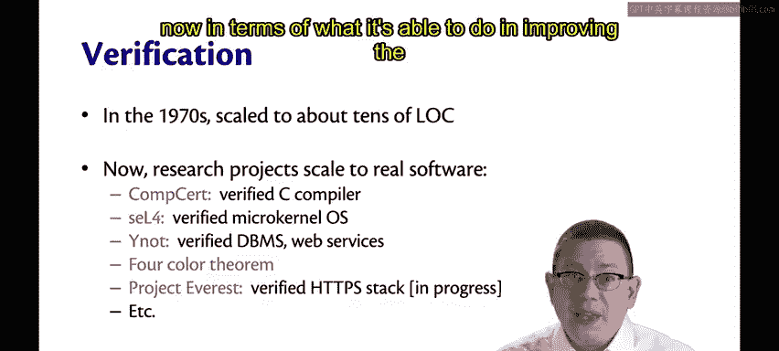
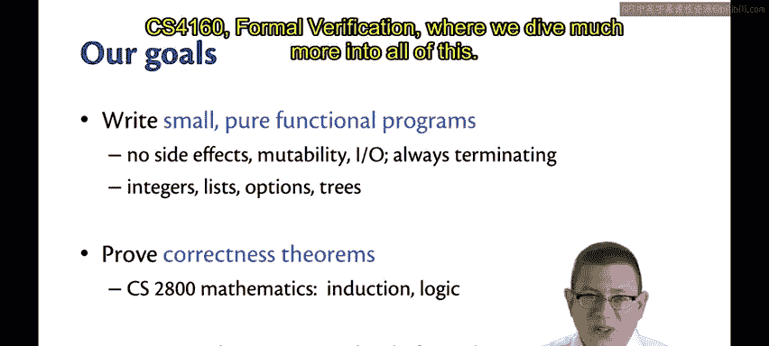
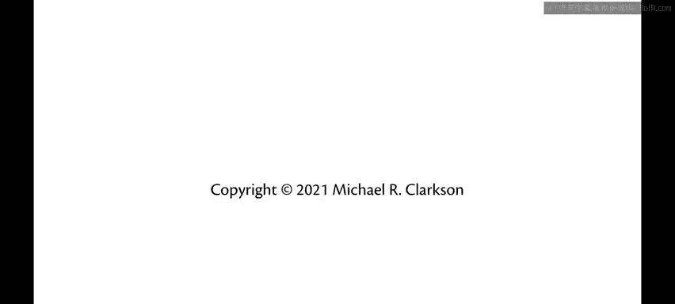

# 091：形式化验证

## 概述

在本节课中，我们将要学习形式化验证的基本概念。形式化验证是一种数学方法，用于确保软件系统按照预期工作，尤其适用于对安全性要求极高的系统。我们将探讨其重要性、发展历程，并了解在CS3110课程中我们将如何应用它来证明小型纯函数式程序的正确性。

---

## 软件可靠性的重要性

如果你的工作是构建下一个运行现实世界关键部件的大型软件系统，会怎样？

例如，一架飞机的自动驾驶飞行控制器。

或者一辆自动驾驶汽车。又或者另一种完全不同的交通工具，比如航天飞机。

航天飞机必须进入太空并搭载人类返回。或者是电网、DNA测序仪。

以及许多其他类型的机器。这些系统有什么共同点？安全性至关重要。

人类可能因这些设备中的任何一个而受伤或死亡。

因此，我们需要运行它们的软件比普通的手机应用（比如TikTok）可靠得多。

😡，这就是本课程下一部分要讨论的内容。

你需要使用哪些技术来构建如此可靠的软件？更早的时候。

我们在讨论测试时见过这张幻灯片，现在是时候回顾它了。

确保软件按预期工作的验证过程有许多方法。

😡，我们之前讨论过从社会性方法一直到数学性方法的各种方法。

在数学方法这一端，你现在对OCaml的类型系统已经有了很多经验。

它比其他语言更严格。也许你已经体会到了这一点。

也许你甚至已经亲身感受到，在编码过程中能够意识到，哇，一旦我的代码编译通过，它就能按我的意愿工作。

这在其他语言中不一定成立。

因为它们的类型系统表达能力不够强。另一方面。

当然，有时它确实会让代码编译变得更麻烦。那么。

让我们再向前迈进一步，超越类型系统，进入所谓的“形式化验证”。

这里的“形式化”指的是数学意义上的形式化，即对你试图证明的内容进行严谨的数学描述。

因此，你应该从CS 2800课程中熟悉这种思想。

## 形式化验证的历史与发展

形式化验证的历史可以追溯到大约60或70年代。那时。

事实证明，我们康奈尔大学自己的教授Gs是这一领域的领军人物之一。

大约在70年代。形式化验证，即证明程序的正确性。

当时只能扩展到大约几十行代码的规模。

它需要大量的人工工作，大量的纸上证明。

而且做起来并不总是那么愉快。它曾经一度。

可能有点被认为是没有前途的东西。

时至今日，你可能仍会偶尔遇到持这种观点的人。顺便说一下。

机器学习也曾经历过同样的事情，看看我们现在在机器学习领域取得了什么成就。

那么，也看看我们现在在形式化验证领域取得了什么成就。😡。

现在的研究项目已经扩展到真实的软件规模。😡，例如。

有一个名为CompCert的经过验证的C编译器，它已被证明是正确的，并且有研究表明它比其他C编译器少得多。

少得多的错误。现在你可能会想，既然我们证明了它是正确的，它怎么还会有错误？这是因为并非编译器的所有部分都被证明了正确性，有一些部分（比如解析器的一部分）最初没有被证明正确，实际上他们现在已经完成了那些部分的验证工作。

😡。

其他例子包括SEL4，这是一个经过验证的微内核操作系统。

还有Verdi，它提供了一个库，在此基础上构建了一个经过验证的数据库管理系统，这项工作部分由我们自己的Greg Morrisett教授完成。

他现在是康奈尔理工学院的院长兼副教务长。

更数学化的成果包括四色定理的计算机辅助证明。

你可能在CS 2110中记得它，该定理指出给平面地图着色最多只需要四种颜色。

还有其他更激动人心的进行中的工作，比如Project Everest。

由微软研究院部分完成，这是一个经过验证的HTTPS协议栈。

还有许多其他有趣的项目正在进行。所以在大约40年的时间里。

我们从只能处理一些玩具示例，发展到了能够处理真实软件。

这些都是研究努力的成果，其中一些项目耗费了数年的人力。

SEL4在这方面尤其引人注目。但在接下来的40年里，我们可能会达到什么程度？嗯。

到那时，我的职业生涯将接近尾声，但你们将正值事业的黄金时期。

因此，我对你们在40年后将看到的形式化验证能力，以及它在提高软件正确性方面所能做的事情感到兴奋。

😡。

## CS3110课程中的形式化验证

我们在CS3110中要做什么？嗯，不会是构建一个完整的经过验证的微内核操作系统。

抱歉。我们将要做以下事情。我们将编写一些小型、纯函数式的程序。

所谓纯函数式，我的意思当然是指没有副作用。

没有可变性，没有输入/输出，并且它们总是会终止。

当然，有办法绕过所有这些限制。

但随着你构建更复杂的程序，技术难度会增加。

所以我们将从简单的内容开始。小型且纯粹。

我们将对涉及整数、列表、选项、树。

以及其他几种数据结构的程序进行证明。我们将证明这些程序的正确性定理。

所以这回到了你在CS 2800中学到或正在学习的内容，为此你需要了解一些逻辑知识。

在这个过程中，你肯定会得到更多关于归纳法的练习。😡。

我们在所有这些中的目标不是做到100%完全形式化。我们将保持严谨。

我们将对我们提出的主张、使用的证明技术以及给出的理由保持谨慎。

但我们不会试图做到事无巨细、面面俱到。那可以做到。

只是需要多得多的工作量。如果你对此感兴趣。

我确实有一门CS4160课程，专门讲形式化验证，在那里我们会更深入地探讨所有这些内容。

---

## 总结

本节课中我们一起学习了形式化验证的基本概念。我们了解到，形式化验证是一种用于确保关键软件系统正确性的数学方法，其应用范围已从几十行代码的示例扩展到真实的操作系统、编译器等项目。在CS3110课程中，我们将通过编写和证明小型纯函数式程序的正确性，来实践这一思想的核心部分，为构建更可靠的软件打下基础。