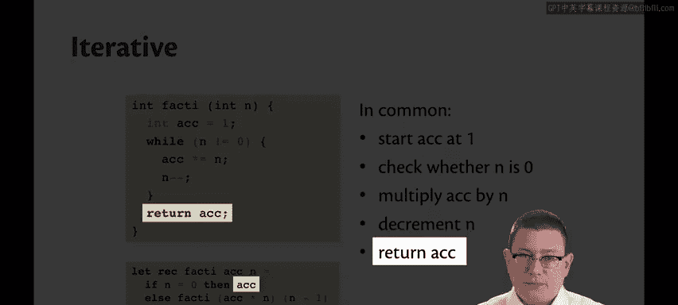
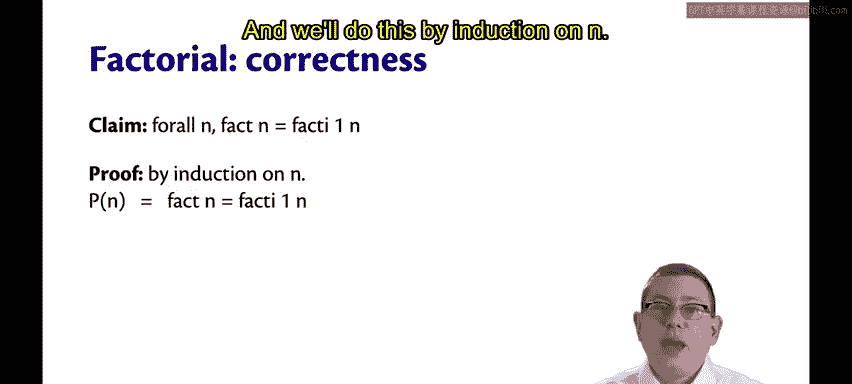
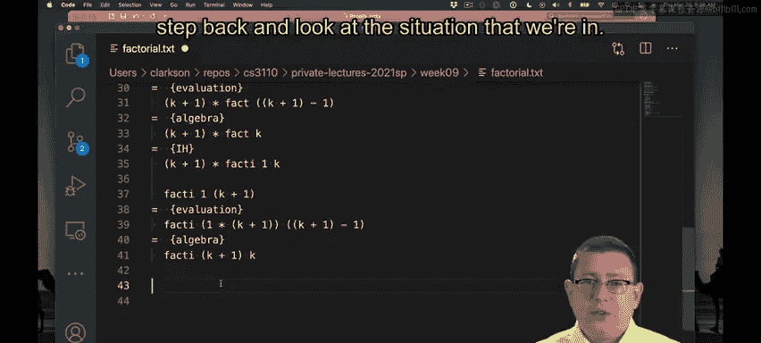
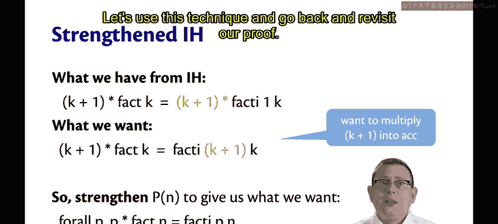
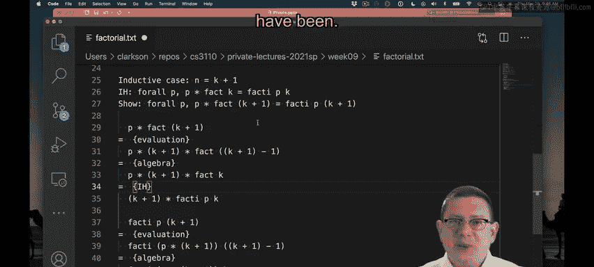
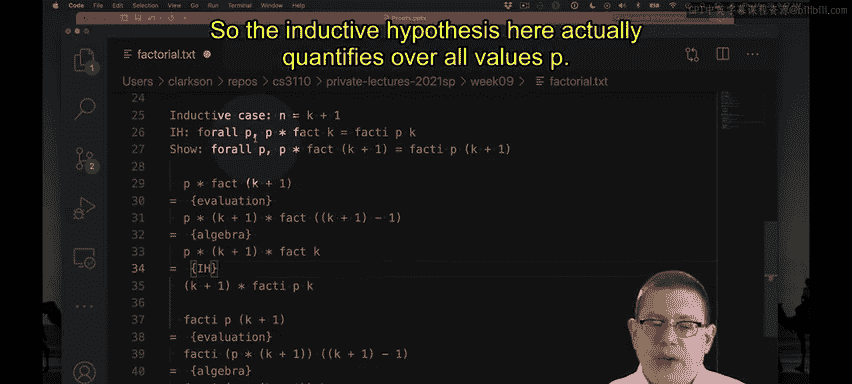
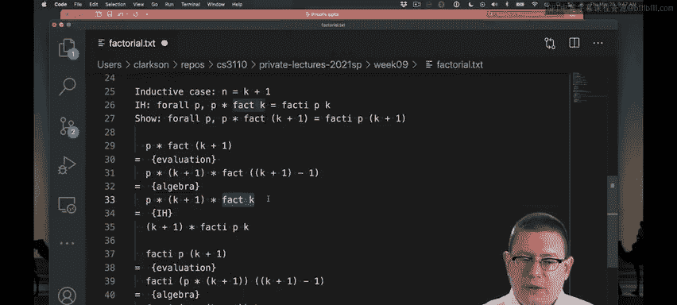
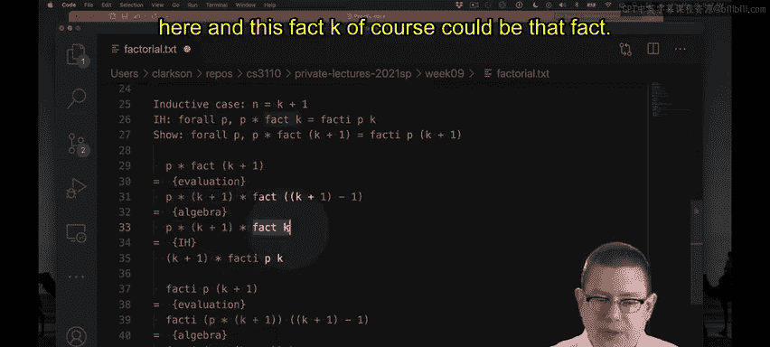
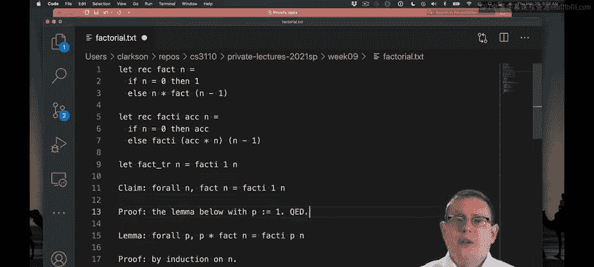

# 096：迭代阶乘的证明示例 🧮

在本节课中，我们将学习如何通过归纳法证明一个递归程序的正确性。具体来说，我们将证明一个“尾递归”版本的阶乘函数与标准的递归版本是等价的。通过这个例子，我们将展示如何通过强化归纳假设来克服证明中的困难。


## 迭代阶乘函数



首先，我们来看两个阶乘函数的实现。一个是标准的递归版本 `fact`，另一个是更高效的尾递归版本 `fact_i`（`i` 代表迭代）。



以下是 `fact` 函数的定义：
```ocaml
let rec fact n =
  if n = 0 then 1
  else n * fact (n - 1)
```

以下是尾递归辅助函数 `fact_i` 的定义：
```ocaml
let fact_i acc n =
  if n = 0 then acc
  else fact_i (acc * n) (n - 1)
```

为了理解为什么称其为“迭代”，我们可以将其与Java等命令式语言中的迭代解决方案进行比较。两者都使用一个从1开始的累加器，检查输入的数字 `n` 是否为零，将累加器乘以 `n`，递减 `n`，最后返回累加器的值。


## 证明目标


我们的目标是证明以下声明的正确性：
```
fact n = fact_i 1 n
```
也就是说，对于任意自然数 `n`，标准的 `fact n` 与以 `1` 作为初始累加器调用的 `fact_i 1 n` 结果相同。


我们将通过对 `n` 进行归纳来证明这一点。

## 初始尝试与遇到的困难


我们首先尝试证明属性 `P(n)`：`fact n = fact_i 1 n`。


**基础情况**：当 `n = 0` 时，`fact 0` 计算结果为 `1`。同时，`fact_i 1 0` 也返回累加器 `1`。因此，基础情况成立。

**归纳步骤**：假设对于某个自然数 `k`，`P(k)` 成立，即 `fact k = fact_i 1 k`。我们需要证明 `P(k+1)` 也成立。

我们从 `fact (k+1)` 开始：
```
fact (k+1) = (k+1) * fact k          （根据 `fact` 的定义，因为 k+1 > 0）
           = (k+1) * (fact_i 1 k)    （应用归纳假设）
```
现在，我们需要证明 `(k+1) * (fact_i 1 k)` 等于 `fact_i 1 (k+1)`。



然而，我们在这里遇到了障碍。我们无法直接对 `fact_i 1 (k+1)` 进行求值，因为我们不知道 `k` 的具体值（它可能是0，也可能是其他数），因此无法确定是进入 `if` 的 `then` 分支还是 `else` 分支。我们卡住了。

## 强化归纳假设

当我们遇到这种僵局时，退一步审视情况会有所帮助。问题在于归纳假设过于具体——它总是将 `1` 作为 `fact_i` 的第一个参数。我们真正需要的是将 `(k+1)` 这个因子乘到累加器里去。



因此，我们需要强化我们想要证明的属性 `P`。我们将它推广为：
```
对于所有的 p，都有：p * fact n = fact_i p n
```
这个新属性 `P'(n)` 的含义是：你可以将任意值 `p` 作为累加器的初始值传入，`fact_i p n` 的结果就等于 `p` 乘以 `fact n`。

## 使用强化假设完成证明

现在，我们使用强化后的属性 `P'(n)` 来重新进行证明。

**基础情况**：对于任意 `p`，`p * fact 0 = p * 1 = p`。同时，`fact_i p 0` 返回累加器 `p`。因此，基础情况成立。

**归纳步骤**：假设对于某个自然数 `k`，`P'(k)` 成立，即对于所有 `p`，都有 `p * fact k = fact_i p k`。我们需要证明 `P'(k+1)` 也成立，即对于所有 `p`，都有 `p * fact (k+1) = fact_i p (k+1)`。





我们从左边开始：
```
p * fact (k+1) = p * ((k+1) * fact k)    （根据 `fact` 的定义）
               = (p * (k+1)) * fact k    （乘法结合律）
```
现在，我们有了 `(p * (k+1)) * fact k` 这个形式。请注意，我们的归纳假设 `P'(k)` 是“对于所有 `p`...”。这意味着我们可以选择将归纳假设中的 `p` 实例化为 `p * (k+1)`。



应用归纳假设（其中 `p` 取值为 `p * (k+1)`）：
```
(p * (k+1)) * fact k = fact_i (p * (k+1)) k
```
接下来，我们处理右边 `fact_i p (k+1)`。由于 `k+1 > 0`，我们进入 `else` 分支：
```
fact_i p (k+1) = fact_i (p * (k+1)) k    （根据 `fact_i` 的定义）
```
现在，我们得到：
```
p * fact (k+1) = (p * (k+1)) * fact k
               = fact_i (p * (k+1)) k    （应用归纳假设）
               = fact_i p (k+1)          （根据 `fact_i` 的定义）
```
因此，我们证明了对于所有 `p`，`p * fact (k+1) = fact_i p (k+1)`。归纳步骤完成。



## 得出最终结论

通过归纳法，我们证明了引理：**对于所有自然数 `n` 和所有整数 `p`，`p * fact n = fact_i p n`。**


我们最初的目标 `fact n = fact_i 1 n` 是这个引理的一个直接推论（只需令 `p = 1` 即可）。


最后，如果我们有一个尾递归的阶乘函数 `fact_tr`，它简单地调用 `fact_i 1 n`：
```ocaml
let fact_tr n = fact_i 1 n
```
那么其正确性证明就非常直接：`fact_tr n = fact_i 1 n = fact n`。

## 总结



本节课中，我们一起学习了如何证明迭代（尾递归）阶乘函数的正确性。

1.  **我们首先定义了标准递归阶乘 `fact` 和尾递归辅助函数 `fact_i`。**
2.  **最初的证明尝试遇到了障碍，因为归纳假设不够强大。**
3.  **我们通过将属性推广为 `p * fact n = fact_i p n` 来强化了归纳假设。** 这允许累加器携带一个任意的乘数 `p`。
4.  **使用强化后的假设，我们成功地通过归纳法完成了证明。**
5.  **最终，我们最初的结论作为引理的一个特例（`p=1`）得以证明。**


这个例子展示了一个非常重要的程序验证技术：**编写一个简单、显然正确的“慢”版本，再编写一个高效但不那么显然正确的“快”版本，然后证明两者结果一致。** 这是一种建立对高效算法信心的强大方法。