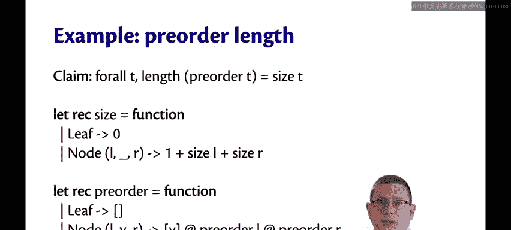
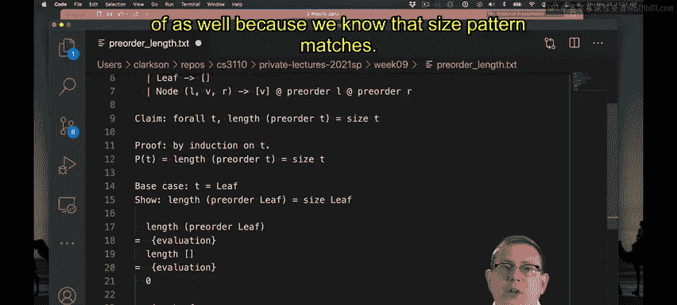
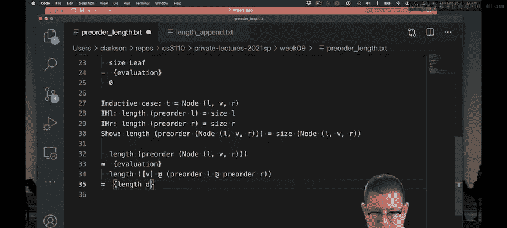
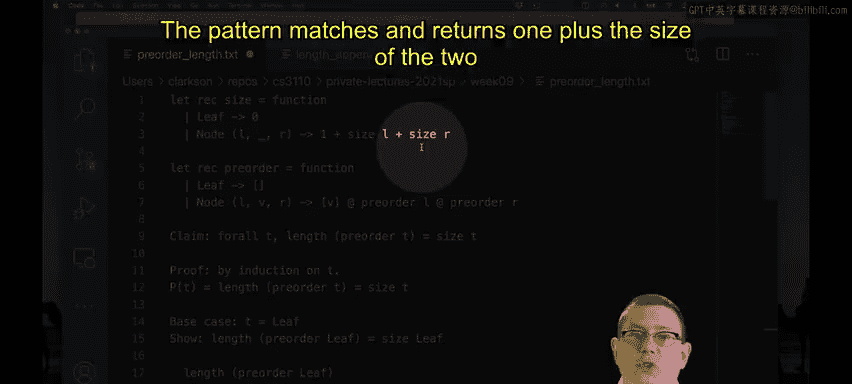
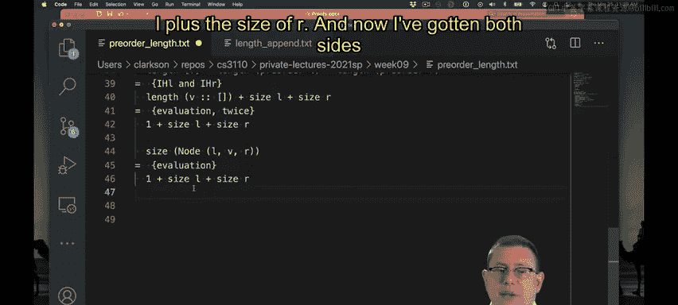

# 101：树的前序遍历长度证明示例 🌳

在本节课中，我们将学习如何对树结构进行归纳证明。具体来说，我们将证明一个关于二叉树前序遍历的重要性质：**前序遍历结果列表的长度等于树中节点的数量**。

## 概述

我们将通过一个具体的例子来演示归纳法在树结构上的应用。证明的目标是：对于任意二叉树 `t`，其前序遍历列表的长度 `length (preorder t)` 等于树的大小 `size t`。这里的 `size` 函数计算树中的节点总数。

## 证明目标与定义

首先，我们明确要证明的命题 `P(t)`：



```
P(t): length (preorder t) = size t
```

其中，`preorder` 函数执行前序遍历：先访问节点的值，然后递归遍历左子树，最后递归遍历右子树。`size` 函数计算树中的节点数。

以下是相关的OCaml代码定义：

```ocaml
type 'a tree = Leaf | Node of 'a * 'a tree * 'a tree

let rec preorder = function
  | Leaf -> []
  | Node (v, l, r) -> v :: (preorder l @ preorder r)

let rec size = function
  | Leaf -> 0
  | Node (_, l, r) -> 1 + size l + size r
```

## 证明过程：归纳法

我们将对树的结构进行归纳证明。

### 基础情况：`t = Leaf`



当树是叶子节点时，我们需要证明 `P(Leaf)` 成立，即 `length (preorder Leaf) = size Leaf`。


1.  计算左边 `length (preorder Leaf)`：
    *   根据 `preorder` 定义，`preorder Leaf` 求值为 `[]`。
    *   `length []` 求值为 `0`。
2.  计算右边 `size Leaf`：
    *   根据 `size` 定义，`size Leaf` 求值为 `0`。

因此，左边等于右边（`0 = 0`），基础情况得证。

### 归纳情况：`t = Node (v, l, r)`

现在，我们进入归纳步骤。假设对于任意子树 `l` 和 `r`，归纳假设 `P(l)` 和 `P(r)` 成立：
*   `IH_l: length (preorder l) = size l`
*   `IH_r: length (preorder r) = size r`

我们需要证明 `P(Node (v, l, r))` 也成立，即：
`length (preorder (Node (v, l, r))) = size (Node (v, l, r))`

**证明左边表达式：**

1.  根据 `preorder` 定义，展开一步：
    `length (preorder (Node (v, l, r))) = length (v :: (preorder l @ preorder r))`

2.  此时，我们需要一个关键的引理（已在之前的课程中证明过）：**`length` 函数在列表连接操作上是可分配的**。即对于任意列表 `xs` 和 `ys`，有：
    `length (xs @ ys) = length xs + length ys`

3.  将 `v :: (preorder l @ preorder r)` 视为 `[v] @ (preorder l @ preorder r)`，并应用上述引理：
    `length ([v] @ (preorder l @ preorder r)) = length [v] + length (preorder l @ preorder r)`

4.  `length [v]` 很容易计算，它等于 `1`。



5.  再次对 `length (preorder l @ preorder r)` 应用分配引理：
    `length (preorder l @ preorder r) = length (preorder l) + length (preorder r)`

6.  现在，我们可以应用归纳假设 `IH_l` 和 `IH_r`：
    `length (preorder l) + length (preorder r) = size l + size r`

7.  综合以上步骤，左边表达式最终简化为：
    `1 + size l + size r`

**证明右边表达式：**

根据 `size` 函数的定义，直接计算：
`size (Node (v, l, r)) = 1 + size l + size r`

**得出结论：**

左边表达式 `1 + size l + size r` 与右边表达式 `1 + size l + size r` 完全相同。因此，在归纳假设成立的前提下，归纳情况 `P(Node (v, l, r))` 也成立。



## 总结



本节课中，我们一起学习了如何对二叉树进行归纳证明。我们证明了 **`length (preorder t) = size t`** 这一性质。证明过程清晰地展示了：
1.  **基础情况**的处理：直接根据函数定义求值。
2.  **归纳步骤**的构建：假设子性质成立，证明当前性质。
3.  **关键引理**的应用：利用 `length` 对列表连接的分配律来简化表达式。
4.  **归纳假设**的使用：将复杂表达式替换为已知的等价形式，最终使等式两边相等。


这个证明是函数式编程中利用结构归纳法验证程序性质的典型范例。通过这样的练习，我们可以更深入地理解递归数据结构和递归函数的正确性。