# 108：引用的语法与语义 🔍

在本节课中，我们将要学习OCaml中引用的语法和语义。引用是实现可变状态的核心机制，理解其工作原理对于编写高效的程序至关重要。

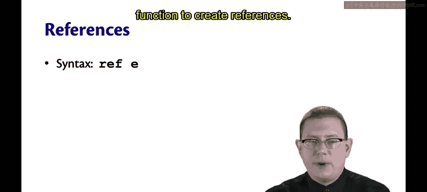

## 引用的创建

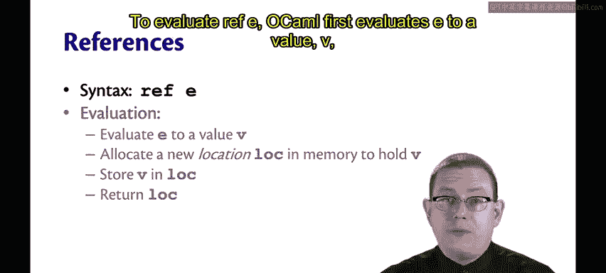

让我们首先仔细看看引用的语法和语义。引用通过 `ref` 函数创建，`ref` 是标准库中用于创建引用的函数。

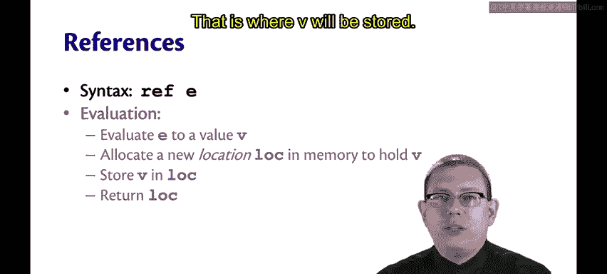

**公式**：`ref E`

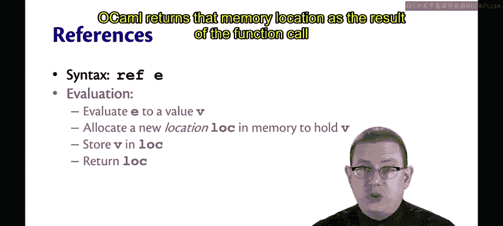

为了求值 `ref E`，OCaml首先将表达式 `E` 求值为一个值 `V`。

然后，它在内存中分配一个新的位置，我们称这个位置为 `loc`。值 `V` 将被存储在这个位置。

OCaml将这个内存位置作为调用 `ref` 函数的结果返回。

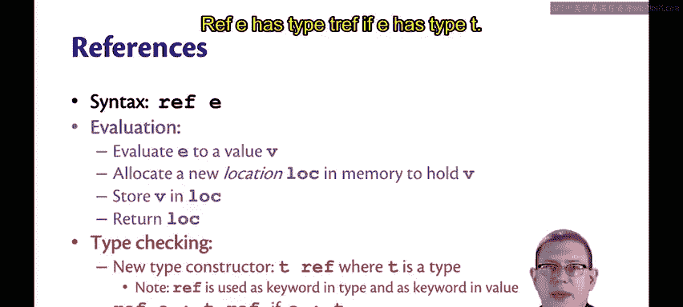

对于类型检查，我们现在有了一个新的类型构造器，它同样写作 `ref`。请注意不要混淆这两者：`ref` 既用于表示类型，也用于表示创建引用的函数。

`T ref` 是一个适用于任何类型 `T` 的类型。因此，你可以有 `int ref`、`string ref` 或对变体类型的引用等。

**公式**：如果 `E` 具有类型 `T`，那么 `ref E` 具有类型 `T ref`。

## 位置与值的关系

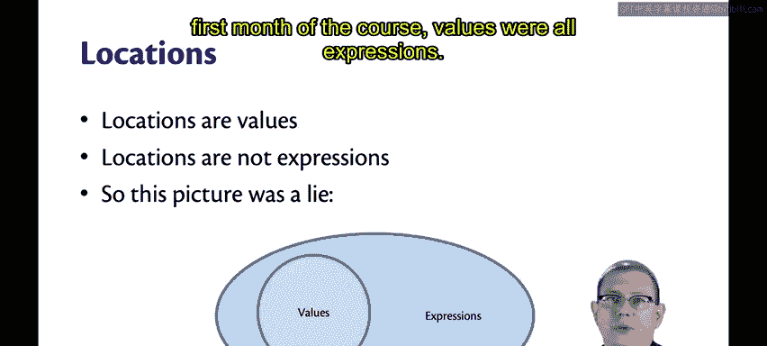

位置是值，但它们不是表达式。你不能直接在OCaml源文件中写下一个位置，也不能直接写下内存地址或在内存地址上进行算术运算。

正如我在第一周或第二周展示这张图时所警告的那样，这个维恩图并没有完全反映真相。在我们之前以及课程第一个月所看到的那些值中，值都是表达式。

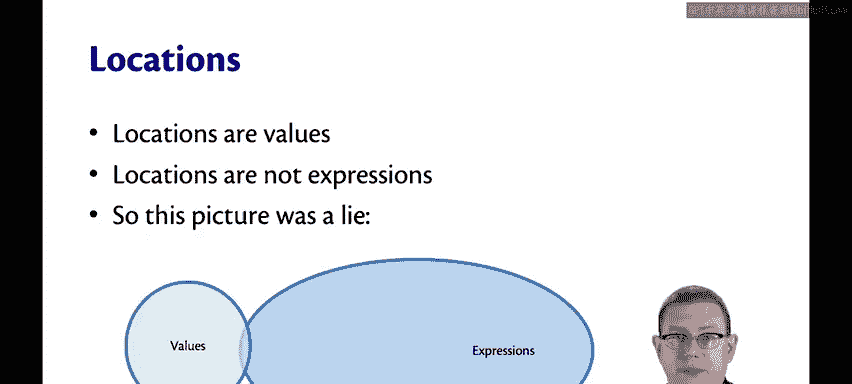

但现在我们有了不是表达式的值。位置值不是我们可以在程序中直接写下的表达式。

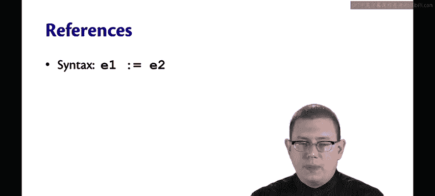

因此，真相是维恩图应该看起来像这样：其中有些值是表达式，有些值则不是。

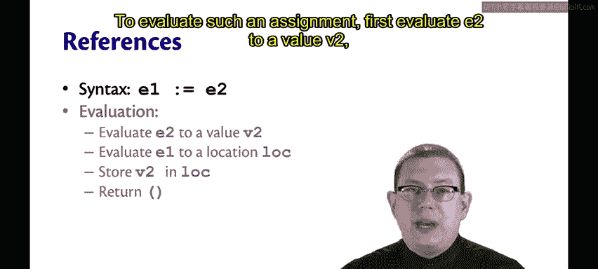

## 赋值操作符

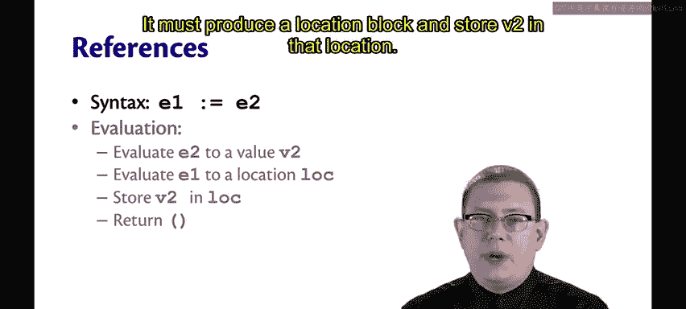

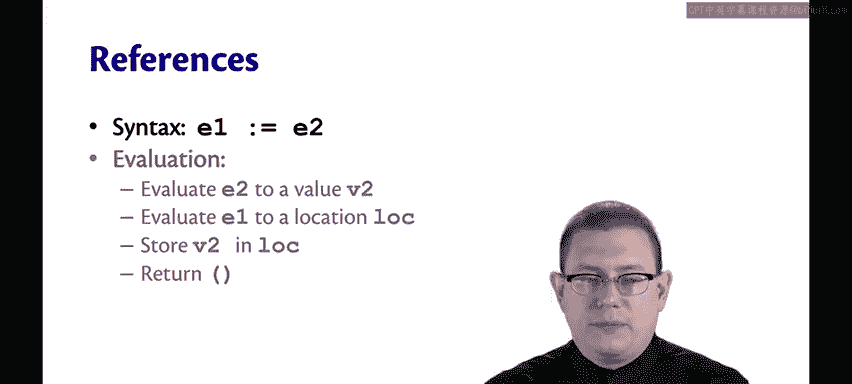

赋值操作符写作 `E1 := E2`。

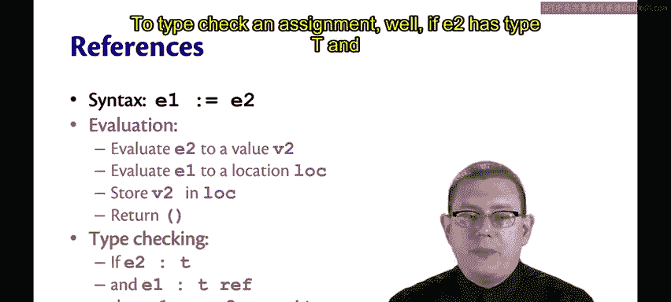

**公式**：`E1 := E2`

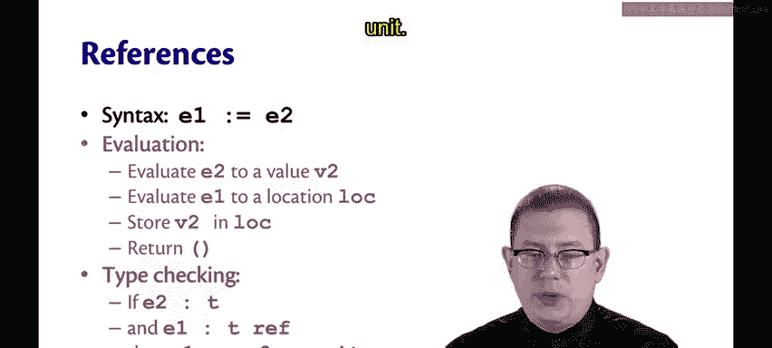

为了求值这样的赋值，首先将 `E2` 求值为值 `V2`。

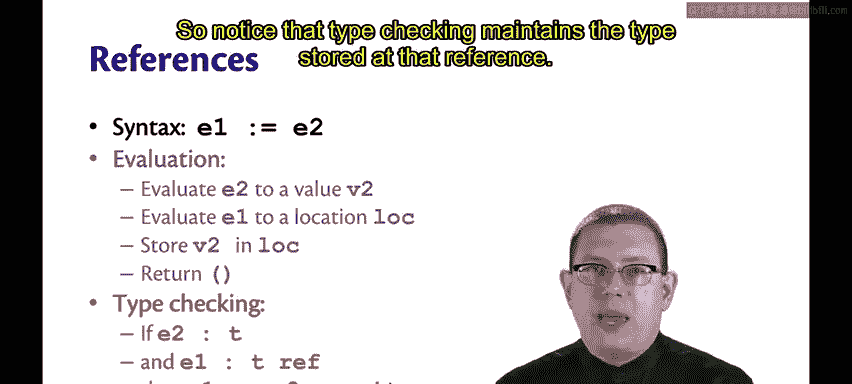

然后求值 `E1`。它必须产生一个位置 `loc`。接着将 `V2` 存储在该位置。

作为赋值的结果，返回 `unit`。

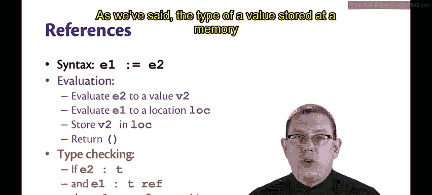

为了对赋值进行类型检查，如果 `E2` 具有类型 `T`，并且 `E1` 具有类型 `T ref`，那么 `E1 := E2` 具有类型 `unit`。

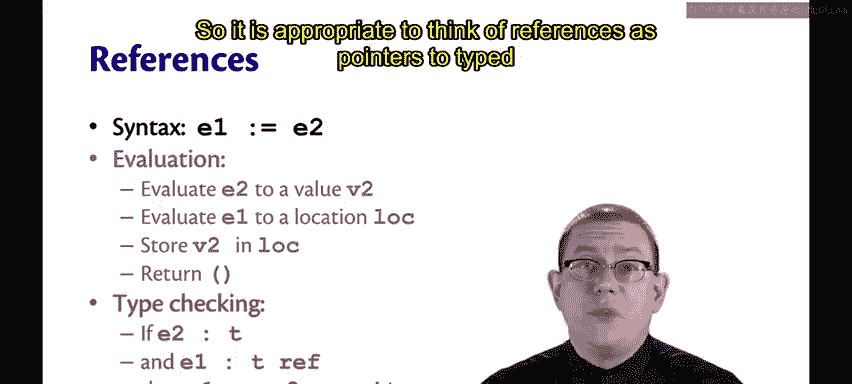

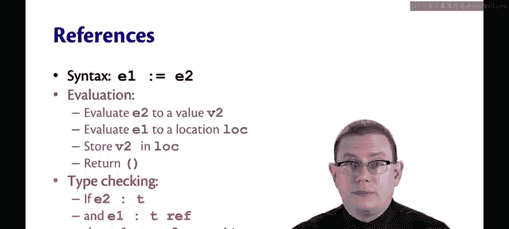

请注意，类型检查维护了存储在该引用处的类型。正如我们所说，存储在内存位置的值的类型不能改变。因此，将引用视为指向内存中类型化位置的指针是合适的。

## 关于Unit类型的更多讨论

让我们再谈谈 `unit` 类型。我们之前已经见过它几次。

`unit` 是一个类型，它唯一的值是写作括号 `()` 的 unit 值。由于它是其类型中唯一的值，因此没有有趣的操作可以对它进行。

如果你愿意，可以通过与布尔类型类比来理解 `unit`。`bool` 是一个类型，它有两个值：`true` 和 `false`。`unit` 也是一个类型，它恰好比布尔类型少一个值，它只有一个值，那就是 `unit`。

在你以前使用过的其他语言中，最接近的类比可能是 `void`。当你在Java或C中有一个没有有趣返回值的过程时，它的返回类型是 `void`。你可以将其视为一个单一的、无法进行任何有趣操作的值。

这与OCaml中的 `print` 和 `assert` 类似。例如，在OCaml中执行 `print_string`，这是一个接收字符串并返回 `unit` 的函数；在其他语言中，它可能只是一个 `void` 返回类型。同样，如果你断言一个布尔表达式，其类型是 `unit`，除了断言失败时会引发异常外，不会发生任何有趣的事情。

## 解引用操作符

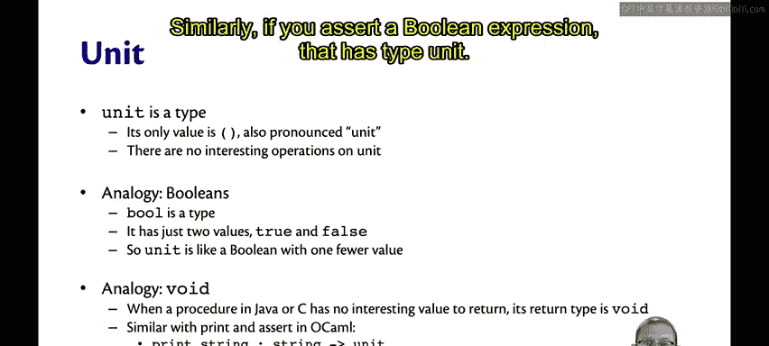

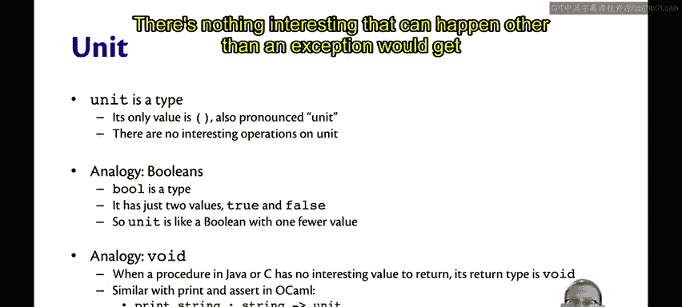

解引用操作符写作 `!E`，其中 `E` 是一个表达式。

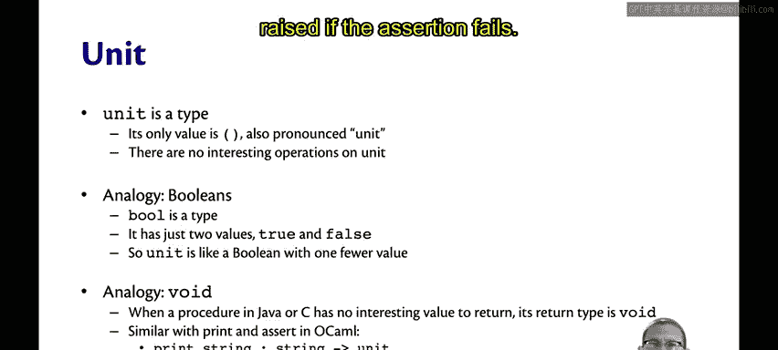

**公式**：`!E`

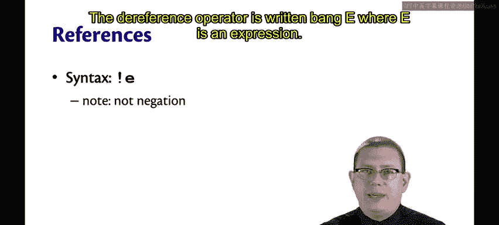

请注意，这不是逻辑非。在许多其他语言中，感叹号 `!` 表示布尔非。但在这里不是，它表示解引用。

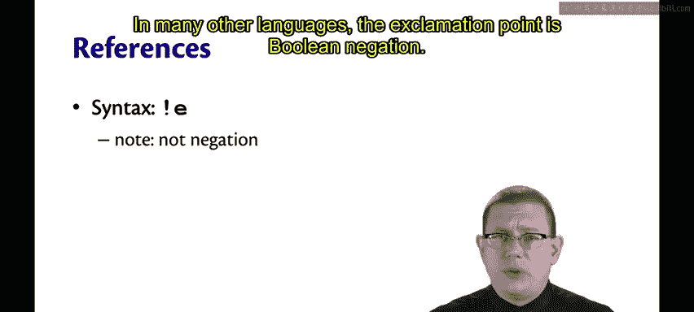

为了求值一个解引用，首先求值 `E`，它必须产生一个位置 `loc`，然后直接返回该位置的内容。

进行类型检查时，如果 `E` 具有类型 `T ref`，那么 `!E` 具有类型 `T`。感叹号操作符本质上是去掉了那个 `ref`。

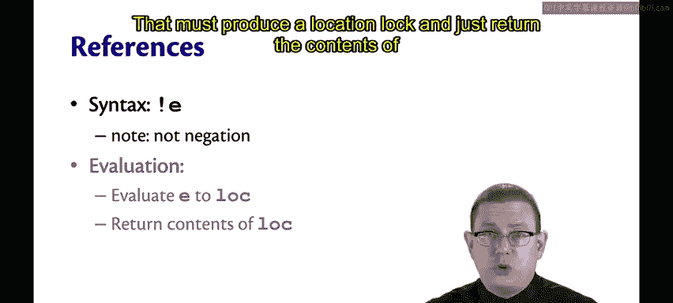

---

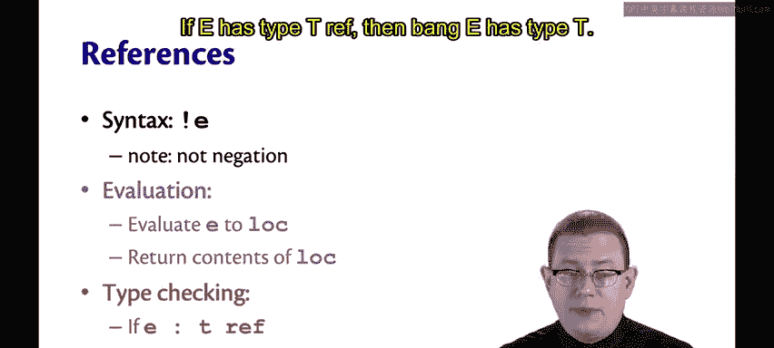

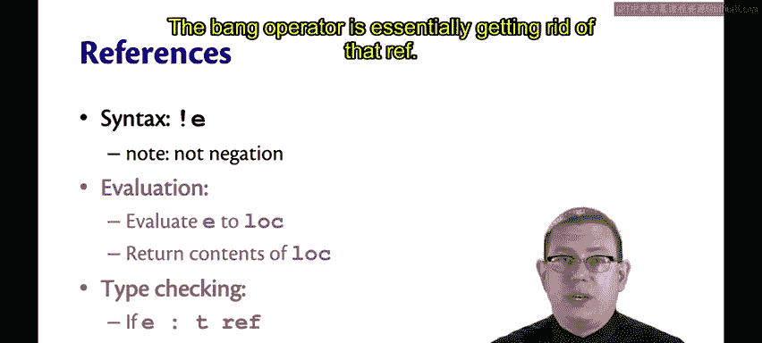

本节课中我们一起学习了OCaml引用的核心语法与语义。我们了解了如何通过 `ref` 创建引用，如何使用 `:=` 进行赋值，以及如何使用 `!` 进行解引用。我们还探讨了 `unit` 类型的含义，并理解了内存位置作为值（但非表达式）的特殊性。掌握这些概念是理解和使用OCaml中可变状态的基础。